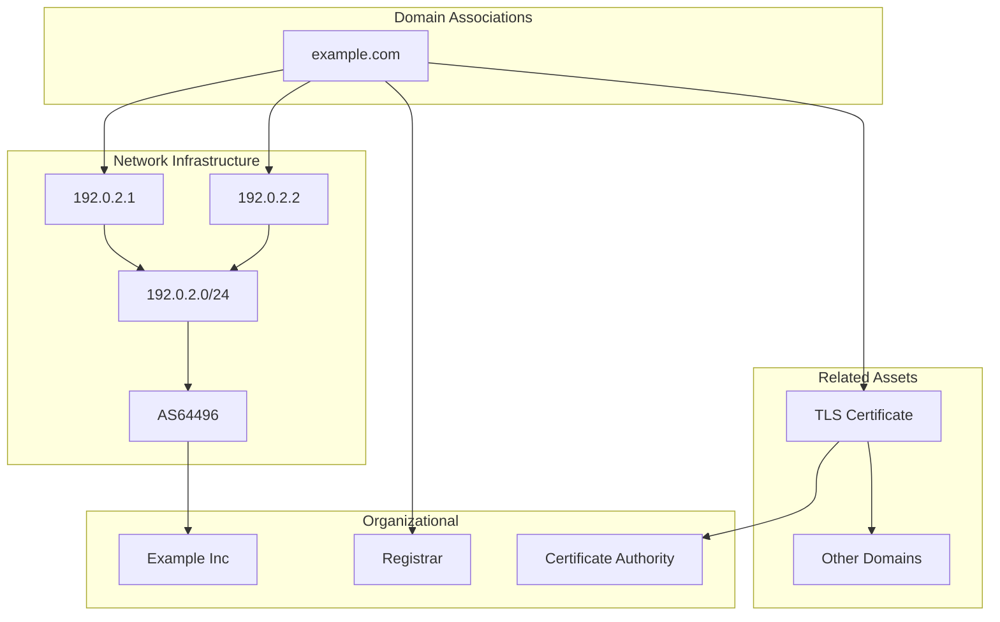

# assoc - Association Analysis

The `assoc` subcommand analyzes relationships between discovered assets in the graph database.

## Synopsis

```bash
amass assoc [options]
```

## Options

### Target Selection

| Flag | Description | Example |
|------|-------------|---------|
| `-d` | Domain names (comma-separated) | `-d example.com` |
| `-df` | File containing domain names | `-df domains.txt` |

### Output Options

| Flag | Description |
|------|-------------|
| `-o` | Output to text file |
| `-dir` | Data directory path |

## Examples

### Basic Association Analysis

```bash
amass assoc -d example.com
```

Output:
```
example.com
├── Netblocks
│   ├── 192.0.2.0/24 (AS64496 - Example Inc)
│   └── 198.51.100.0/24 (AS64497 - CDN Provider)
├── Organizations
│   ├── Example Inc (registrant)
│   └── Let's Encrypt (certificate issuer)
└── Related Domains
    ├── example.org (shared IP)
    └── example.net (shared certificate)
```

### Save to File

```bash
amass assoc -d example.com -o associations.txt
```

## Relationship Types



## Analysis Capabilities

| Analysis | Description |
|----------|-------------|
| **Network Mapping** | IP to Netblock to ASN relationships |
| **Org Attribution** | Domain ownership and registration |
| **Certificate Links** | Shared certificates across domains |
| **Infrastructure Overlap** | Domains sharing IPs or networks |

## Use Cases

### Infrastructure Mapping

```bash
# Find all infrastructure for a target
amass assoc -d target.com -o infra.txt
```

### Related Domain Discovery

```bash
# Find domains sharing infrastructure
amass assoc -d known-target.com | grep "Related Domains"
```

## See Also

- [enum](enum.md) - Discover assets
- [viz](viz.md) - Visualize associations
- [subs](subs.md) - Subdomain listing
