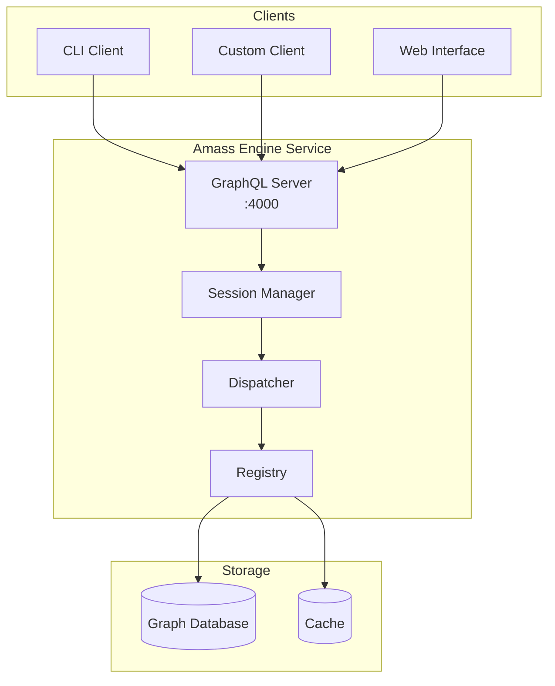

# engine - Collection Service

The `engine` subcommand runs Amass as a persistent service, exposing a GraphQL API for session management and asset discovery coordination.

## Synopsis

```bash
amass engine [options]
```

## Description

The engine service provides:

- **GraphQL API** for programmatic access
- **Session management** for concurrent enumerations
- **Persistent state** across multiple queries
- **Real-time monitoring** via subscriptions

## Options

| Flag | Description |
|------|-------------|
| `-log-dir` | Path to log directory |
| `-nocolor` | Disable colorized output |
| `-silent` | Disable all output |
| `-config` | Configuration file path |

## GraphQL Endpoint

Default: `http://127.0.0.1:4000/graphql`

## GraphQL Operations

### Mutations

| Operation | Description |
|-----------|-------------|
| `createSessionFromJson` | Create a new discovery session |
| `createAsset` | Submit seed assets to a session |
| `terminateSession` | Stop a running session |

### Queries

| Operation | Description |
|-----------|-------------|
| `sessionStats` | Get real-time session statistics |
| `sessions` | List active sessions |

### Subscriptions

| Operation | Description |
|-----------|-------------|
| `logMessages` | Stream session log messages |

## Usage Examples

### Start the Engine

```bash
# Basic start
amass engine

# With logging
amass engine -log-dir /var/log/amass

# With configuration
amass engine -config /etc/amass/config.yaml
```

### Background Service

```bash
# Start in background
amass engine &

# Or with nohup
nohup amass engine > /var/log/amass/engine.log 2>&1 &
```

### Docker Deployment

```bash
docker run -d \
    -p 4000:4000 \
    -v amass-data:/data \
    owaspamass/amass:latest engine
```

## GraphQL Examples

### Create Session

```graphql
mutation {
  createSessionFromJson(config: "{
    \"scope\": {
      \"domains\": [\"example.com\"]
    },
    \"options\": {
      \"active\": true
    }
  }") {
    id
    status
  }
}
```

### Submit Asset

```graphql
mutation {
  createAsset(
    sessionId: "session-123"
    asset: {
      type: "FQDN"
      value: "example.com"
    }
  ) {
    id
    type
  }
}
```

### Get Statistics

```graphql
query {
  sessionStats(sessionId: "session-123") {
    assetsDiscovered
    assetsProcessed
    queueSize
    duration
  }
}
```

### Subscribe to Logs

```graphql
subscription {
  logMessages(sessionId: "session-123") {
    timestamp
    level
    message
  }
}
```

## Architecture



## Signal Handling

| Signal | Behavior |
|--------|----------|
| `SIGINT` | Graceful shutdown |
| `SIGTERM` | Graceful shutdown |
| `SIGHUP` | Reload configuration |

## See Also

- [enum](enum.md) - Enumeration command (uses engine API)
- [Architecture](../architecture/index.md) - System architecture
