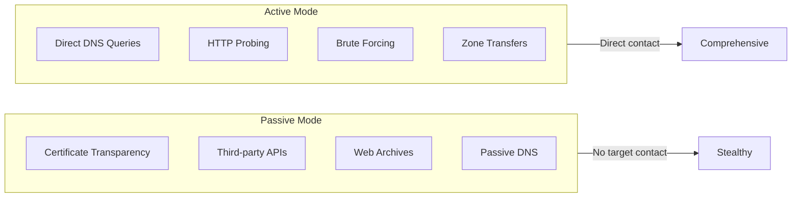
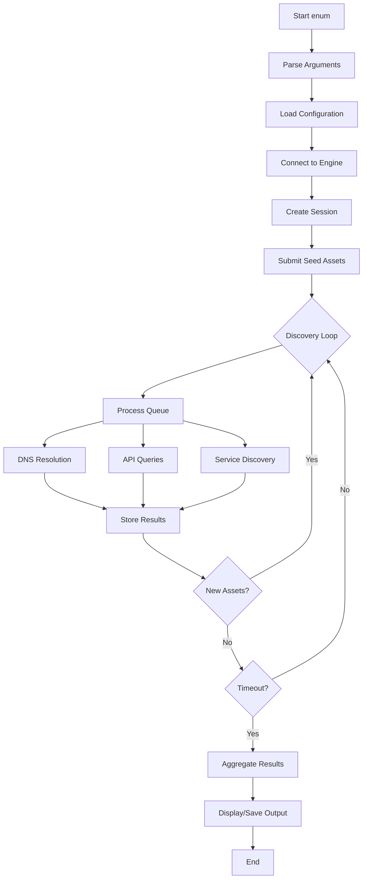

# enum - Asset Enumeration

The `enum` subcommand performs automated asset discovery via the GraphQL API, coordinating DNS resolution, API integrations, and service discovery.

## Synopsis

```bash
amass enum [options]
```

## Target Specification

### Domain Options

| Flag | Description | Example |
|------|-------------|---------|
| `-d` | Domain names (comma-separated) | `-d example.com,example.org` |
| `-df` | File containing domain names | `-df domains.txt` |
| `-bl` | Blacklist of subdomain names (comma-separated) | `-bl admin.example.com` |
| `-blf` | Path to file with blacklisted subdomains | `-blf blacklist.txt` |
| `-p` | Ports separated by commas (default: 80, 443) | `-p 80,443,8080` |

### Network Options

| Flag | Description | Example |
|------|-------------|---------|
| `-addr` | IP addresses and ranges | `-addr 192.168.1.1-254` |
| `-asn` | ASN numbers | `-asn 13337,14618` |
| `-cidr` | CIDR blocks | `-cidr 192.168.1.0/24` |
| `-iface` | Network interface to send traffic through | `-iface eth0` |

## Discovery Methods

| Flag | Description |
|------|-------------|
| `-active` | Enable active enumeration (direct target contact) |
| `-passive` | Passive discovery only (deprecated — passive is the default mode) |
| `-brute` | Execute brute forcing after passive searches |
| `-alts` | Enable altered name generation |
| `-norecursive` | Turn off recursive brute forcing |

### Active vs Passive



## DNS Configuration

| Flag | Description | Default |
|------|-------------|---------|
| `-r` | Untrusted DNS resolvers | Public pool |
| `-tr` | Trusted DNS resolvers | Baseline |
| `-dns-qps` | Max DNS queries per second | Unlimited |
| `-max-dns-queries` | Deprecated alias for `-dns-qps` | — |
| `-rqps` | Max QPS per untrusted resolver | 5 |
| `-trqps` | Max QPS per trusted resolver | 15 |

### Resolver Example

```bash
# Use custom resolvers with rate limiting
amass enum -d example.com \
    -r 8.8.8.8,1.1.1.1 \
    -tr 9.9.9.9 \
    -dns-qps 200 \
    -rqps 10
```

## Wordlist Options

| Flag | Description |
|------|-------------|
| `-w` | Brute force wordlist path |
| `-aw` | Alteration wordlist path |
| `-wm` | Hashcat-style masks for DNS brute forcing |
| `-awm` | Hashcat-style masks for name alterations |

### Brute Force Example

```bash
# Brute force with custom wordlist
amass enum -d example.com -brute -w /path/to/wordlist.txt
```

## Control Options

| Flag | Description | Example |
|------|-------------|---------|
| `-timeout` | Minutes before quitting | `-timeout 30` |
| `-max-depth` | Maximum subdomain label depth | `-max-depth 3` |
| `-min-for-recursive` | Subdomains before recursive brute forcing | `-min-for-recursive 2` |

### Depth Control

```
max-depth=1: example.com, www.example.com
max-depth=2: example.com, www.example.com, api.www.example.com
max-depth=3: example.com, ... , v1.api.www.example.com
```

## Output Options

| Flag | Description | Example |
|------|-------------|---------|
| `-o` | Output file path | `-o results.txt` |
| `-oA` | Output prefix for all formats | `-oA results` |
| `-json` | Output as JSON lines | `-json -o results.json` |
| `-log` | Path to log file | `-log amass.log` |
| `-dir` | Data directory path | `-dir /data/amass` |
| `-config` | Configuration file path | `-config config.yaml` |

### Output Formats

```bash
# Text output
amass enum -d example.com -o results.txt

# JSON output
amass enum -d example.com -json -o results.json

# All formats with prefix
amass enum -d example.com -oA scan_results
# Creates: scan_results.txt, scan_results.json
```

## Display Options

| Flag | Description |
|------|-------------|
| `-nocolor` | Disable colorized output |
| `-silent` | Disable all output |
| `-v` | Verbose output |
| `-demo` | Censor output for demonstrations |

## Data Source Options

| Flag | Description |
|------|-------------|
| `-include` | Data sources to include (comma-separated) |
| `-exclude` | Data sources to exclude (comma-separated) |
| `-if` | Path to file with included data sources |
| `-ef` | Path to file with excluded data sources |
| `-list` | Print all available data sources |

### Source Selection

```bash
# List available sources
amass enum -list

# Include specific sources
amass enum -d example.com -include "Censys,Shodan,VirusTotal"

# Exclude specific sources
amass enum -d example.com -exclude "Bing,Yahoo"
```

## Input Files

| Flag | Description |
|------|-------------|
| `-nf` | Path to file with known subdomain names |
| `-rf` | Path to file with untrusted resolvers |
| `-trf` | Path to file with trusted resolvers |

## Advanced Options

| Flag | Description |
|------|-------------|
| `-scripts` | Path to Amass Data Source (ADS) scripts directory |

## Examples

### Basic Enumeration

```bash
amass enum -d example.com
```

### Comprehensive Scan

```bash
amass enum -d example.com \
    -active \
    -brute \
    -alts \
    -w /usr/share/wordlists/subdomains.txt \
    -o results.txt
```

### Stealth Reconnaissance

```bash
amass enum -d example.com \
    -passive \
    -timeout 60 \
    -o passive_results.txt
```

### Multiple Targets

```bash
amass enum \
    -df targets.txt \
    -active \
    -brute \
    -dns-qps 500 \
    -timeout 120 \
    -oA comprehensive_scan
```

### With Custom Configuration

```bash
amass enum -d example.com \
    -config /path/to/config.yaml \
    -dir /data/amass \
    -o results.txt
```

## Workflow Diagram



## See Also

- [engine](engine.md) - Run the collection engine
- [subs](subs.md) - Subdomain analysis
- [Configuration](../configuration/index.md) - Configuration options
