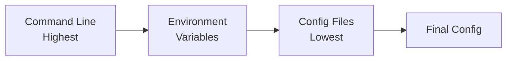

# CLI Reference

The Amass CLI provides specialized subcommands for asset discovery, analysis, and visualization.

## Command Structure

```
amass [subcommand] [options]
```

## Available Subcommands

| Subcommand | Purpose |
|------------|---------|
| [`enum`](enum.md) | Perform automated asset discovery |
| [`engine`](engine.md) | Run the collection engine service |
| [`subs`](subs.md) | Extract and present subdomain data |
| [`assoc`](assoc.md) | Analyze asset associations |
| [`track`](track.md) | Identify newly discovered assets |
| [`viz`](viz.md) | Generate graph visualizations |

## Global Options

| Flag | Description |
|------|-------------|
| `-h`, `--help` | Display usage information |
| `--version` | Print version number |

## Quick Examples

### Basic Enumeration

```bash
# Single domain
amass enum -d example.com

# Multiple domains
amass enum -d example.com,example.org

# From file
amass enum -df domains.txt
```

### Active vs Passive

```bash
# Passive only (no direct contact with target)
amass enum -passive -d example.com

# Active with brute forcing
amass enum -active -brute -d example.com
```

### Output Control

```bash
# Save to file
amass enum -d example.com -o results.txt

# All output formats
amass enum -d example.com -oA results
```

### DNS Configuration

```bash
# Custom resolvers
amass enum -d example.com -r 8.8.8.8,1.1.1.1

# Rate limiting
amass enum -d example.com -dns-qps 200
```

## Configuration Priority

Settings are applied in this order (highest to lowest priority):

1. **Command-line arguments** - Override everything
2. **Environment variables** - Override config files
3. **Configuration files** - Default settings



## Common Workflows

### Reconnaissance Workflow

```bash
# 1. Start the engine
amass engine &

# 2. Run enumeration
amass enum -d target.com -active -brute -o enum.txt

# 3. Analyze subdomains
amass subs -d target.com -ip -o subs.txt

# 4. Generate visualization
amass viz -d3 -d target.com -o /output
```

### Continuous Monitoring

```bash
# Track changes over time
amass track -d target.com -since "2024-01-01"

# Compare with previous runs
amass track -d target.com
```

## Exit Codes

| Code | Meaning |
|------|---------|
| 0 | Success |
| 1 | General error |
| 2 | Invalid arguments |

## Environment Variables

| Variable | Description |
|----------|-------------|
| `AMASS_CONFIG` | Path to configuration file |
| `AMASS_DIR` | Data directory path |

## See Also

- [Configuration Guide](../configuration/index.md)
- [Data Sources](../configuration/data_sources.md)
- [Architecture Overview](../architecture/index.md)
