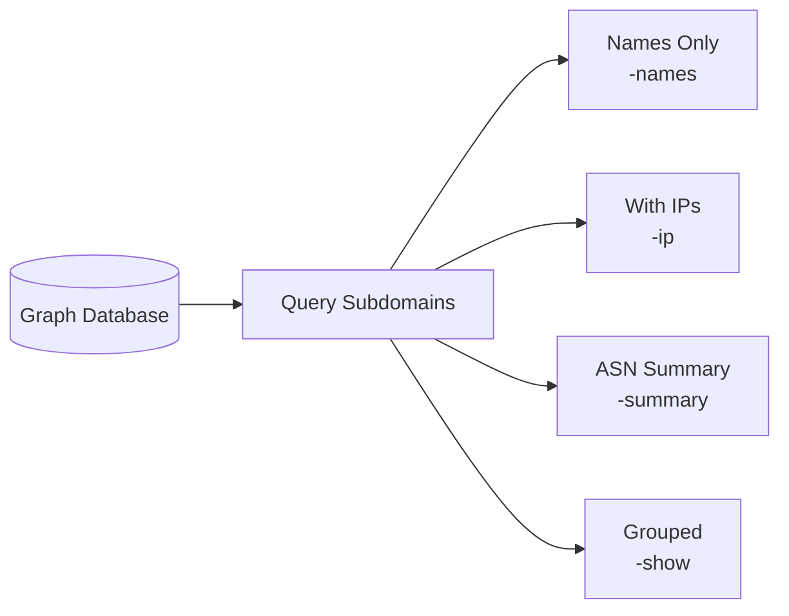

# subs - Subdomain Analysis

The `subs` subcommand extracts and presents subdomain data from the graph database.

## Synopsis

```bash
amass subs [options]
```

## Options

### Target Selection

| Flag | Description | Example |
|------|-------------|---------|
| `-d` | Domain names (comma-separated) | `-d example.com` |
| `-df` | File containing domain names | `-df domains.txt` |

### Display Options

| Flag | Description |
|------|-------------|
| `-names` | Print only discovered names |
| `-summary` | Print ASN table summary |
| `-show` | Print results with domain headers |
| `-ip` | Show IP addresses for names |
| `-ipv4` | Show IPv4 addresses only |
| `-ipv6` | Show IPv6 addresses only |
| `-demo` | Censor output for demonstrations |

### Output Options

| Flag | Description |
|------|-------------|
| `-o` | Output to text file |
| `-dir` | Data directory path |

## Examples

### Basic Subdomain List

```bash
amass subs -d example.com
```

Output:
```
www.example.com
api.example.com
mail.example.com
cdn.example.com
```

### With IP Addresses

```bash
amass subs -d example.com -ip
```

Output:
```
www.example.com 192.0.2.1
api.example.com 192.0.2.2
mail.example.com 192.0.2.10
cdn.example.com 198.51.100.50
```

### ASN Summary

```bash
amass subs -d example.com -summary
```

Output:
```
ASN        | Netblock        | Organization
-----------|-----------------|------------------
AS64496    | 192.0.2.0/24    | Example Inc
AS64497    | 198.51.100.0/24 | CDN Provider
```

### Names Only

```bash
amass subs -d example.com -names -o subdomains.txt
```

### Demo Mode (Censored)

```bash
amass subs -d example.com -demo
```

Output:
```
www.e][[REDACTED].com
api.e][[REDACTED].com
```

## Output Modes



## See Also

- [enum](enum.md) - Discover subdomains
- [viz](viz.md) - Visualize subdomain relationships
