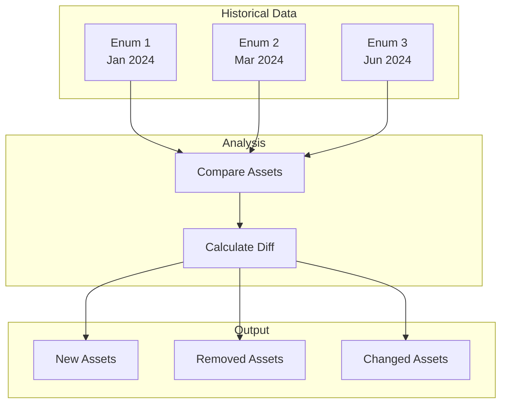

# track - Change Detection

The `track` subcommand identifies newly discovered assets over time, enabling continuous monitoring of attack surface changes.

## Synopsis

```bash
amass track [options]
```

## Options

### Target Selection

| Flag | Description | Example |
|------|-------------|---------|
| `-d` | Domain names (comma-separated) | `-d example.com` |
| `-df` | File containing domain names | `-df domains.txt` |

### Time Filtering

| Flag | Description | Example |
|------|-------------|---------|
| `-since` | Exclude assets discovered before date | `-since "01/02 15:04:05 2006 MST"` |
| `-last` | Compare with last N enumerations | `-last 2` |

### Output Options

| Flag | Description |
|------|-------------|
| `-o` | Output to text file |
| `-history` | Show full history |
| `-dir` | Data directory path |

## Examples

### Basic Change Detection

```bash
amass track -d example.com
```

Output:
```
[NEW] api-v2.example.com
[NEW] staging.example.com
[REMOVED] old-api.example.com
```

### Changes Since Date

```bash
amass track -d example.com -since "2024-06-01"
```

### Compare Recent Enumerations

```bash
amass track -d example.com -last 3
```

### Full History

```bash
amass track -d example.com -history
```

Output:
```
Enumeration 1 (2024-01-15):
  - www.example.com
  - api.example.com

Enumeration 2 (2024-03-20):
  + staging.example.com
  + api-v2.example.com

Enumeration 3 (2024-06-01):
  + cdn.example.com
  - old-api.example.com
```

## Change Detection Workflow



## Use Cases

### Security Monitoring

```bash
# Daily monitoring script
#!/bin/bash
amass enum -d example.com -passive -o /data/$(date +%Y%m%d).txt
amass track -d example.com -last 2 | mail -s "Attack Surface Changes" security@example.com
```

### Compliance Auditing

```bash
# Monthly audit
amass track -d example.com -since "$(date -d '30 days ago' +%Y-%m-%d)"
```

## See Also

- [enum](enum.md) - Discover assets
- [subs](subs.md) - Current subdomain listing
