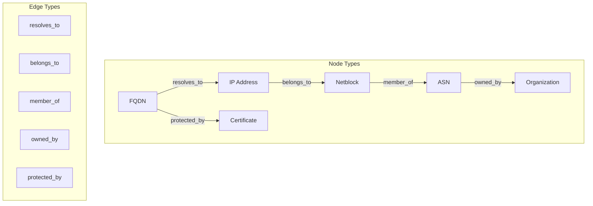
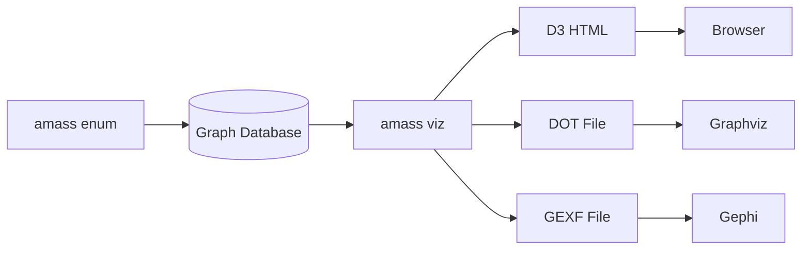

# viz - Visualization

The `viz` subcommand generates graph visualizations from discovered asset relationships.

## Synopsis

```bash
amass viz [options]
```

## Output Formats

| Flag | Format | Description |
|------|--------|-------------|
| `-d3` | D3.js HTML | Interactive browser visualization |
| `-dot` | DOT/Graphviz | Graph description language |
| `-gexf` | Gephi GEXF | Gephi graph format |

## Options

### Target Selection

| Flag | Description | Example |
|------|-------------|---------|
| `-d` | Domain names (comma-separated) | `-d example.com` |
| `-df` | File containing domain names | `-df domains.txt` |
| `-since` | Include assets after date | `-since "01/02 15:04:05 2006 MST"` |

### Output Options

| Flag | Description |
|------|-------------|
| `-o` | Output directory |
| `-oA` | Output file prefix |
| `-dir` | Data directory path |

## Examples

### D3.js Interactive Visualization

```bash
amass viz -d3 -d example.com -o /output
```

Creates an interactive HTML file viewable in any browser:

```
/output/
└── example.com_d3.html
```

### Graphviz DOT Format

```bash
amass viz -dot -d example.com -o /output
```

Output can be rendered with Graphviz:

```bash
dot -Tpng example.com.dot -o graph.png
dot -Tsvg example.com.dot -o graph.svg
```

### Gephi GEXF Format

```bash
amass viz -gexf -d example.com -o /output
```

Import into [Gephi](https://gephi.org/) for advanced analysis.

### Multiple Formats

```bash
amass viz -d3 -dot -gexf -d example.com -oA network_map
```

Creates:
```
network_map.html
network_map.dot
network_map.gexf
```

### Time-Bounded Visualization

```bash
amass viz -d3 -d example.com -since "06/01 00:00:00 2024 UTC" -o /output
```

## Graph Structure



## Visualization Workflow



## See Also

- [enum](enum.md) - Discover assets
- [subs](subs.md) - Subdomain analysis
- [assoc](assoc.md) - Association analysis
