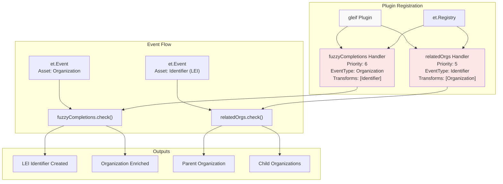
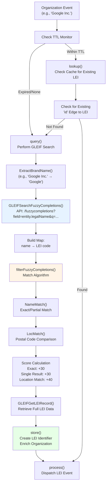
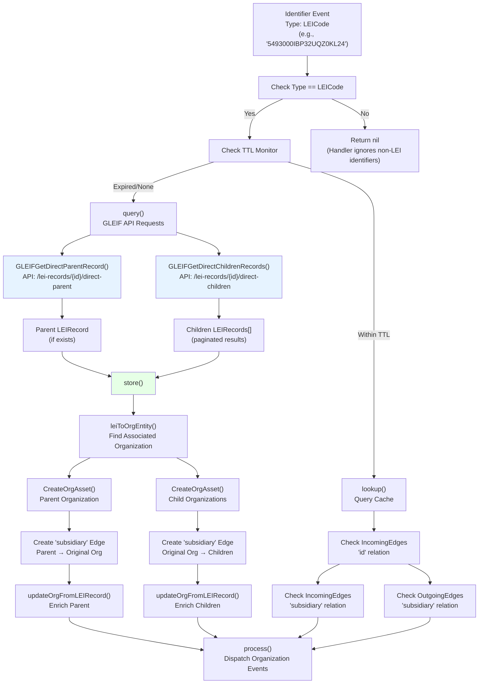
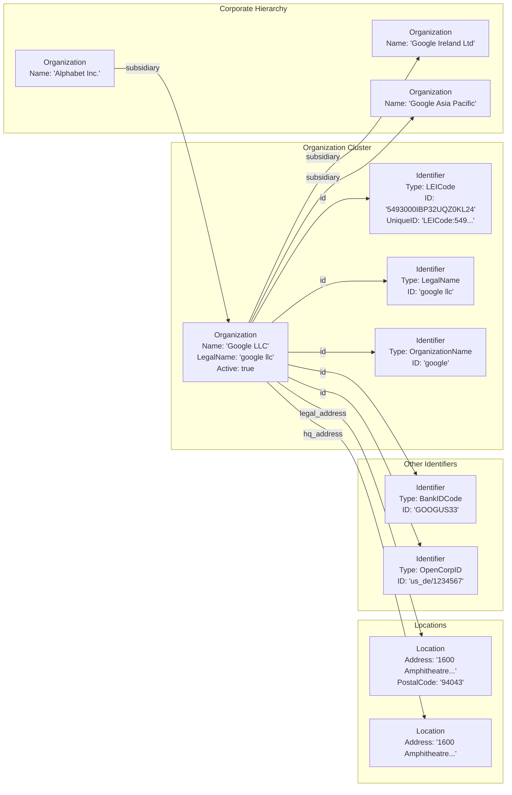

# GLEIF Plugin

The GLEIF Plugin integrates with the Global Legal Entity Identifier Foundation (GLEIF) API to discover and enrich organization data with Legal Entity Identifiers (LEI codes) and corporate hierarchy information. This plugin performs two primary functions: (1) searching for LEI codes associated with discovered organizations using fuzzy name matching, and (2) discovering parent and subsidiary relationships for organizations that have known LEI codes.

For information about other API integration plugins, see [API Integration Plugins](#6.3). For details on the Aviato plugin which also enriches organization data, see [Aviato Plugin](#6.3.2).

---

## Overview and Architecture

The GLEIF Plugin implements two event handlers that process different asset types in the discovery pipeline:

| Handler | Priority | Input Asset | Output Assets | Purpose |
|---------|----------|-------------|---------------|---------|
| `fuzzyCompletions` | 6 | `Organization` | `Identifier` (LEI), enriched `Organization` | Search for LEI codes via fuzzy name matching |
| `relatedOrgs` | 5 | `Identifier` (LEI) | `Organization` (parent/children) | Discover corporate hierarchy relationships |

The plugin uses a confidence-based source attribution system with a fixed confidence score of 100, as GLEIF is considered an authoritative source for legal entity information.

---

## Plugin Registration and Handler Flow



**Diagram: GLEIF Plugin Handler Registration and Event Processing**

The plugin registers two handlers during the `Start()` method. Both handlers check TTL (Time-To-Live) constraints before querying the GLEIF API to avoid redundant lookups within the configured TTL window.

---

## Fuzzy Completions Handler

### Purpose and Workflow

The `fuzzyCompletions` handler processes `Organization` events and attempts to find matching LEI codes using GLEIF's fuzzy completion search API. The workflow involves brand name extraction, API search, and sophisticated matching algorithms.



**Diagram: Fuzzy Completions Search Workflow**

### Brand Name Extraction

The plugin extracts the core brand name from organization names by removing common legal suffixes (e.g., "Inc", "LLC", "Ltd", "GmbH"). This is implemented using a regex pattern that matches these suffixes:

```
([a-zA-Z0-9]{1}[\sa-zA-Z0-9.\-']+)([,\s]{1,3})(Inc|LLC|Ltd|...)([.,\s]{0,3})$
```

The acronyms list includes variations like "Inc", "LLC", "LTD", "PLC", "SA", "S.A.", "AG", "GmbH", "AB", "Oy", "SARL", "S.A.R.L" and their case variations.

### Matching Algorithm and Scoring

The `filterFuzzyCompletions()` function implements a multi-stage scoring system:

| Match Type | Score | Condition |
|------------|-------|-----------|
| Exact name match | +30 | Organization name exactly matches GLEIF result |
| Single exact match | +30 | Only one exact match found (high confidence) |
| Location match | +40 | Postal code matches between org and LEI record |
| Partial match (base) | 0-30 | Smith-Waterman-Gotoh similarity score × 30 |
| Single partial match | +30 | Only one partial match found |

**String Similarity Algorithm:** The plugin uses the Smith-Waterman-Gotoh (SWG) algorithm with parameters:
- Case insensitive matching
- Gap penalty: -0.1
- Match score: 1
- Mismatch penalty: -0.5
- Minimum similarity threshold for partial matches: 0.85

### LEI Record Retrieval and Storage

Once a match is identified, the plugin retrieves the full LEI record via `GLEIFGetLEIRecord(lei)` and stores it:

1. **Create LEI Identifier Asset**: Type `general.LEICode` with format `LEICode:{lei_id}`
2. **Create `id` Relationship**: Links Organization → Identifier
3. **Enrich Organization Properties**: Updates legal name, addresses, registration info
4. **Create Location Assets**: Converts LEI addresses to `contact.Location` entities
5. **Add Additional Identifiers**: BIC, MIC, OpenCorpID, SPGlobalCompanyID codes

---

## Related Organizations Handler

### Purpose and Workflow

The `relatedOrgs` handler processes `Identifier` events where the identifier type is `LEICode`. It discovers parent and child organizations in the corporate hierarchy using GLEIF's relationship API endpoints.



**Diagram: Related Organizations Discovery Workflow**

### Direct Parent and Children Discovery

The plugin makes two separate API calls:

1. **Direct Parent**: `GET /api/v1/lei-records/{lei}/direct-parent`
   - Returns a single `LEIRecord` or null if no parent exists
   - Creates a `subsidiary` edge: Parent → Current Organization

2. **Direct Children**: `GET /api/v1/lei-records/{lei}/direct-children`
   - Returns paginated list of child `LEIRecord` entities
   - Follows `next` links until all pages are retrieved
   - Creates `subsidiary` edges: Current Organization → Each Child

---

## Organization Enrichment Process

### LEI Record Data Mapping

When a LEI record is retrieved, the `updateOrgFromLEIRecord()` function enriches the organization with the following data:

| LEI Field | OAM Field/Asset | Transformation |
|-----------|-----------------|----------------|
| `Attributes.Entity.LegalName.Name` | `Organization.LegalName` | Lowercased, stored as `LegalName` identifier |
| `Attributes.Entity.OtherNames[]` | `Identifier` (OrganizationName) | Multiple identifiers created |
| `Attributes.Entity.TransliteratedOtherNames[]` | `Identifier` (OrganizationName) | Multiple identifiers created |
| `Attributes.Entity.CreationDate` | `Organization.FoundingDate` | Direct copy |
| `Attributes.Entity.Jurisdiction` | `Organization.Jurisdiction` | Direct copy |
| `Attributes.Entity.RegisteredAs` | `Organization.RegistrationID` | Direct copy |
| `Attributes.Entity.Status` | `Organization.Active` | "ACTIVE" → true, else false |
| `Attributes.Entity.LegalAddress` | `contact.Location` | Converted via `buildAddrFromLEIAddress()` |
| `Attributes.Entity.HeadquartersAddress` | `contact.Location` | Linked with `hq_address` relation |
| `Attributes.Entity.OtherAddresses[]` | `contact.Location` | Multiple locations, `location` relation |
| `Attributes.BIC[]` | `Identifier` (BankIDCode) | Multiple identifiers |
| `Attributes.MIC[]` | `Identifier` (MarketIDCode) | Multiple identifiers |
| `Attributes.OCID` | `Identifier` (OpenCorpID) | Single identifier |
| `Attributes.SPGlobal[]` | `Identifier` (SPGlobalCompanyID) | Multiple identifiers |

### Address Conversion

LEI addresses are converted to OAM `contact.Location` entities using the `buildAddrFromLEIAddress()` function:

```
Format: "{street} {city} {province} {postalCode} {country}"
```

Where:
- `street` = joined `AddressLines[]`
- `province` = extracted from `Region` (removes country prefix if present, e.g., "US-CA" → "CA")

The resulting string is then processed by `StreetAddressToLocation()` to create a structured location asset.

---

## Data Model and Relationships



**Diagram: GLEIF Plugin Data Model - Organization and Related Entities**

All edges created by the plugin include `general.SourceProperty` with:
- `Source: "GLEIF"`
- `Confidence: 100`

---

## TTL and Caching Strategy

### TTL Configuration

The plugin uses TTL (Time-To-Live) checks to avoid redundant API queries. TTL values are configured per asset type transformation:

- **Fuzzy Completions**: TTL for `Organization` → `Identifier` transformation
- **Related Organizations**: TTL for `Identifier` → `Identifier` transformation (for LEI traversal)

The TTL start time is calculated using `support.TTLStartTime()` which reads from the session configuration.

### Monitoring Mechanism

The plugin marks assets as "monitored" using the `support.MarkAssetMonitored()` function, which creates a `last_monitored` property tag on the entity with the source name as the value. This prevents redundant queries:

```
If asset has "last_monitored" tag with value "GLEIF" within TTL window:
    → Skip API query, use cached data
Else:
    → Perform API query, mark as monitored
```

### Cache Lookup Process

Both handlers implement `lookup()` methods that query the session cache:

**Fuzzy Completions Lookup:**
1. Query for outgoing `id` edges from the Organization
2. Check if target is an Identifier with type `LEICode`
3. Verify edge has `SourceProperty` tag from GLEIF within TTL window
4. Return the LEI identifier if found

**Related Organizations Lookup:**
1. Query for incoming `id` edges to the LEI identifier → find Organization
2. Query for incoming `subsidiary` edges to the Organization → find Parent
3. Query for outgoing `subsidiary` edges from the Organization → find Children
4. Verify all edges have GLEIF source tags within TTL window

---

## GLEIF API Integration

### API Endpoints Used

The plugin interfaces with GLEIF API v1 through helper functions in `engine/plugins/support/org/gleif.go`:

| Function | Endpoint | Purpose |
|----------|----------|---------|
| `GLEIFSearchFuzzyCompletions(name)` | `GET /api/v1/fuzzycompletions?field=entity.legalName&q={name}` | Search for LEI records by name |
| `GLEIFGetLEIRecord(id)` | `GET /api/v1/lei-records/{id}` | Retrieve full LEI record details |
| `GLEIFGetDirectParentRecord(id)` | `GET /api/v1/lei-records/{id}/direct-parent` | Get direct parent organization |
| `GLEIFGetDirectChildrenRecords(id)` | `GET /api/v1/lei-records/{id}/direct-children` | Get all direct children (paginated) |

### Rate Limiting

All GLEIF API calls are rate-limited using a `golang.org/x/time/rate.Limiter` configured at initialization:

```go
limit := rate.Every(3 * time.Second)
gleifLimit = rate.NewLimiter(limit, 1)
```

This enforces a maximum rate of 1 request per 3 seconds (20 requests per minute), ensuring compliance with GLEIF API usage policies.

### Response Structures

The plugin expects specific JSON response structures:

**FuzzyCompletionsResponse:**
```
Data[] → {
  Type: "fuzzycompletions"
  Attributes.Value: matched name string
  Relationships.LEIRecords.Data.ID: LEI code
}
```

**LEIRecord (SingleResponse/MultipleResponse):**
```
Data → {
  Type: "lei-records"
  ID: LEI code
  Attributes → {
    Entity → { LegalName, OtherNames, Addresses, Status, ... }
    Registration → { Status, Dates, ... }
    BIC[], MIC[], OCID, SPGlobal[]
  }
}
```

---

## Code Organization

The GLEIF plugin is organized into several focused files:

| File | Purpose | Key Components |
|------|---------|----------------|
| `plugin.go` | Main plugin interface | `gleif` struct, `Start()`, `Stop()`, handler registration |
| `fuzzy.go` | Fuzzy completion search | `fuzzyCompletions` handler, matching algorithms |
| `related.go` | Hierarchy discovery | `relatedOrgs` handler, parent/child traversal |
| `org_lei.go` | Organization enrichment | `updateOrgFromLEIRecord()`, `addIdentifiersToOrg()`, `addAddress()` |
| `lei_record.go` | LEI identifier creation | `createLEIFromRecord()`, `buildAddrFromLEIAddress()` |
| `types.go` | Type definitions | `gleif`, `fuzzyCompletions`, `relatedOrgs` structs |

**Supporting files (outside plugin directory):**
- `engine/plugins/support/org/gleif.go` - GLEIF API client functions
- `engine/plugins/support/org/types.go` - GLEIF API response structures
- `engine/plugins/support/org/match.go` - Name matching utilities
