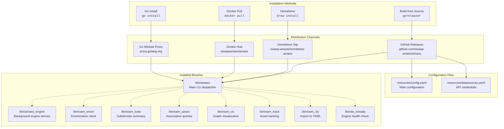
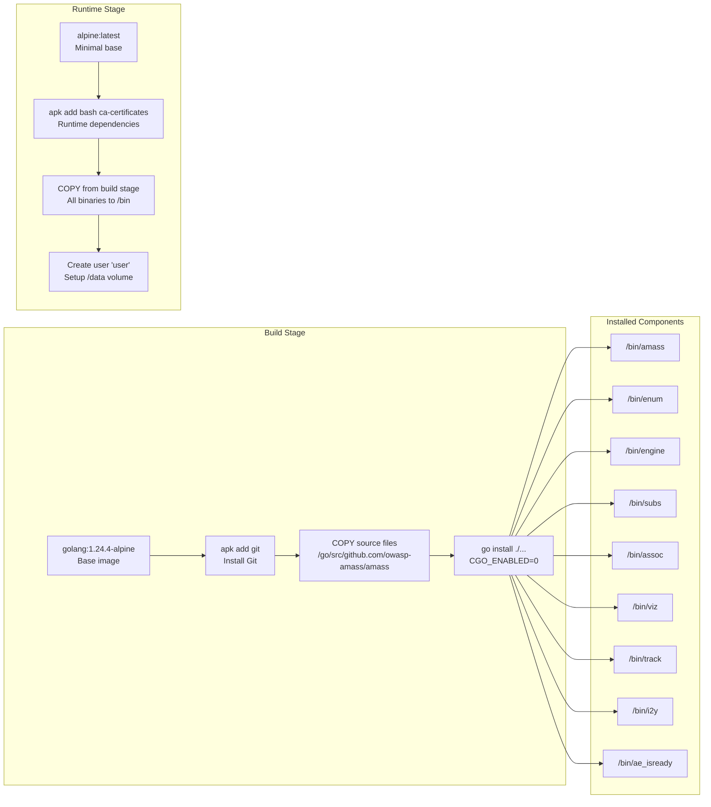
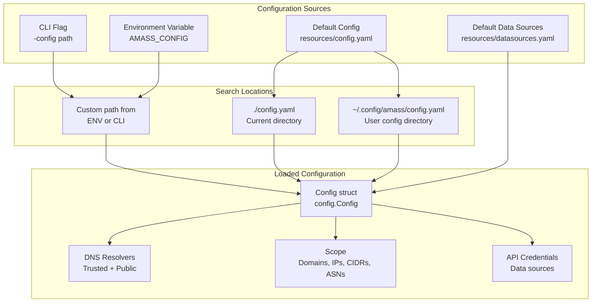
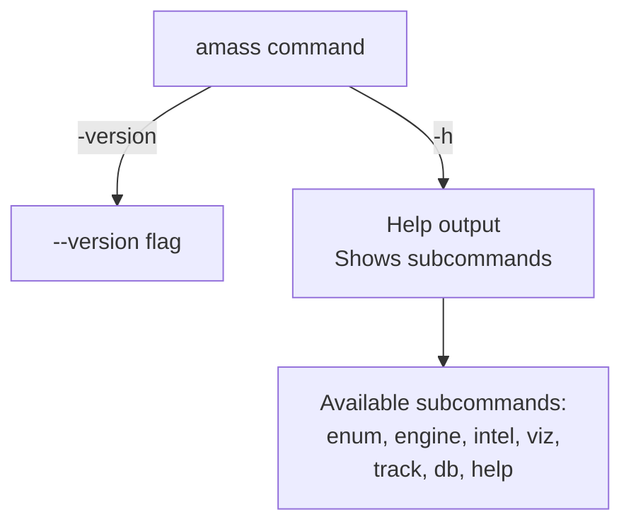
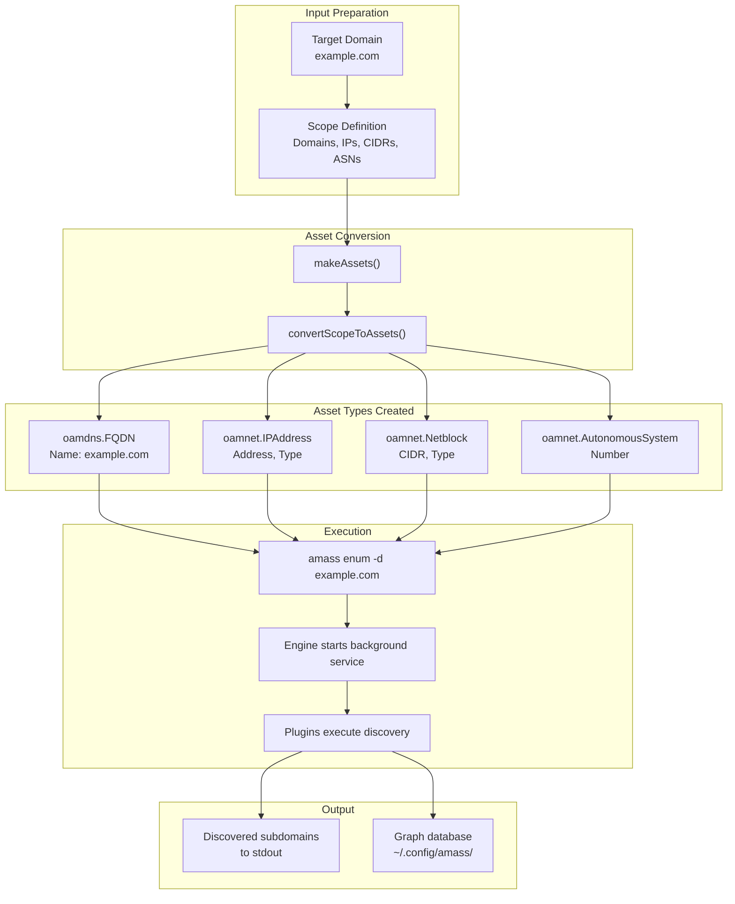

# Installation & Deployment

Multiple installation methods are available depending on your platform and use case.

## Installation Methods

### Installation Path Overview



### Go Install (Recommended for Developers)

Install directly from source using Go 1.24.0+:

```bash
CGO_ENABLED=0 go install github.com/owasp-amass/amass/v5/cmd/amass@latest
```

The binary will be available in `$GOPATH/bin`.

### Pre-built Releases

Binary packages are available from [GitHub Releases](https://github.com/owasp-amass/amass/releases) for multiple platforms:

| Platform | Architectures |
|----------|---------------|
| **Linux** | amd64, 386, arm, arm64, ARMv6, ARMv7 |
| **Windows** | amd64 |
| **macOS** | amd64, arm64 (Apple Silicon) |

Each release archive includes binaries, documentation, and default configuration files.

### Building from Source

For development or customization, build Amass from source.

```bash
# Clone the repository
git clone https://github.com/owasp-amass/amass.git
cd amass

# Build all binaries
go build -v ./cmd/...

# Or install to $GOPATH/bin
go install -v ./cmd/...
```

**Build Process:**



The repository uses GitHub Actions for automated testing and building:

| Workflow | Trigger | Purpose |
|----------|---------|---------|
| **tests** | Push to main/develop, PRs | Run test suite on 3 OS |
| **lint** | Push, PRs | Code quality checks |
| **goreleaser** | Tag push `v*.*.*` | Create releases |
| **docker** | Tag push `v*.*.*` | Build Docker images |

### Docker

```bash
# Pull the latest image
docker pull owaspamass/amass:latest

# Basic enumeration
docker run --rm owaspamass/amass enum -d example.com

# With persistent storage
docker run --rm -v /host/data:/data owaspamass/amass enum -d example.com
```

**Docker Image Details:**

| Property | Value |
|----------|-------|
| Registry | `owaspamass/amass` |
| Platforms | linux/amd64, linux/arm64 |
| Base | Alpine Linux |
| Security | Non-root user |

### Homebrew (macOS)

```bash
brew tap owasp-amass/homebrew-amass
brew install amass
```

## Included Binaries

The installation provides multiple executables:

| Binary | Purpose |
|--------|---------|
| `amass` | Main CLI entry point |
| `enum` | Primary asset discovery interface |
| `engine` | Core enumeration service |
| `ae_isready` | Health check utility |
| `subs` | Subdomain analysis tool |
| `assoc` | Asset association analyzer |
| `viz` | Graph visualization generator |
| `track` | Change detection tool |
| `i2y` | Data format converter |

## System Requirements

### Minimum Resources

| Resource | Minimum | Recommended |
|----------|---------|-------------|
| **RAM** | 512 MB | 2 GB+ |
| **Disk** | 100 MB | 1 GB+ |
| **Network** | Internet connectivity | Low-latency connection |

### Platform Support

- Linux (all distributions)
- macOS (Intel and Apple Silicon)
- Windows (64-bit)

## Configuration Directories

### Configuration File Locations



### System-wide Configuration

| Platform | Path |
|----------|------|
| Linux/macOS | `/etc/amass/` |
| Windows | `C:\ProgramData\amass\` |

### User Configuration

| Platform | Path |
|----------|------|
| Linux/macOS | `~/.config/amass/` |
| Windows | `%APPDATA%\amass\` |
| Docker | `/.config/amass/` |

## Docker Deployment

### Basic Usage

```bash
docker run --rm owaspamass/amass enum -d example.com
```

### With Volume Mounts

```bash
# Mount configuration
docker run --rm \
    -v /host/config:/.config/amass \
    owaspamass/amass enum -d example.com

# Mount output directory
docker run --rm \
    -v /host/output:/output \
    owaspamass/amass enum -d example.com -o /output/results.txt
```

### Docker Compose

For production deployments with PostgreSQL:

```bash
git clone https://github.com/owasp-amass/amass-docker-compose.git
cd amass-docker-compose

# Configure passwords in config/assetdb.env
# Update config/config.yaml with database credentials

docker compose run --rm enum -active -d example.com
```

## Verification

Validate successful installation:

```bash
# Check version
amass -version

# Display help
amass help

# Test enumeration (5 minute timeout)
amass enum -d example.com -timeout 5
```

### Expected Output Structure



## Quick Start Guide

### Basic Enumeration Workflow



### Running Your First Enumeration

```bash
# Enumerate a single domain
amass enum -d example.com

# Enumerate multiple domains
amass enum -d example.com,example.org

# Specify a custom configuration file
amass enum -config /path/to/config.yaml -d example.com

# Docker-based enumeration with persistent storage
mkdir -p ~/amass-output
docker run -v ~/amass-output:/data owaspamass/amass enum -d example.com
```

**Input to OAM asset type mapping:**

| Input Type | OAM Asset Type |
|-----------|----------------|
| Domain | `oamdns.FQDN{Name: "example.com"}` |
| IP Address | `oamnet.IPAddress{Address, Type}` |
| CIDR Range | `oamnet.Netblock{CIDR, Type}` |
| ASN | `oamnet.AutonomousSystem{Number}` |

## Next Steps

After completing the quick start, explore these resources:

| Topic | Description |
|-------|-------------|
| **Architecture** | Understanding system components |
| **CLI Commands** | Full command reference |
| **Configuration** | Advanced configuration options |
| **Data Sources** | Configuring API credentials |

### Common Next Actions

1. **Configure API Keys:** Add credentials to `datasources.yaml` for enhanced discovery.

2. **Run the Engine Service:** For continuous enumeration, run the engine as a background service:
   ```bash
   amass engine
   ```

3. **Analyze Results:** Use OAM tools to query and visualize collected data:
   ```bash
   oam_subs -d example.com
   oam_viz -d example.com -o graph.html
   ```

4. **Track Changes:** Monitor for new assets over time:
   ```bash
   oam_track -d example.com -since 2024-01-01
   ```

## Troubleshooting

### Common Issues

| Issue | Solution |
|-------|----------|
| Command not found | Ensure `$GOPATH/bin` is in `$PATH` |
| Permission denied | Check file permissions on config directories |
| Network errors | Verify DNS resolver connectivity |
| Out of memory | Increase available RAM or use `-timeout` |

### Docker Health Checks

Use the included `ae_isready` binary for container orchestration:

```bash
docker exec amass-container ae_isready
```
