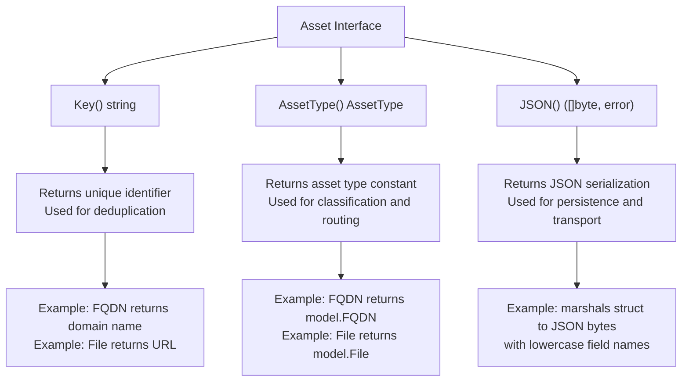
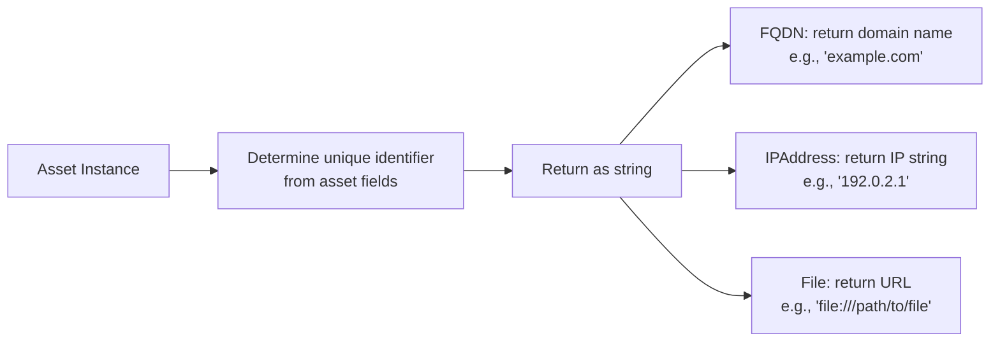
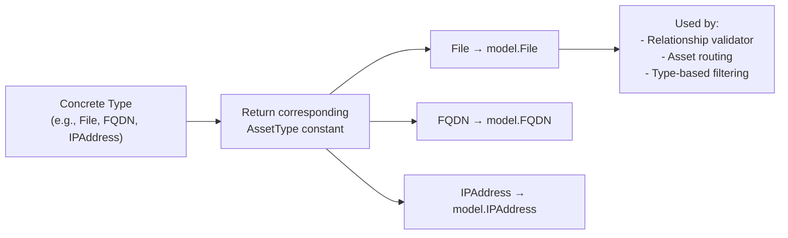
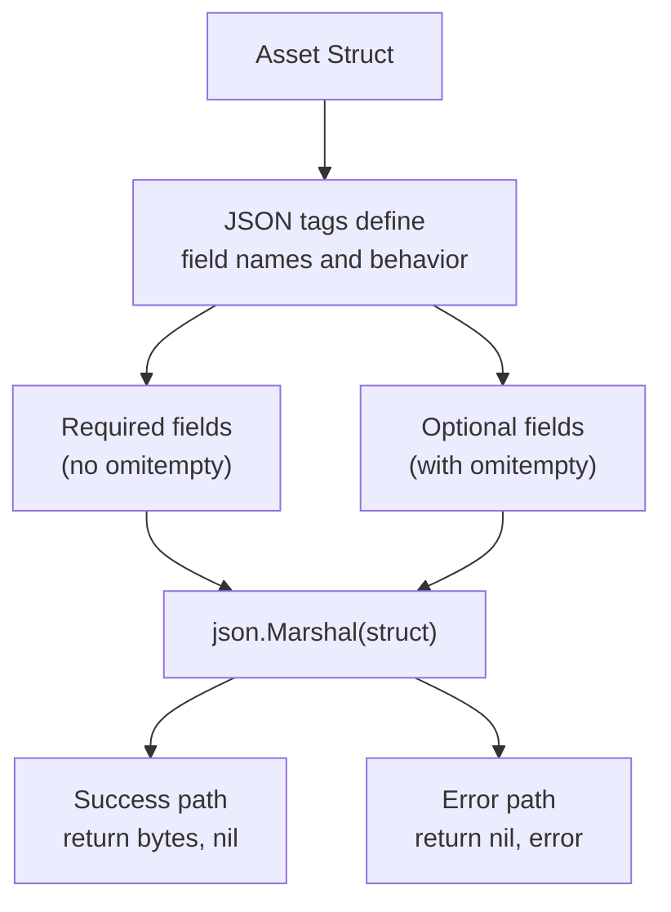
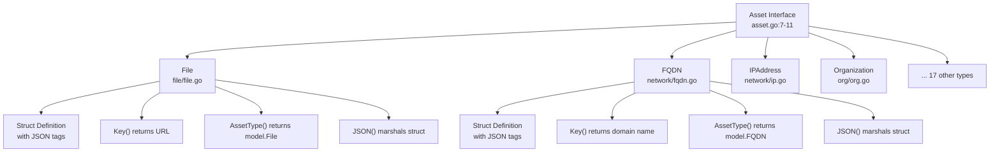
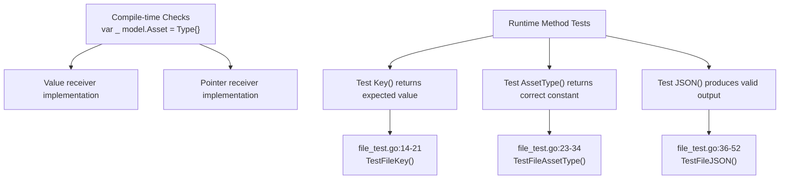
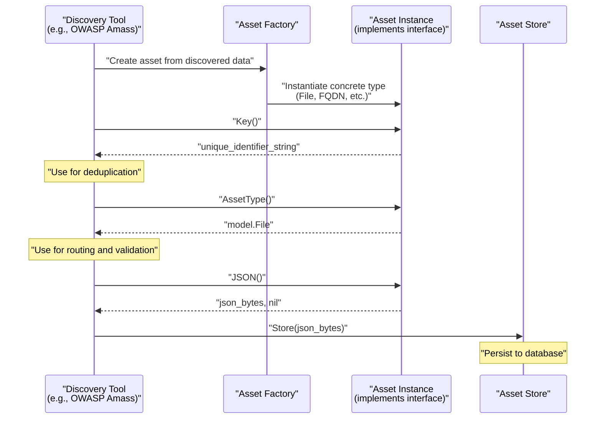

# Asset Interface

This document provides a detailed specification of the `Asset` interface, which forms the foundational abstraction layer of the open-asset-model. The interface defines three required methods that all asset types must implement: `Key()`, `AssetType()`, and `JSON()`. This page covers the interface contract, the `AssetType` enumeration containing 21 defined constants, method specifications, and implementation patterns.

For information about how assets connect through relationships, see [Relation Interface](#2.2). For information about asset metadata that doesn't establish relationships, see [Property Interface](#2.3). For detailed documentation of each asset type implementation, see [Asset Types](#3).

---

## Interface Contract

The `Asset` interface is defined in  and consists of three methods that enable polymorphic handling of all asset types throughout the system:

```go
type Asset interface {
    Key() string
    AssetType() AssetType
    JSON() ([]byte, error)
}
```

### Interface Methods and Their Contracts



---

## AssetType Enumeration

The `AssetType` is defined as a string type in  to enable human-readable serialization and extensibility. Twenty-one asset type constants are defined in , representing the complete taxonomy of assets the model can describe.

### Complete AssetType Constants

| Constant | Value | Domain | Description |
|----------|-------|--------|-------------|
| `Account` | "Account" | Identity/Financial | User accounts or financial accounts |
| `AutnumRecord` | "AutnumRecord" | Registration | WHOIS/RDAP autonomous system registration record |
| `AutonomousSystem` | "AutonomousSystem" | Network | Internet routing autonomous system |
| `ContactRecord` | "ContactRecord" | Organizational | Contact information from registration records |
| `DomainRecord` | "DomainRecord" | Registration | WHOIS/RDAP domain registration record |
| `File` | "File" | Digital | File discovered (document, image, etc.) |
| `FQDN` | "FQDN" | Network | Fully qualified domain name |
| `FundsTransfer` | "FundsTransfer" | Financial | Financial transaction between accounts |
| `Identifier` | "Identifier" | Identity | Standardized identifier (LEI, DUNS, etc.) |
| `IPAddress` | "IPAddress" | Network | IPv4 or IPv6 address |
| `IPNetRecord` | "IPNetRecord" | Registration | WHOIS/RDAP IP network registration record |
| `Location` | "Location" | Organizational | Physical location or address |
| `Netblock` | "Netblock" | Network | IP address range (CIDR block) |
| `Organization` | "Organization" | Organizational | Organization or company entity |
| `Person` | "Person" | Organizational | Individual person |
| `Phone` | "Phone" | Organizational | Phone number |
| `Product` | "Product" | Product | Technology product or software |
| `ProductRelease` | "ProductRelease" | Product | Specific version/release of a product |
| `Service` | "Service" | Digital | Network service (HTTP, SSH, etc.) |
| `TLSCertificate` | "TLSCertificate" | Digital | TLS/SSL certificate |
| `URL` | "URL" | Digital | Uniform resource locator |

### AssetList Array

A convenience array `AssetList` is provided in  containing all asset type constants. This array enables iteration over all defined asset types, useful for validation, documentation generation, or exhaustive testing.

```go
var AssetList = []AssetType{
    Account, AutnumRecord, AutonomousSystem, ContactRecord, DomainRecord, 
    File, FQDN, FundsTransfer, Identifier, IPAddress, IPNetRecord, Location, 
    Netblock, Organization, Person, Phone, Product, ProductRelease, Service, 
    TLSCertificate, URL,
}
```

---

## Method Specifications

### Key() Method

The `Key()` method returns a string that uniquely identifies the asset instance. This identifier is used for deduplication in asset stores and as a primary key in graph databases.

**Contract Requirements:**
- Must return a non-empty string for valid assets
- Must be deterministic (same asset produces same key)
- Must be unique within an asset type (two different FQDNs have different keys)
- Keys may collide across different asset types (acceptable, as type provides differentiation)

**Implementation Pattern:**



**Example from File implementation:**
```go
// file/file.go:21-23
func (f File) Key() string {
    return f.URL
}
```

The `File` type uses its URL field as the unique key. Other implementations follow similar patterns:
- `FQDN` returns the domain name
- `IPAddress` returns the IP address string
- `Organization` returns the organization name

### AssetType() Method

The `AssetType()` method returns the `AssetType` constant corresponding to the concrete implementation. This enables runtime type identification without reflection.

**Contract Requirements:**
- Must return the correct constant matching the implementation
- Must be a value from the defined 21 asset type constants
- Should return the same value for all instances of a given concrete type

**Implementation Pattern:**



**Example from File implementation:**
```go
// file/file.go:26-28
func (f File) AssetType() model.AssetType {
    return model.File
}
```

This method enables the relationship validation system to determine valid connections between assets (see [Relation Interface](#2.2)) and allows discovery tools to route assets to appropriate handlers.

### JSON() Method

The `JSON()` method serializes the asset to JSON format, enabling persistence, transport, and interoperability with other systems. The method returns both the byte slice and a potential error.

**Contract Requirements:**
- Must return valid JSON that can be deserialized
- Field names should follow Go JSON marshaling conventions (lowercase with underscores)
- Optional fields should use `omitempty` tag
- Must not include unexported fields
- Error should be returned only for marshaling failures (rare with properly structured data)

**Implementation Pattern:**



**Example from File implementation:**

The `File` struct defines JSON tags in :
```go
type File struct {
    URL  string `json:"url"`
    Name string `json:"name,omitempty"`
    Type string `json:"type,omitempty"`
}
```

The `JSON()` method implementation in :
```go
func (f File) JSON() ([]byte, error) {
    return json.Marshal(f)
}
```

**Example JSON output:**
```json
{
  "url": "file:///var/html/index.html",
  "name": "index.html",
  "type": "Document"
}
```

When `Name` or `Type` are empty strings, they are omitted from the JSON output due to the `omitempty` tag.

---

## Implementation Pattern

All concrete asset types follow a consistent implementation pattern. The diagram below illustrates the relationship between the interface, concrete types, and implementation requirements:



### Standard Implementation Checklist

When implementing a new asset type, follow this checklist:

1. **Define struct** with appropriate fields and JSON tags
   - Required fields: no `omitempty`
   - Optional fields: include `omitempty`
   - Use lowercase field names in JSON tags
   
2. **Implement Key() method**
   - Return a unique identifier for the asset
   - Choose a field that naturally serves as the primary key
   
3. **Implement AssetType() method**
   - Return the corresponding constant from 
   - Ensure the constant is already defined in the enumeration
   
4. **Implement JSON() method**
   - Use `json.Marshal()` for standard struct marshaling
   - Handle the error return (though rarely occurs)

5. **Add tests** (see Testing section below)

---

## Interface Compliance Testing

The codebase uses Go's compile-time interface compliance checks to ensure all asset types properly implement the `Asset` interface. This pattern is demonstrated in :

```go
var _ model.Asset = File{}       // Value receiver check
var _ model.Asset = (*File)(nil) // Pointer receiver check
```

### Testing Pattern



### Example Test Implementation

**Interface Compliance Check** ():
```go
func TestFileAssetType(t *testing.T) {
    var _ model.Asset = File{}       // Compile-time check
    var _ model.Asset = (*File)(nil) // Pointer check
    
    f := File{}
    expected := model.File
    actual := f.AssetType()
    
    if actual != expected {
        t.Errorf("Expected asset type %v but got %v", expected, actual)
    }
}
```

**Key() Method Test** ():
```go
func TestFileKey(t *testing.T) {
    want := "file:///var/html/index.html"
    f := File{URL: want, Name: "index.html", Type: "Document"}
    
    if got := f.Key(); got != want {
        t.Errorf("File.Key() = %v, want %v", got, want)
    }
}
```

**JSON() Method Test** ():
```go
func TestFileJSON(t *testing.T) {
    f := File{
        URL:  "file:///var/html/index.html",
        Name: "index.html",
        Type: "Document",
    }
    expected := `{"url":"file:///var/html/index.html","name":"index.html","type":"Document"}`
    actual, err := f.JSON()
    
    if err != nil {
        t.Errorf("Unexpected error: %v", err)
    }
    
    if !reflect.DeepEqual(string(actual), expected) {
        t.Errorf("Expected JSON %v but got %v", expected, string(actual))
    }
}
```

---

## AssetType Validation

The  file contains comprehensive validation of all 21 asset type constants, ensuring:

1. String values match expected names
2. All constants are defined
3. Count matches the expected number

This test serves as a regression check to prevent accidental modification of the asset type enumeration:

```go
func TestAssetTypeConstants(t *testing.T) {
    assetTypes := []AssetType{
        Account, AutnumRecord, AutonomousSystem, ContactRecord, DomainRecord,
        File, FQDN, FundsTransfer, Identifier, IPAddress, IPNetRecord,
        Location, Netblock, Organization, Person, Phone, Product,
        ProductRelease, Service, TLSCertificate, URL,
    }
    
    expectedTypes := []string{
        "Account", "AutnumRecord", "AutonomousSystem", "ContactRecord",
        "DomainRecord", "File", "FQDN", "FundsTransfer", "Identifier",
        "IPAddress", "IPNetRecord", "Location", "Netblock", "Organization",
        "Person", "Phone", "Product", "ProductRelease", "Service",
        "TLSCertificate", "URL",
    }
    
    // Validation logic...
}
```

---

## Usage in Discovery Workflows

The `Asset` interface enables polymorphic handling of discovered assets in reconnaissance tools. The following diagram illustrates how a discovery tool interacts with the interface:



The interface abstraction allows discovery tools to:
1. **Deduplicate** assets using `Key()` before storage
2. **Route** assets to appropriate handlers using `AssetType()`
3. **Serialize** assets using `JSON()` for persistence
4. **Process** heterogeneous asset collections uniformly

---

## Interface Design Rationale

The `Asset` interface follows several key design principles:

### Minimalist Interface

The three-method interface represents the **minimum required operations** for asset handling:
- Identity (`Key()`)
- Classification (`AssetType()`)
- Serialization (`JSON()`)

This minimalism ensures maximum flexibility for implementations while maintaining type safety.

### String-based AssetType

The choice of `string` as the underlying type for `AssetType` () rather than an integer enumeration enables:
- Human-readable JSON serialization
- Easier debugging and logging
- Extensibility without breaking existing code
- Self-documenting data exports

### JSON Method Signature

The `JSON()` method returns `([]byte, error)` matching Go's standard `json.Marshal()` signature, enabling:
- Consistent error handling patterns
- Integration with standard library conventions
- Flexibility for custom marshaling logic in implementations

---

## Related Interfaces

The `Asset` interface works in conjunction with two other core interfaces:

- **Relation Interface** ([see page 2.2](#2.2)): Connects assets through typed relationships
- **Property Interface** ([see page 2.3](#2.3)): Attaches metadata to assets without creating relationships

Together, these three interfaces form the complete abstraction layer for the open-asset-model.
