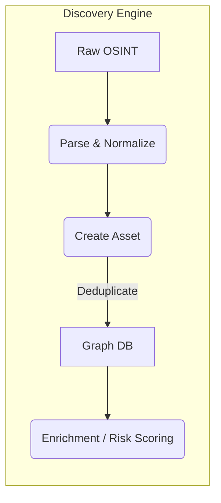
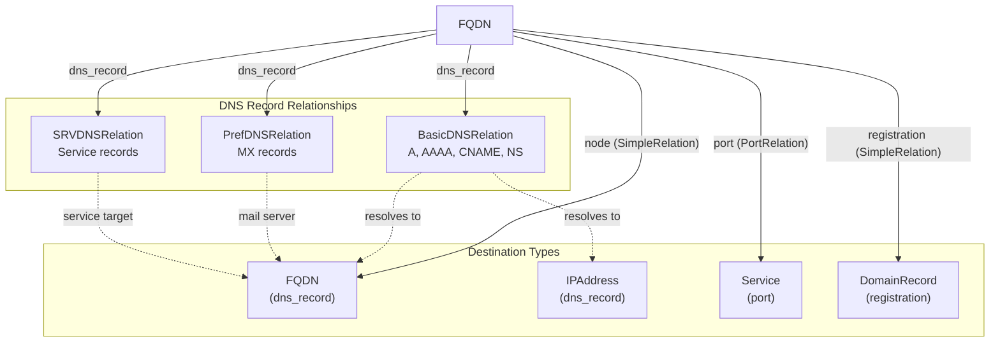
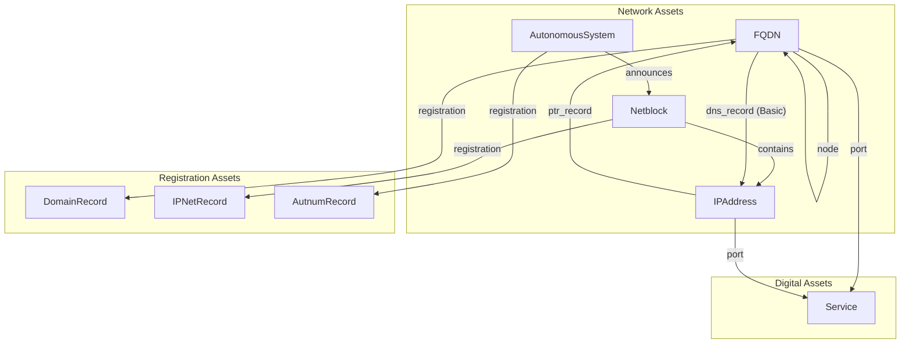
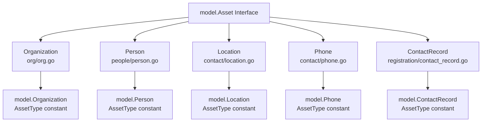
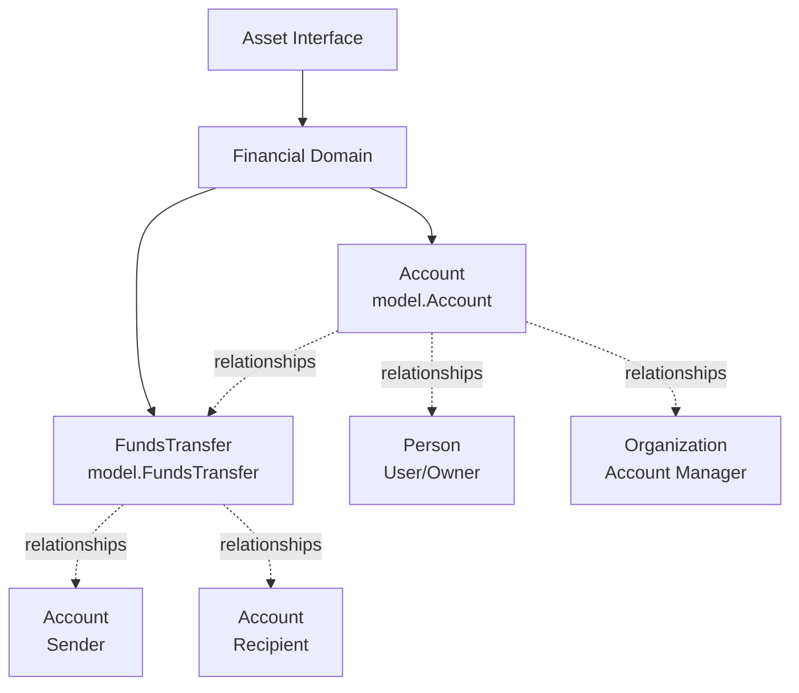
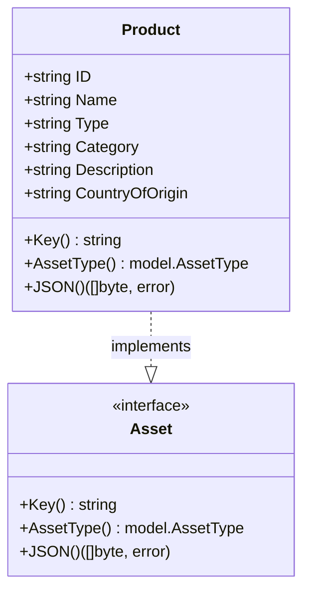
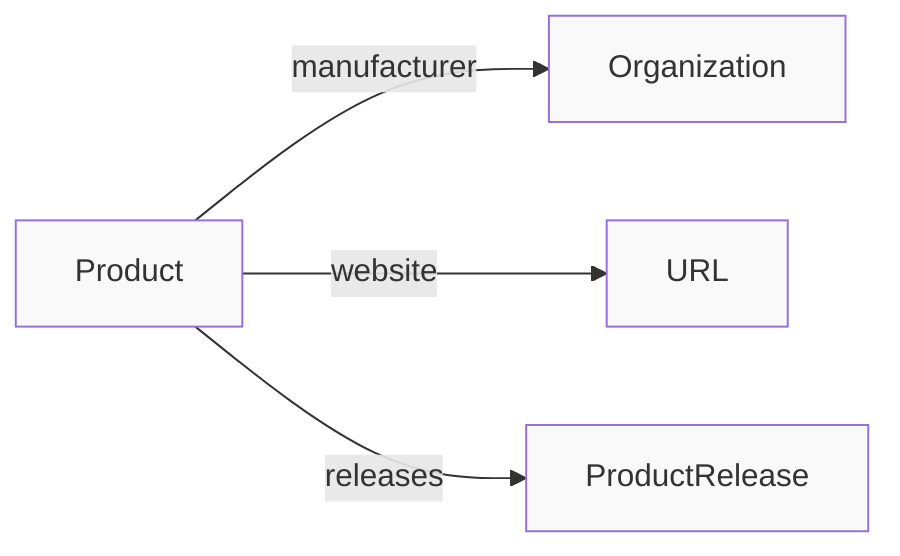

# :simple-owasp: Assets

In the [OWASP](https://owasp.org) [Open Asset Model](https://github.com/owasp-amass/open-asset-model), an asset represents any discrete, observable element in the external environment of an organization that holds security or operational relevance. Assets can range from technical resources like domain names and IP addresses to organizational constructs such as legal entities and brand names. What makes assets central to the model is that they serve as the primary objects of analysis—entities that can be discovered, attributed, linked, enriched, and ultimately assessed for risk. Each asset is uniquely identified, carries contextual metadata such as confidence and source of discovery, and participates in a web of typed relationships that form a dynamic, queryable graph of an organization's external footprint.

## :material-graph-outline: Why *Assets* Are the First‑Class Citizens

In the **Open Asset Model (OAM)**, *assets* are the atomic units of knowledge that describe an organization’s externally observable footprint.  Every other class in the model—attributes, properties, relations—exists to enrich or contextualize an asset.  By treating *everything discoverable* (from a DNS name to a cloud storage bucket) as an asset, we gain three strategic advantages:

1. **Uniform Vocabulary** – Analysts, tools, and automation pipelines can exchange data without bespoke translation layers.
2. **Composable Reasoning** – Graph analytics, enrichment, and risk scoring can be applied consistently because every node shares a common set of metadata fields (`id`, `confidence`, `source` …).
3. **Auditability** – Each asset retains a pointer to discovery provenance, making it trivial to reproduce findings or trace errors.

## :material-graph-outline: Asset Definition

> **Asset**: *An identifiable object—digital, network, or legal—that an organization owns, operates, or relies on and that can be observed from outside the security perimeter.*

An asset is **not** just a label; it is a self‑contained document that answers three questions:

1. **What is it?**
   A type‑specific schema (e.g., *FQDN*, *TLSCertificate*, *AutonomousSystem*).
2. **Where did it come from?**
   One or more *DiscoveryMethods* with timestamps and collection method.
3. **How certain are we?**
   A *confidence* score that downstream pipelines can use to gate actions.

## :material-graph-outline: Asset Taxonomy (Partial)

| Category               | Example Asset Types                                    | Typical Sources                       |
| ---------------------- | ------------------------------------------------------ | ------------------------------------- |
| **Network & DNS**      | `FQDN`, `IPAddress`, `AutonomousSystem`, `Netblock` | DNS enumeration, passive DNS, RDAP |
| **Products & Services**       | `Product`, `ProductRelease`, `Service`      | DNS, Port scanning, banner grabbing    |
| **Organization**       | `Organization`, `Account`, `FundsTransfer`                 | GLEIF, business registries       |
| **Identity & Contact** | `ContactRecord`, `Identifier`, `Phone`, `Location`         | TLS certs, WHOIS, RDAP, websites     |
| **Cryptographic**      | `TLSCertificate`                             | CT logs, public websites         |

*This list is intentionally open‑ended; community pull requests routinely add new asset types as technology evolves.*

## :material-graph-outline: Core Asset Attributes

Every asset embeds a minimal yet powerful set of metadata:

```json
type: "FQDN"
created_at: "2025-06-11"
last_seen: "2025-06-27"
```

Additional attributes are type‑specific—for instance, an `IPAddress` has the **address** field, while an `Organization` stores jurisdiction and registration numbers.

## :material-graph-outline: Relationships: Building the Graph

Assets rarely exist in isolation.  The model expresses **typed, directed edges** such as:

- `dns_record` – *FQDN* → *IPAddress*
- `contains` – *Netblock* → *IPAddress*
- `announces` – *AutonomousSystem* → *Netblock*
- `registration` – *Netblock* → *IPNetRecord*

These links turn the asset collection into a searchable **property graph**, enabling path‑finding queries like *“Which IP ranges host domains that roll up to Acme Corp’s legal entities?”*

## :material-graph-outline: Lifecycle in the Discovery Pipeline



1. **Parse & Normalize** – A discovery plugin converts evidence into the canonical asset schema.
2. **Create Asset** – New or updated asset documents are emitted with provenance.
3. **Deduplicate** – The graph layer merges assets sharing the same unique `key`.
4. **Enrichment** – Plugins append properties, such as alternative names, vulnerabilities, etc.
5. **Analytics & Export** – Downstream tools run path queries, generate reports, or feed alerting pipelines.

## :material-graph-outline: Quick Example: From Evidence to Asset

Imagine Amass extracts the email address *security@example.com* from the footer of *www.example.com*:

```text
Source URL: https://www.example.com
Evidence: "Contact us at security@example.com for vulnerabilities."
```

The *web scraper* module produces:

```json
type: "ContactRecord"
discovered_at: "http://www.example.com"
created_at: "2025-06-28"
last_seen: "2025-06-28"
```

An edge will be created between the **ContactRecord** and **Identifier** containing the email address (security@example.com). Future encounters with the same email address will reference the same asset in the graph.

## :material-graph-outline: Where to Go Next

Take a look at the pages where details are provided for each asset type.

- [Relations](../relations/index.md) – Overview of Relations in the Open Asset Model.
- [Properties](../properties/index.md) - Overview of a Property in the Open Asset Model.
- [Triples](../../asset_db/triples.md) – Querying the graph with SPARQL‑inspired triples.


## Asset Categories

### Asset Type Taxonomy

The asset types are organized into seven logical domains, reflecting the holistic approach to attack surface modeling:

```mermaid
graph TD
    Root["Asset Type Taxonomy<br/>21 Total Types"]

    Network["Network Domain<br/>(6 types)"]
    Organizational["Organizational Domain<br/>(5 types)"]
    Digital["Digital Domain<br/>(5 types)"]
    Financial["Financial Domain<br/>(2 types)"]
    Product["Product Domain<br/>(2 types)"]
    Registration["Registration Domain<br/>(4 types)"]
    Identity["Identity Domain<br/>(2 types)"]

    Root --> Network
    Root --> Organizational
    Root --> Digital
    Root --> Financial
    Root --> Product
    Root --> Registration
    Root --> Identity

    Network --> FQDN["FQDN"]
    Network --> IPAddress["IPAddress"]
    Network --> Netblock["Netblock"]
    Network --> AS["AutonomousSystem"]
    Network --> IPNetRec["IPNetRecord"]
    Network --> AutnumRec["AutnumRecord"]

    Organizational --> Org["Organization"]
    Organizational --> Person["Person"]
    Organizational --> Location["Location"]
    Organizational --> Phone["Phone"]
    Organizational --> Contact["ContactRecord"]

    Digital --> File["File"]
    Digital --> URL["URL"]
    Digital --> Service["Service"]
    Digital --> TLS["TLSCertificate"]
    Digital --> DomainRec["DomainRecord"]

    Financial --> Account1["Account"]
    Financial --> Transfer["FundsTransfer"]

    Product --> Prod["Product"]
    Product --> Release["ProductRelease"]

    Registration --> DomainRec2["DomainRecord"]
    Registration --> AutnumRec2["AutnumRecord"]
    Registration --> IPNetRec2["IPNetRecord"]
    Registration --> Contact2["ContactRecord"]

    Identity --> Account2["Account"]
    Identity --> Identifier["Identifier"]
```



The following table catalogs all 21 asset types with their primary domain classification:

| Asset Type | Primary Domain | Description |
|------------|----------------|-------------|
| `Account` | Identity / Financial | User accounts and authentication credentials |
| `AutnumRecord` | Registration / Network | AS number registration records from RIR databases |
| `AutonomousSystem` | Network | BGP autonomous system numbers |
| `ContactRecord` | Registration / Organizational | Contact information from registration databases |
| `DomainRecord` | Registration / Digital | Domain name registration records from WHOIS/RDAP |
| `File` | Digital | Files such as documents, images, or other artifacts |
| `FQDN` | Network | Fully qualified domain names |
| `FundsTransfer` | Financial | Financial transactions and money movement |
| `Identifier` | Identity | Various organizational and entity identifiers (LEI, DUNS, etc.) |
| `IPAddress` | Network | IPv4 and IPv6 addresses |
| `IPNetRecord` | Registration / Network | IP network allocation records from RIR databases |
| `Location` | Organizational | Physical addresses and geographic locations |
| `Netblock` | Network | CIDR network blocks |
| `Organization` | Organizational | Companies, institutions, and organizational entities |
| `Person` | Organizational | Individual people |
| `Phone` | Organizational | Telephone numbers |
| `Product` | Product | Technology products and software |
| `ProductRelease` | Product | Specific versions or releases of products |
| `Service` | Digital | Network services running on infrastructure |
| `TLSCertificate` | Digital | X.509 TLS/SSL certificates |
| `URL` | Digital | Universal resource locators |

### Network Assets

The network domain defines four asset types that model Internet infrastructure:

| Asset Type | Purpose | Key Format | Primary Use Case |
|------------|---------|------------|------------------|
| `FQDN` | Fully Qualified Domain Name | Domain name string | DNS hierarchy, hostnames |
| `IPAddress` | IP address (v4 or v6) | IP address string | Network endpoints, routing |
| `Netblock` | IP address range in CIDR notation | CIDR string (e.g., "192.168.1.0/24") | IP allocation, ownership |
| `AutonomousSystem` | AS number representing routing domain | AS number as string | BGP routing, ISP identification |

#### FQDN Relationships



#### Network Asset Relationship Graph



### Organizational Assets

The organizational domain models business entities, individuals, and their contact information:

| Asset Type | Package | Purpose |
|------------|---------|---------|
| `Organization` | `org/org.go` | Corporate entities, nonprofits, and other business organizations |
| `Person` | `people/person.go` | Individual people with biographical information |
| `Location` | `contact/location.go` | Physical addresses and geographic locations |
| `Phone` | `contact/phone.go` | Telephone contact information with E.164 formatting |
| `ContactRecord` | `registration/contact_record.go` | Registration contact details |



### Financial Assets

The financial domain contains two asset types that model financial systems:



**Account field specifications:**

| Field | JSON Key | Type | Required | Description |
|-------|----------|------|----------|-------------|
| `ID` | `unique_id` | `string` | Yes | Unique identifier for the account; serves as the asset key |
| `Type` | `account_type` | `string` | Yes | Type classification of the account (e.g., "ACH", "checking", "savings") |
| `Username` | `username` | `string` | No | Username associated with the account for access |
| `Number` | `account_number` | `string` | No | Account number (e.g., bank account number) |
| `Balance` | `balance` | `float64` | No | Current balance of the account |
| `Active` | `active` | `bool` | No | Whether the account is currently active |

**FundsTransfer field specifications:**

| Field | JSON Key | Type | Required | Description |
|-------|----------|------|----------|-------------|
| `ID` | `unique_id` | `string` | Yes | Unique identifier for the transfer; serves as the asset key |
| `Amount` | `amount` | `float64` | Yes | Monetary amount of the transfer |
| `ReferenceNumber` | `reference_number` | `string` | No | Reference or tracking number for the transaction |
| `Currency` | `currency` | `string` | No | Currency code for the transfer (e.g., "USD", "EUR") |
| `Method` | `transfer_method` | `string` | No | Transfer method or mechanism (e.g., "ACH", "wire", "SWIFT") |
| `ExchangeDate` | `exchange_date` | `string` | No | Date/time of currency exchange (ISO 8601 format) |
| `ExchangeRate` | `exchange_rate` | `float64` | No | Exchange rate applied if currency conversion occurred |

### Product Assets

The product domain defines two asset types for tracking technology products:

| Asset Type | AssetType Constant | Purpose | Key Field |
|------------|-------------------|---------|-----------|
| `Product` | `model.Product` | Represents a technology product | `ID` (unique identifier) |
| `ProductRelease` | `model.ProductRelease` | Represents a specific version/release of a product | `Name` (release name/version) |





---

*© 2025 Jeff Foley — Licensed under Apache 2.0.*
