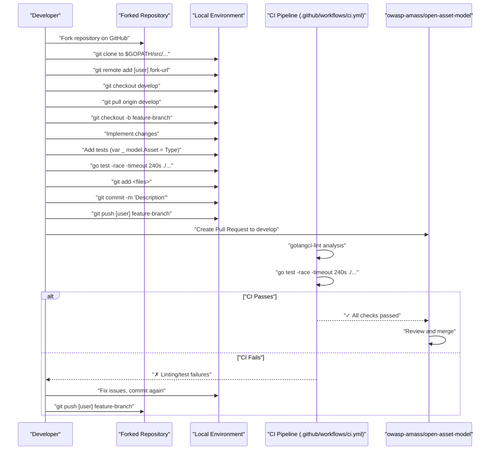
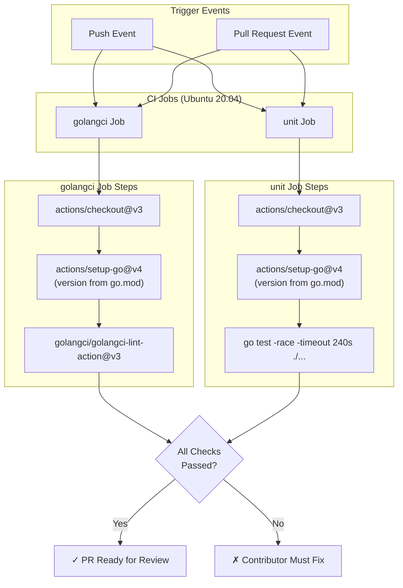
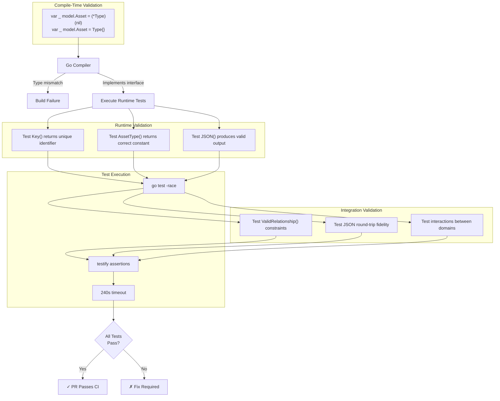

# Contributing Guide

This document explains how to contribute to the Open Asset Model project, including development setup, the fork-and-pull contribution workflow, CI pipeline requirements, coding standards, and testing practices. For information on implementing new asset types or relationships, see [Implementation Patterns](#6).

**Sources:** , 

---

## Development Prerequisites

The Open Asset Model requires the following for local development:

| Requirement | Version | Purpose |
|------------|---------|---------|
| Go | 1.19+ | Primary language runtime |
| git | Any recent | Source control and contribution workflow |
| golangci-lint | Latest | Static analysis and linting |

The project uses a minimal dependency footprint, requiring only the `testify` testing framework for assertions and test utilities.

**Sources:** , 

---

## Repository Setup

The Open Asset Model uses a **fork-and-pull contribution model**. This section outlines the correct way to configure your local repository to maintain proper import path resolution for Go modules.

### Cloning with Correct Import Paths

The repository must be cloned to a specific location within your `$GOPATH` to ensure Go resolves import paths correctly:

```bash
git clone https://github.com/owasp-amass/open-asset-model $GOPATH/src/github.com/owasp-amass/open-asset-model
cd $GOPATH/src/github.com/owasp-amass/open-asset-model
```

After cloning the upstream repository, add your fork as a secondary remote:

```bash
git remote add [github-user] https://github.com/[github-user]/open-asset-model
```

This configuration sets `owasp-amass` as the origin remote and your fork as a named remote for pushing changes.

### Development Branch Workflow

All contributions must branch from and merge into the `develop` branch:

```bash
# Ensure develop branch is current
git checkout --track origin/develop
git pull origin develop

# Create feature/fix branch
git checkout -b [fix-or-improvement-name]
```

**Sources:** 

---

## Contribution Workflow

The following diagram illustrates the complete contribution lifecycle from fork to merge:

**Diagram: Fork-and-Pull Contribution Flow**



**Sources:** , 

### Commit Guidelines

When committing changes:

1. Stage modified files: `git add <updated files>`
2. Write descriptive commit messages: `git commit -m "A short description of the changes"`
3. Push to your fork: `git push [github-user] [fix-or-improvement-name]`

**Important constraints:**
- All commits must target the `develop` branch
- Force pushing is prohibited; update PRs with additional commits
- PRs must be rebased/merged with current `develop` before submission

**Sources:** 

---

## Continuous Integration Pipeline

The CI pipeline enforces code quality through two parallel jobs: `golangci` (linting) and `unit` (testing). Both jobs must pass before a pull request can be merged.

**Diagram: CI Pipeline Architecture**



**Sources:** 

### Job: golangci (Linting)

The `golangci` job performs static analysis to catch:
- Code style violations
- Common programming errors
- Inefficient code patterns
- Security vulnerabilities

The job runs the `golangci/golangci-lint-action@v3` GitHub Action, which executes multiple linters in parallel.

**Sources:** 

### Job: unit (Testing)

The `unit` job executes all tests with race detection enabled:

```bash
go test -race -timeout 240s ./...
```

| Flag | Purpose |
|------|---------|
| `-race` | Enables Go's race detector to catch concurrent access bugs |
| `-timeout 240s` | Allows up to 4 minutes for test execution |
| `./...` | Runs tests in all packages recursively |

The 240-second timeout accommodates comprehensive relationship validation tests that verify the constraint taxonomy.

**Sources:** 

---

## Coding Standards

### Interface Compliance Pattern

All asset types must implement the `Asset` interface defined in . The standard pattern for verifying interface compliance at compile-time uses type assertion:

```go
// Compile-time interface compliance check
var _ model.Asset = (*TypeName)(nil)
var _ model.Asset = TypeName{}
```

This pattern appears in every asset test file (e.g., `file_test.go`, `fqdn_test.go`, `org_test.go`) and ensures both value and pointer receivers satisfy the interface.

**Sources:** 

### JSON Serialization Standards

All asset implementations must provide a `JSON()` method that returns `[]byte`. The method should:

1. Use `json.Marshal()` for struct serialization
2. Apply `omitempty` tags to optional fields
3. Return proper error handling for marshaling failures
4. Use consistent field naming conventions (snake_case or camelCase)

Example field tag pattern from asset implementations:

```go
type ExampleAsset struct {
    RequiredField string `json:"required_field"`
    OptionalField string `json:"optional_field,omitempty"`
}
```

---

## Testing Requirements

Every contribution that adds or modifies functionality must include corresponding tests. The testing architecture follows a three-layer validation strategy.

**Diagram: Testing Architecture and Validation Layers**



**Sources:** , 

### Required Test Coverage

For each new asset type, the test file must include:

| Test Category | Example Pattern | Purpose |
|--------------|----------------|---------|
| Interface compliance | `var _ model.Asset = (*FQDN)(nil)` | Compile-time verification |
| Key() method | `assert.Equal(t, expected, asset.Key())` | Validates unique identifier |
| AssetType() method | `assert.Equal(t, model.FQDN, asset.AssetType())` | Validates type constant |
| JSON() method | `assert.NotNil(t, asset.JSON())` | Validates serialization |
| Field validation | Test all struct fields | Ensures data integrity |

### Using testify for Assertions

The project uses `github.com/stretchr/testify` for test assertions. Example patterns:

```go
import (
    "testing"
    "github.com/stretchr/testify/assert"
)

func TestAssetImplementation(t *testing.T) {
    asset := NewAsset(params)
    
    assert.NotEmpty(t, asset.Key())
    assert.Equal(t, model.ExpectedType, asset.AssetType())
    assert.NotNil(t, asset.JSON())
}
```

**Sources:** 

---

## Pull Request Process

### Creating a Pull Request

After pushing your branch to your fork:

1. Navigate to the upstream repository: `https://github.com/owasp-amass/open-asset-model`
2. Click "Pull requests" → "New pull request"
3. Select "compare across forks"
4. Set base repository to `owasp-amass/open-asset-model`, base branch to `develop`
5. Set head repository to your fork, compare branch to your feature branch
6. Fill out the pull request template with:
   - Description of changes
   - Motivation and context
   - Testing performed
   - Related issues (if applicable)

**Sources:** 

### Pull Request Checklist

Before submitting, verify:

- [ ] Branch is up-to-date with `develop`
- [ ] All tests pass locally: `go test -race -timeout 240s ./...`
- [ ] golangci-lint passes: `golangci-lint run`
- [ ] New asset types include interface compliance checks
- [ ] New functionality includes corresponding tests
- [ ] JSON serialization is tested for new types
- [ ] Commit messages are descriptive
- [ ] No force pushes in commit history

### After Submission

Monitor your pull request for:

1. **CI Status Checks**: Both `golangci` and `unit` jobs must pass
2. **Review Comments**: Maintainers may request changes
3. **Merge Conflicts**: Rebase if `develop` has advanced

If CI fails:
- Review the CI logs in the GitHub Actions tab
- Fix issues locally
- Commit the fixes (do not amend or force push)
- Push the new commits to your branch

The CI pipeline will automatically re-run on new commits.

**Sources:** , 

---

## Getting Help

If you need assistance or guidance during the contribution process:

| Resource | Purpose | URL |
|----------|---------|-----|
| Discord Server | Real-time community discussion | https://discord.gg/HNePVyX3cp |
| GitHub Issues | Report bugs, suggest features | https://github.com/owasp-amass/open-asset-model/issues |
| CONTRIBUTING.md | Full contribution guidelines |  |

The community welcomes questions about:
- Taxonomy improvements
- New asset type proposals
- Implementation guidance
- Testing strategies
- Relationship modeling patterns

**Sources:** , 

---

## Summary Table: Contribution Requirements

| Aspect | Requirement | Validation |
|--------|-------------|------------|
| **Branch Target** | `develop` | PR base branch check |
| **Import Path** | `$GOPATH/src/github.com/owasp-amass/open-asset-model` | Build success |
| **Go Version** | 1.19+ | CI environment check |
| **Testing** | Race-enabled, 240s timeout | `go test -race -timeout 240s ./...` |
| **Linting** | Pass golangci-lint | `golangci/golangci-lint-action@v3` |
| **Interface Compliance** | `var _ model.Asset = Type` | Compile-time check |
| **Force Pushing** | Prohibited | PR history review |
| **Dependencies** | Minimal, justify additions | go.mod review |

**Sources:** , , 
