# Implementation Guide

This guide covers the standard patterns, best practices, and testing strategies for implementing new types within the Open Asset Model. It draws from concrete examples across `Account`, `File`, `Product`, `ProductRelease`, and `FundsTransfer` asset types.

---

## The Three-Method Pattern

All asset types follow a consistent three-method implementation pattern. The `Asset` interface requires exactly three methods, each serving a specific purpose in the asset lifecycle.

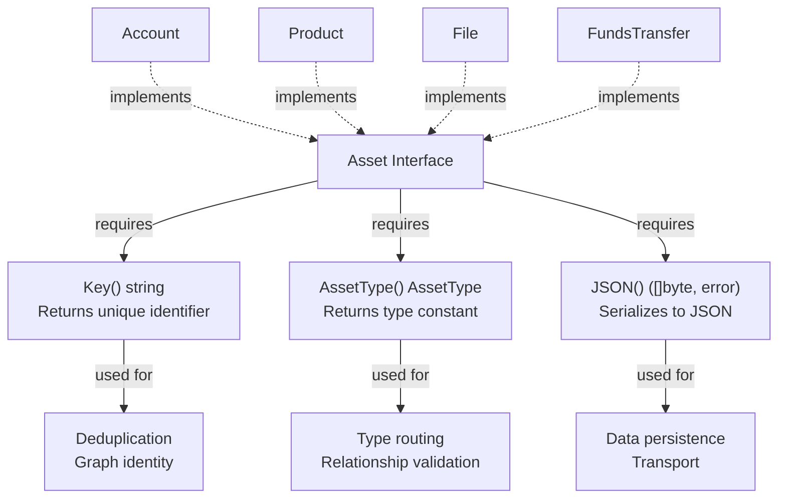

| Method | Return Type | Purpose | Implementation Notes |
|--------|-------------|---------|---------------------|
| `Key()` | `string` | Unique identifier for deduplication and graph indexing | Must be stable and deterministic for the same logical entity |
| `AssetType()` | `AssetType` | Returns the type constant for this asset | Must return one of the constants defined in `asset.go` |
| `JSON()` | `([]byte, error)` | Serializes the asset to JSON format | Uses `encoding/json.Marshal` on the struct |

---

## Struct Design Pattern

Asset implementations follow consistent struct design conventions that ensure compatibility with the model's serialization and validation systems.

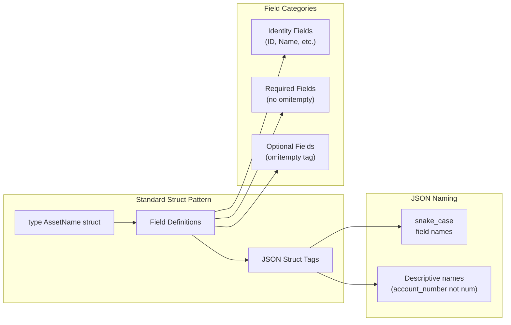

### JSON Tag Conventions

| Pattern | Usage | Example |
|---------|-------|---------|
| `json:"field_name"` | Required fields always present in output | `json:"unique_id"` |
| `json:"field_name,omitempty"` | Optional fields omitted when zero-value | `json:"username,omitempty"` |
| Snake case naming | All JSON field names | `account_number`, `release_date`, `product_type` |
| Descriptive names | Full words over abbreviations | `account_number` not `acct_num` |

**Example from Account:**

```go
type Account struct {
    ID       string  `json:"unique_id"`
    Type     string  `json:"account_type"`
    Username string  `json:"username,omitempty"`
    Number   string  `json:"account_number,omitempty"`
    Balance  float64 `json:"balance,omitempty"`
    Active   bool    `json:"active,omitempty"`
}
```

---

## Key() Implementation Strategies

The `Key()` method must return a stable, unique identifier for each asset instance. The codebase demonstrates three primary strategies:

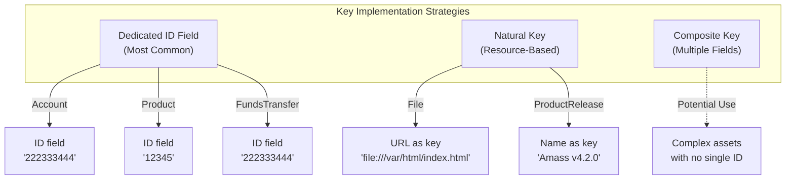

| Strategy | When to Use | Examples | Pros | Cons |
|----------|-------------|----------|------|------|
| **Dedicated ID Field** | Assets with externally-assigned identifiers | Account, Product, FundsTransfer | Simple, explicit, unchanging | Requires ID generation |
| **Natural Key** | Assets with inherent unique identifiers | File (URL), ProductRelease (Name) | No extra field needed, self-documenting | Key may be long |
| **Composite Key** | Assets requiring multiple fields for uniqueness | Not yet used in codebase | Handles complex cases | More complex implementation |

```go
// Pattern 1: Dedicated ID Field
func (a Account) Key() string {
    return a.ID
}

// Pattern 2: Natural Key
func (f File) Key() string {
    return f.URL
}
```

---

## AssetType() Implementation Pattern

The `AssetType()` method always returns the corresponding constant from the `AssetType` enumeration. This method is identical across all implementations.

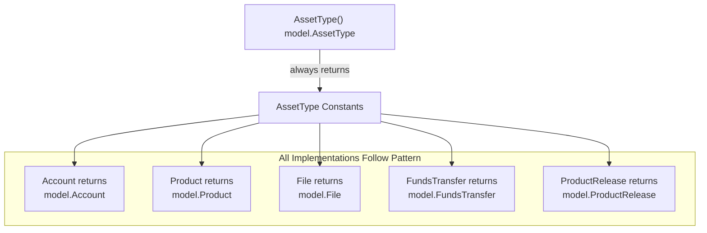

Every asset type uses identical implementation logic:

```go
// Generic pattern used by all assets
func (x TypeName) AssetType() model.AssetType {
    return model.TypeName
}
```

| Asset Type | Constant Returned |
|------------|-------------------|
| Account | `model.Account` |
| Product | `model.Product` |
| ProductRelease | `model.ProductRelease` |
| File | `model.File` |
| FundsTransfer | `model.FundsTransfer` |

---

## JSON() Serialization Pattern

All asset types use Go's `encoding/json` package with `json.Marshal`. The method is a thin wrapper that delegates to the standard library.

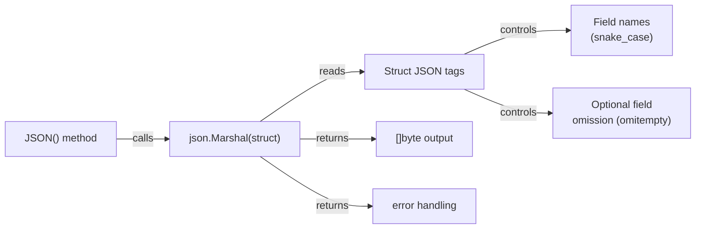

```go
// Universal pattern across all assets
func (x TypeName) JSON() ([]byte, error) {
    return json.Marshal(x)
}
```

!!! note "Key points"
    - **No custom marshaling logic** — all assets rely on struct tags for control
    - **Value receiver** — all implementations use value receivers, not pointers
    - **Error passthrough** — errors from `json.Marshal` propagate directly to caller

### JSON Output Examples

| Asset Type | Sample Output |
|------------|---------------|
| Account | `{"unique_id":"222333444","account_type":"ACH","username":"test",...}` |
| Product | `{"unique_id":"12345","product_name":"OWASP Amass","product_type":"Attack Surface Management",...}` |
| ProductRelease | `{"name":"Amass v4.2.0","release_date":"2023-09-10T14:15:00Z"}` |
| File | `{"url":"file:///var/html/index.html","name":"index.html","type":"Document"}` |

---

## Package Organization Pattern

Asset implementations are organized into domain-specific packages, each importing the core model package.

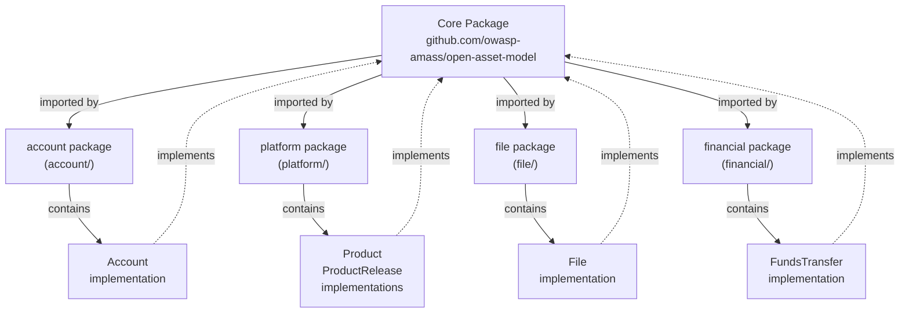

All asset implementations use the same import alias:

```go
import (
    "encoding/json"

    model "github.com/owasp-amass/open-asset-model"
)
```

---

## Implementing Asset Types Step by Step

### Asset Interface Requirements

All asset types must implement the `Asset` interface with three required methods:

| Method | Return Type | Purpose |
|--------|-------------|---------|
| `Key()` | `string` | Returns a unique identifier for the asset instance |
| `AssetType()` | `AssetType` | Returns the asset type constant from the enumeration |
| `JSON()` | `([]byte, error)` | Serializes the asset to JSON format |

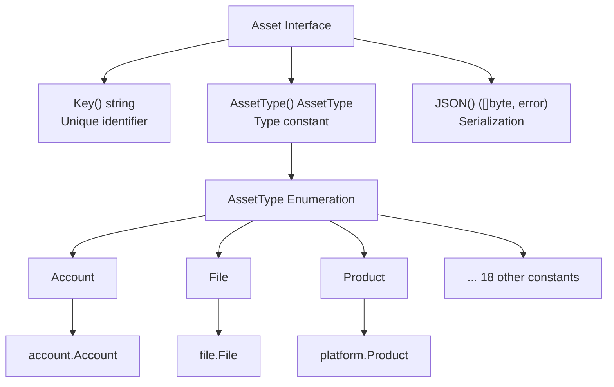

### Field Naming Conventions

| Pattern | Go Field Name | JSON Tag | Example |
|---------|---------------|----------|---------|
| Unique identifier | `ID` | `unique_id` | `account.go` |
| Primary name | `Name` | `name` or `[type]_name` | `file.go`, `product.go` |
| Type classification | `Type` | `type` or `[domain]_type` | `file.go`, `account.go` |
| Descriptive text | `Description` | `description` | `product.go` |
| Optional metadata | Various | Always includes `,omitempty` | `account.go` |

### Implementation Flow

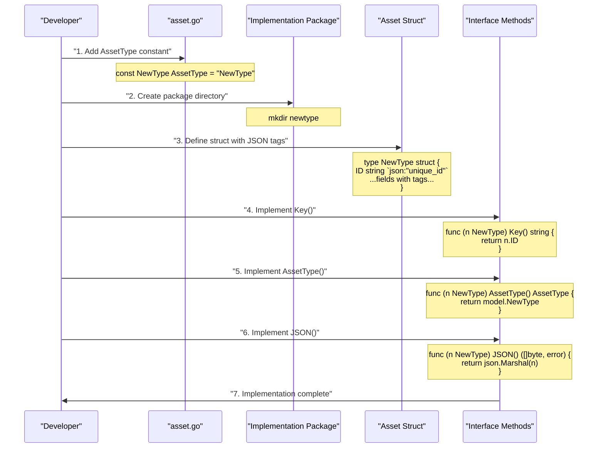

### Complete Implementation Examples

**Simple Asset — `File`:**

```go
package file

import (
    "encoding/json"
    model "github.com/owasp-amass/open-asset-model"
)

type File struct {
    URL  string `json:"url"`
    Name string `json:"name,omitempty"`
    Type string `json:"type,omitempty"`
}

func (f File) Key() string                  { return f.URL }
func (f File) AssetType() model.AssetType   { return model.File }
func (f File) JSON() ([]byte, error)        { return json.Marshal(f) }
```

**Complex Asset — `Account`:**

```go
type Account struct {
    ID       string  `json:"unique_id"`
    Type     string  `json:"account_type"`
    Username string  `json:"username,omitempty"`
    Number   string  `json:"account_number,omitempty"`
    Balance  float64 `json:"balance,omitempty"`
    Active   bool    `json:"active,omitempty"`
}

func (a Account) Key() string                  { return a.ID }
func (a Account) AssetType() model.AssetType   { return model.Account }
func (a Account) JSON() ([]byte, error)        { return json.Marshal(a) }
```

**Multiple Assets in One Package — `platform/product.go`:**

Some packages define multiple asset types sharing the same file and test. Each type has distinct `AssetType()` return value and may use different key strategies:

```go
// Product uses an ID field as key
func (p Product) Key() string { return p.ID }
func (p Product) AssetType() model.AssetType { return model.Product }

// ProductRelease uses Name as a natural key
func (p ProductRelease) Key() string { return p.Name }
func (p ProductRelease) AssetType() model.AssetType { return model.ProductRelease }
```

### omitempty Guidelines

| Field Category | omitempty Required | Rationale |
|----------------|-------------------|-----------|
| Unique identifiers | No | Always required for asset identity |
| Type classifiers | No | Essential for asset categorization |
| Descriptive metadata | Yes | May not always be available |
| Numeric values | Yes | Zero values are valid but omittable |
| Boolean flags | Yes | False is valid but omittable |

---

## Testing Asset Implementations

### Testing Architecture

Every asset implementation must pass three distinct validation layers:

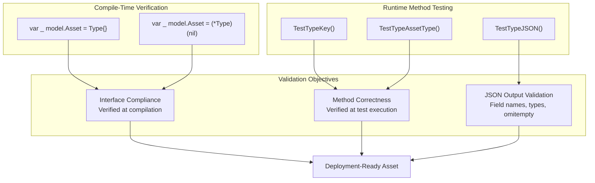

### Key() Test Pattern

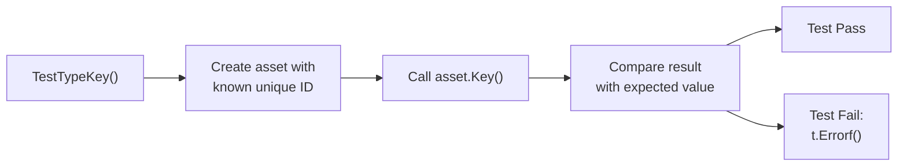

```go
func TestAccountKey(t *testing.T) {
    want := "222333444"
    a := Account{ID: want, Username: "test", Number: "12345", Type: "ACH"}
    if got := a.Key(); got != want {
        t.Errorf("Account.Key() = %v, want %v", got, want)
    }
}
```

### AssetType() and Interface Compliance Test

```go
func TestAccountAssetType(t *testing.T) {
    var _ model.Asset = Account{}       // Compile-time value receiver check
    var _ model.Asset = (*Account)(nil) // Compile-time pointer receiver check

    a := Account{}
    expected := model.Account
    actual := a.AssetType()
    if actual != expected {
        t.Errorf("Expected asset type %v but got %v", expected, actual)
    }
}
```

!!! info "Why both value and pointer?"
    The dual assertion pattern ensures the asset type works in polymorphic contexts. A value receiver check (`Type{}`) verifies direct usage; a pointer receiver check (`(*Type)(nil)`) verifies pointer usage common in databases and collections.

### JSON() Test Pattern

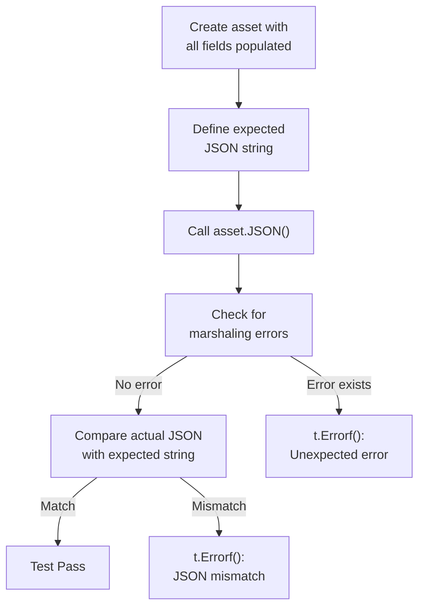

```go
func TestAccountJSON(t *testing.T) {
    a := Account{
        ID: "222333444", Type: "ACH", Username: "test",
        Number: "12345", Balance: 42.50, Active: true,
    }
    expected := `{"unique_id":"222333444","account_type":"ACH","username":"test","account_number":"12345","balance":42.5,"active":true}`
    actual, err := a.JSON()
    if err != nil {
        t.Errorf("Unexpected error: %v", err)
    }
    if !reflect.DeepEqual(string(actual), expected) {
        t.Errorf("Expected JSON %v but got %v", expected, string(actual))
    }
}
```

### Test File Organization

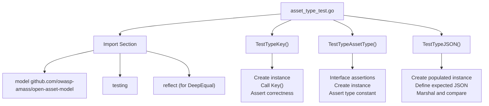

| Test Function | Purpose | Pattern |
|---------------|---------|---------|
| `TestXKey` | Verify `Key()` returns expected identifier | Create instance → call `Key()` → compare with `want` |
| `TestXAssetType` | Verify `AssetType()` and interface compliance | Compile-time checks + runtime constant comparison |
| `TestXJSON` | Verify `JSON()` produces correct output | Marshal → compare with expected JSON string |

---

## Implementation Checklist

### New Asset Checklist

**Package Setup**

- [ ] Create domain-specific package or use existing one
- [ ] Import `encoding/json` and `model` alias for core package

**Struct Definition**

- [ ] Define struct with descriptive name matching AssetType constant
- [ ] Use snake_case JSON tags for all fields
- [ ] Apply `omitempty` to optional fields only
- [ ] Add comments describing relationships

**Interface Methods**

- [ ] `Key()` returning unique string identifier
- [ ] `AssetType()` returning correct constant
- [ ] `JSON()` calling `json.Marshal(struct)`
- [ ] Value receivers on all three methods

**Core Package Update**

- [ ] Add `AssetType` constant to `asset.go`
- [ ] Add constant to `AssetList`

**Test File**

- [ ] `TestXKey` — verifies `Key()` returns expected value
- [ ] `TestXAssetType` — includes compile-time interface assertions
- [ ] `TestXJSON` — verifies full JSON output against expected string
- [ ] All tests pass: `go test ./package`
- [ ] Tests pass with race detector: `go test -race ./package`

---

## Common Pitfalls

!!! warning "Inconsistent JSON tag naming"
    Always use snake_case. `"accountNumber"` is wrong; `"account_number"` is correct.

!!! warning "Missing omitempty on optional fields"
    Zero-value optional fields will appear in JSON output if `omitempty` is not set.

!!! warning "Non-deterministic Key()"
    Never base `Key()` on timestamps or random values. Use immutable, stable fields like IDs or URLs:
    ```go
    // Wrong
    func (a Asset) Key() string {
        return fmt.Sprintf("%s-%d", a.ID, time.Now().Unix())
    }
    // Correct
    func (a Asset) Key() string {
        return a.ID
    }
    ```
