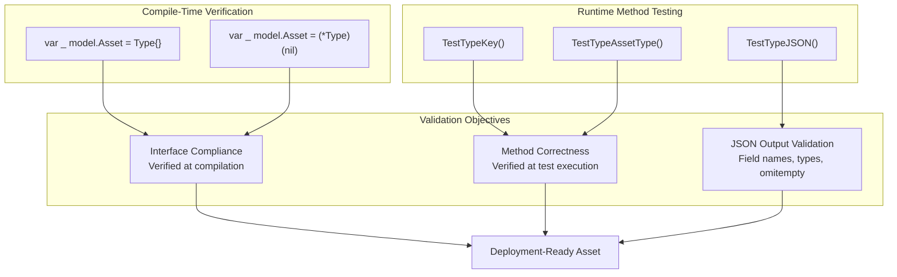
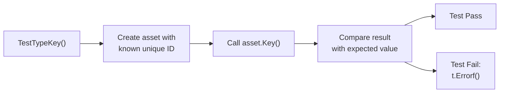
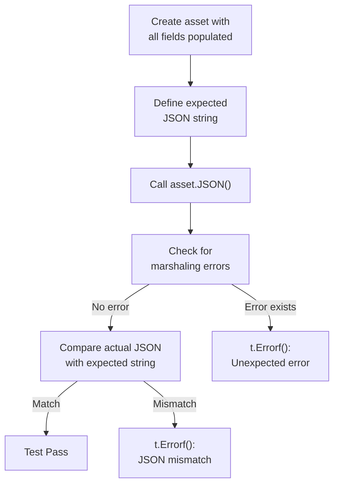
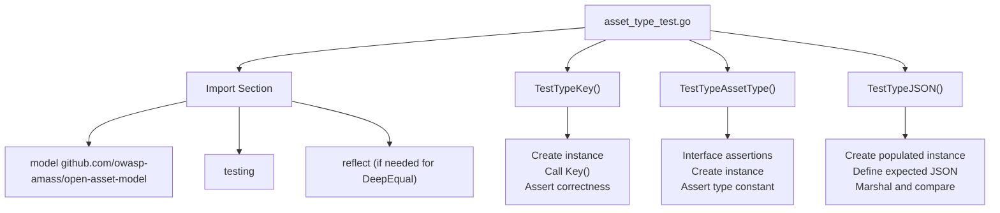

# Testing Asset Implementations

This document provides comprehensive guidelines for testing asset type implementations in the open-asset-model. It covers the three essential testing layers: compile-time interface compliance verification, runtime method behavior validation, and JSON serialization correctness. These testing patterns ensure that all asset implementations conform to the `Asset` interface contract defined in  and produce correct JSON output for data exchange.

For guidance on implementing new asset types, see [Implementing Asset Types](#6.1). For information about the core Asset interface specification, see [Asset Interface](#2.1).

---

## Testing Architecture Overview

Every asset implementation must pass three distinct validation layers to ensure correctness. The testing architecture enforces both compile-time and runtime guarantees.



**Test Architecture Diagram**: Three-layer validation ensures asset implementations meet interface contracts, behave correctly, and serialize properly.

---

## Interface Compliance Testing

Interface compliance testing uses Go's type assertion syntax to verify at **compile time** that an asset type correctly implements the `Asset` interface. This prevents runtime failures from missing or incorrectly-typed methods.

### Compliance Check Pattern

Every test file must include two type assertion statements that verify both value and pointer receivers implement the interface:

```go
var _ model.Asset = Type{}       // Value receiver implementation
var _ model.Asset = (*Type)(nil) // Pointer receiver implementation
```

These assertions are typically placed within the `TestTypeAssetType` function but execute at compile time. If the type does not implement the interface correctly, the code will not compile.

### Implementation Examples

| Asset Type | Test File | Value Check Line | Pointer Check Line |
|------------|-----------|------------------|-------------------|
| Account | [account/account_test.go]() | Line 29 | Line 30 |
| Service | [platform/service_test.go]() | Line 26 | Line 27 |
| Organization | [org/org_test.go]() | Line 27 | Line 28 |
| File | [file/file_test.go]() | Line 24 | Line 25 |
| FundsTransfer | [financial/funds_transfer_test.go]() | Line 24 | Line 25 |

### Why Both Value and Pointer Receivers Matter

The dual assertion pattern ensures the asset type works correctly in polymorphic contexts:

- **Value receiver check** (`Type{}`): Verifies the type can be used directly when passed by value
- **Pointer receiver check** (`(*Type)(nil)`): Verifies pointer usage (common in databases and collections)

This pattern catches scenarios where methods are defined only on pointers (`func (t *Type)`) but the interface is expected to work with values.

---

## Method Validation Testing

Method validation tests verify the runtime behavior of the three required interface methods: `Key()`, `AssetType()`, and `JSON()`. Each method requires a dedicated test function.

### Key() Method Testing

The `Key()` method must return a unique identifier for the asset instance. Tests verify that the returned value matches the expected unique identifier field.



**Key Method Test Flow**: Standard pattern for validating Key() returns the correct unique identifier.

#### Example Test Implementations

**Account Key Test** :
```go
func TestAccountKey(t *testing.T) {
	want := "222333444"
	a := Account{
		ID:       want,
		Username: "test",
		Number:   "12345",
		Type:     "ACH",
	}

	if got := a.Key(); got != want {
		t.Errorf("Account.Key() = %v, want %v", got, want)
	}
}
```

**Service Key Test** :
```go
func TestServiceKey(t *testing.T) {
	want := "222333444"
	serv := Service{
		ID:   want,
		Type: "HTTP",
	}

	if got := serv.Key(); got != want {
		t.Errorf("Service.Key() = %v, want %v", got, want)
	}
}
```

**Key Testing Pattern Summary:**
1. Define expected key value (`want`)
2. Create asset instance with that key in the appropriate field
3. Call `Key()` method
4. Assert returned value equals expected value using `t.Errorf()` on mismatch

---

### AssetType() Method Testing

The `AssetType()` method must return the correct `AssetType` constant as defined in . This test validates type classification correctness.

#### Standard AssetType Test Pattern

All AssetType tests follow this structure :

```go
func TestAccountAssetType(t *testing.T) {
	var _ model.Asset = Account{}       // Compile-time compliance check
	var _ model.Asset = (*Account)(nil) // Pointer compliance check

	a := Account{}
	expected := model.Account
	actual := a.AssetType()

	if actual != expected {
		t.Errorf("Expected asset type %v but got %v", expected, actual)
	}
}
```

#### Key Elements

| Element | Purpose | Location |
|---------|---------|----------|
| Interface assertions | Compile-time verification | First two lines of function |
| Zero-value instantiation | Test default behavior | `Type{}` |
| Constant comparison | Validate correct type return | Compare against `model.AssetType` constant |
| Error message | Clear failure reporting | Include both expected and actual values |

#### Implementation Verification Table

| Asset Type | Expected Constant | Test File Reference |
|------------|-------------------|---------------------|
| Account | `model.Account` |  |
| Service | `model.Service` |  |
| Organization | `model.Organization` |  |
| File | `model.File` |  |
| FundsTransfer | `model.FundsTransfer` |  |

---

### JSON() Method Testing

The `JSON()` method must marshal the asset to valid JSON with correct field names and proper `omitempty` behavior. This is the most complex test as it validates data serialization correctness.

#### JSON Test Structure



**JSON Testing Flow**: Validation process for JSON serialization correctness.

#### Detailed Example: Account JSON Test

:

```go
func TestAccountJSON(t *testing.T) {
	a := Account{
		ID:       "222333444",
		Type:     "ACH",
		Username: "test",
		Number:   "12345",
		Balance:  42.50,
		Active:   true,
	}
	expected := `{"unique_id":"222333444","account_type":"ACH","username":"test","account_number":"12345","balance":42.5,"active":true}`
	actual, err := a.JSON()

	if err != nil {
		t.Errorf("Unexpected error: %v", err)
	}

	if !reflect.DeepEqual(string(actual), expected) {
		t.Errorf("Expected JSON %v but got %v", expected, string(actual))
	}
}
```

#### JSON Tag Validation Requirements

The expected JSON string must match the struct's JSON tags exactly. Compare struct definition  with expected output:

| Struct Field | JSON Tag | Expected in Output |
|--------------|----------|-------------------|
| `ID` | `json:"unique_id"` | `"unique_id":"222333444"` |
| `Type` | `json:"account_type"` | `"account_type":"ACH"` |
| `Username` | `json:"username,omitempty"` | `"username":"test"` |
| `Number` | `json:"account_number,omitempty"` | `"account_number":"12345"` |
| `Balance` | `json:"balance,omitempty"` | `"balance":42.5` |
| `Active` | `json:"active,omitempty"` | `"active":true` |

#### omitempty Behavior Verification

Fields marked with `omitempty` should **not appear** in JSON output when they hold zero values. Test cases should verify:

1. **Populated fields test**: Include all fields (as shown above)
2. **Zero value test** (optional but recommended): Create asset with only required fields and verify optional fields are omitted

#### Complex Asset JSON Testing

Service assets have nested structures requiring careful validation :

```go
func TestServiceJSON(t *testing.T) {
	s := Service{
		ID:         "222333444",
		Type:       "HTTP",
		Output:     "Hello",
		OutputLen:  5,
		Attributes: map[string][]string{"server": {"nginx-1.26.0"}},
	}

	// Test AssetType method
	if s.AssetType() != model.Service {
		t.Errorf("Expected asset type %s, but got %s", model.Service, s.AssetType())
	}

	// Test JSON method
	expectedJSON := `{"unique_id":"222333444","service_type":"HTTP","output":"Hello","output_length":5,"attributes":{"server":["nginx-1.26.0"]}}`
	json, err := s.JSON()
	if err != nil {
		t.Errorf("Unexpected error: %v", err)
	}
	if string(json) != expectedJSON {
		t.Errorf("Expected JSON %s, but got %s", expectedJSON, string(json))
	}
}
```

Note that this test combines AssetType validation with JSON testing, which is a valid pattern.

---

## Complete Test File Structure

A well-formed test file for an asset implementation contains three test functions following a consistent naming convention and structure.

### Standard Test File Template



**Test File Organization**: Standard structure followed by all asset type tests.

### File Organization Example: Account Tests

[account/account_test.go]() demonstrates the complete structure:

| Section | Lines | Purpose |
|---------|-------|---------|
| Copyright header | 1-3 | License information |
| Package declaration | 5 | Same package as implementation |
| Imports | 7-12 | Standard library and model import |
| TestAccountKey | 14-26 | Key() method validation |
| TestAccountAssetType | 28-39 | AssetType() and interface compliance |
| TestAccountJSON | 41-60 | JSON() serialization validation |

### Test Function Naming Convention

All test functions must follow this pattern:

- `TestTypeKey` - Tests the Key() method
- `TestTypeAssetType` - Tests the AssetType() method
- `TestTypeJSON` - Tests the JSON() method

Where `Type` is the name of the asset struct (e.g., `Account`, `Service`, `Organization`).

---

## Best Practices and Common Patterns

### Required Imports

Every asset test file needs these imports:

```go
import (
	"testing"
	
	model "github.com/owasp-amass/open-asset-model"
)
```

If using `reflect.DeepEqual` for JSON comparison (recommended pattern):

```go
import (
	"reflect"
	"testing"
	
	model "github.com/owasp-amass/open-asset-model"
)
```

### Error Message Formatting

Follow consistent error message patterns for clarity:

| Test Type | Error Message Pattern | Example |
|-----------|----------------------|---------|
| Key() test | `Type.Key() = %v, want %v` |  |
| AssetType() test | `Expected asset type %v but got %v` |  |
| JSON() error check | `Unexpected error: %v` |  |
| JSON() comparison | `Expected JSON %v but got %v` |  |

### Test Data Guidelines

#### Unique Identifier Values
Use realistic but clearly test values for unique identifiers:
- ✅ Good: `"222333444"` - recognizable as test data
- ❌ Avoid: `"1"` - too generic, might conflict with production data patterns
- ❌ Avoid: Random UUIDs - harder to debug failed tests

#### Field Population
Always populate **all fields** in JSON tests to verify:
1. Required fields serialize correctly
2. Optional fields with `omitempty` appear when populated
3. Data types serialize correctly (strings, numbers, booleans, nested structures)

#### JSON String Formatting
Expected JSON strings should:
- Have no whitespace (compact format)
- Use correct field ordering (matches Go's JSON marshaler behavior)
- Include all populated fields
- Use proper escaping for special characters

### Running Tests

Execute tests using standard Go test commands:

```bash
# Run all tests in a package
go test ./account

# Run specific test function
go test ./account -run TestAccountJSON

# Run with race detector (as in CI)
go test -race ./...

# Run with coverage
go test -cover ./...
```

The CI pipeline runs tests with: `go test -race -timeout 240s` as mentioned in the high-level architecture documentation.

---

## Testing Checklist

Before submitting a new asset implementation, verify:

### Compile-Time Verification
- [ ] Value receiver interface assertion present: `var _ model.Asset = Type{}`
- [ ] Pointer receiver interface assertion present: `var _ model.Asset = (*Type)(nil)`
- [ ] Code compiles without errors

### Method Tests
- [ ] `TestTypeKey()` function exists and passes
- [ ] Key test uses realistic test data
- [ ] Key test verifies correct field is returned
- [ ] `TestTypeAssetType()` function exists and passes
- [ ] AssetType test includes interface assertions
- [ ] AssetType test verifies correct constant from 
- [ ] `TestTypeJSON()` function exists and passes

### JSON Serialization Tests
- [ ] JSON test creates fully populated asset instance
- [ ] Expected JSON string matches struct's JSON tags exactly
- [ ] Test checks for marshaling errors
- [ ] Test compares actual output with expected output
- [ ] Special characters and nested structures handled correctly
- [ ] `omitempty` behavior is correct (fields appear when populated)

### Code Quality
- [ ] Test file follows naming convention: `type_test.go`
- [ ] All tests follow consistent error message patterns
- [ ] Package declaration matches implementation package
- [ ] Copyright header present
- [ ] No unnecessary imports

### Test Execution
- [ ] All tests pass: `go test ./package`
- [ ] Tests pass with race detector: `go test -race ./package`
- [ ] Tests complete within timeout (240s)
