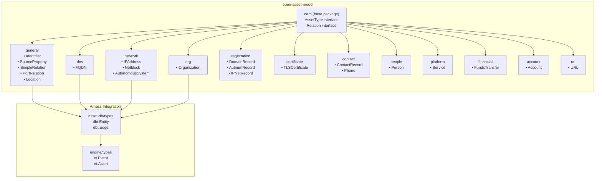
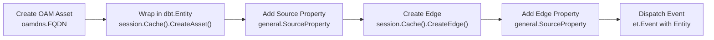
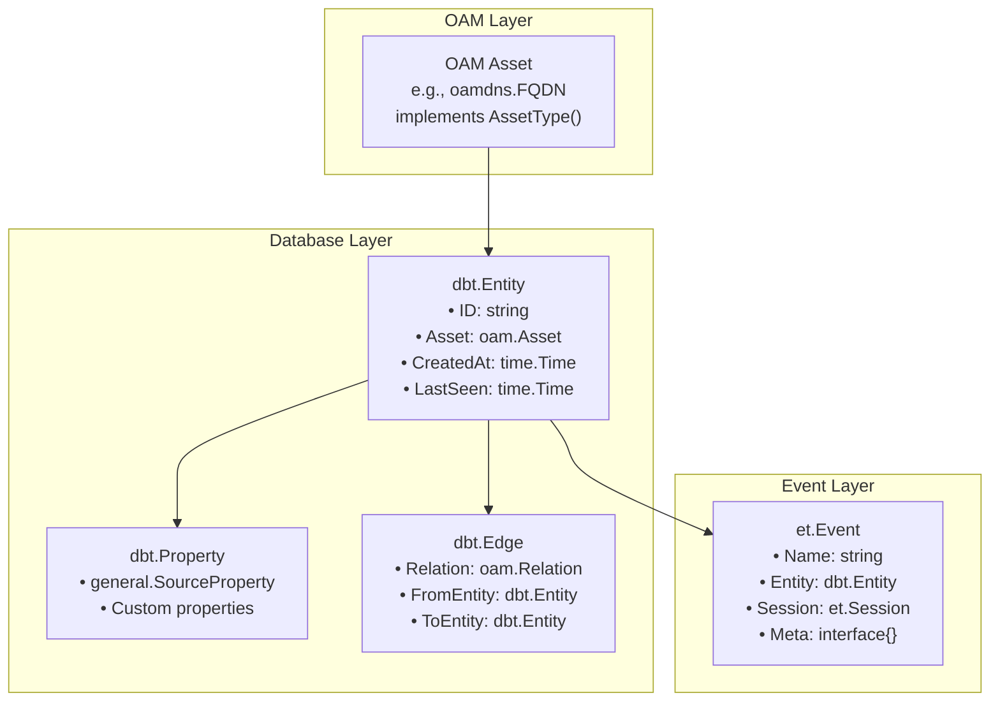
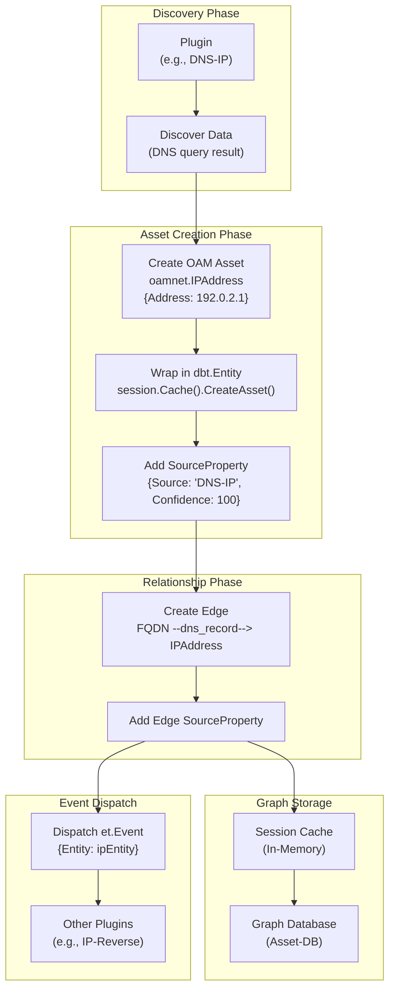
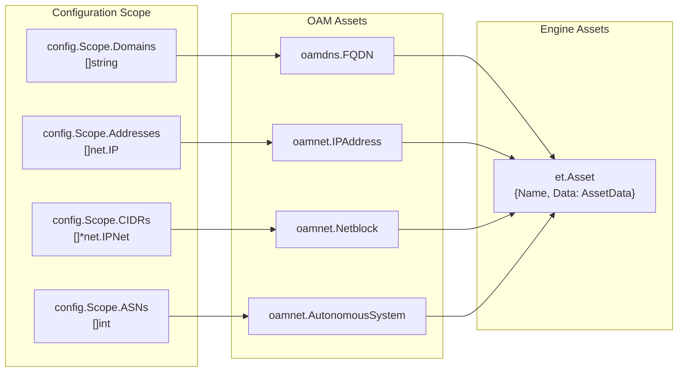
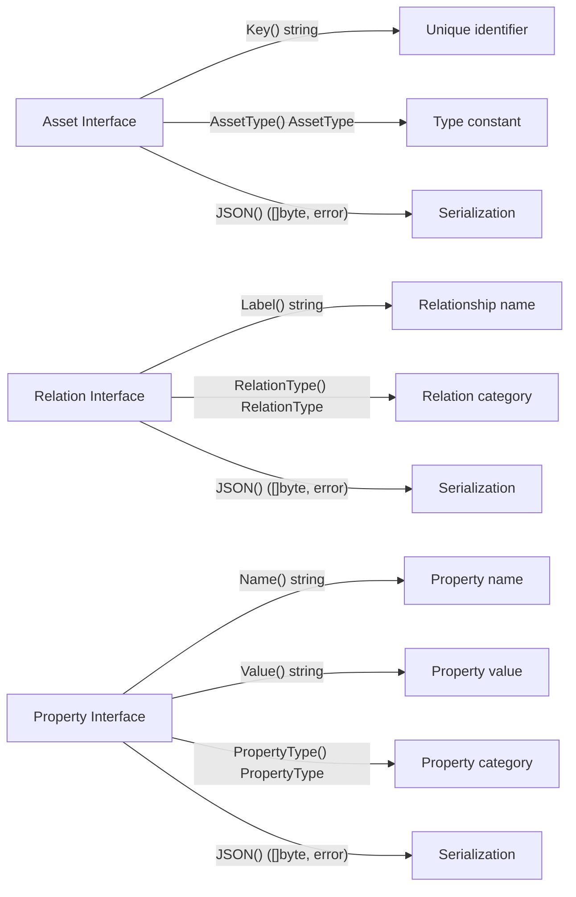
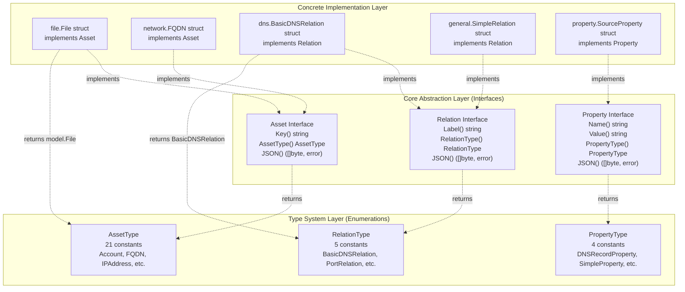
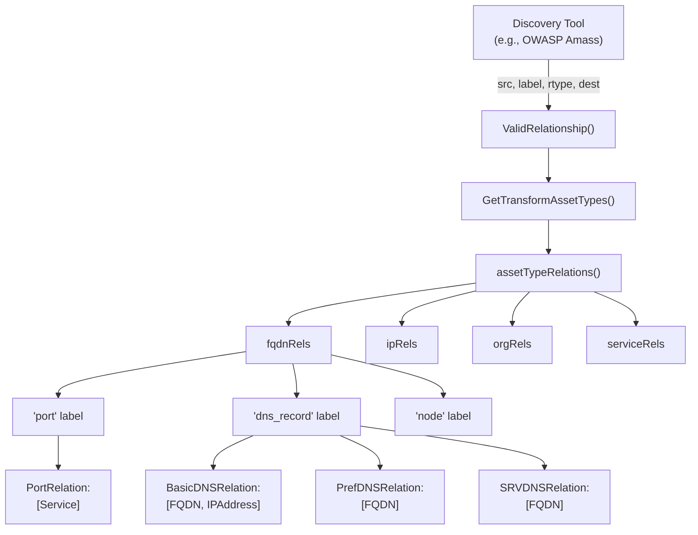

# :simple-owasp: Open Asset Model

The **Amass Project's** [Open Asset Model](https://github.com/owasp-amass/open-asset-model) redefines the understanding of an attack surface. Shifting the paradigm away from narrow, internet infrastructure-focused collection, the **OAM** broadens its scope to include both physical and digital assets. This approach delivers a realistic view of **assets and their lesser-known associations**, utilizing adversarial tactics to gain visibility into potential risks and attack vectors that might otherwise be overlooked.

---

## **//** Overview

- **Deep Attack Surface Intelligence:** Identifies both **physical and digital assets**, moving beyond IT infrastructure.
- **Standardized Asset Framework:** Ensures **consistency in asset classification**, facilitating efficient data exchange and streamlined analysis.
- **Cyclic Discovery:** Recursively approaches data exploration, leveraging each finding to dynamically **expand the target scope**.
- **Community-Driven:** Developed and continuously refined by security experts within the **OWASP Amass** ecosystem.
- **Risk Mapping:** Exposes hidden attack vectors by **mapping asset relationships** and tracking their changes over time.

---

## :material-graph: Explore OAM Asset Types

---

<div class="grid cards" markdown>

-   :material-file-account:{ .lg .middle } __Account__

    ---

    Collect usernames, account types, and related attributes to track exposed user accounts

    [:octicons-arrow-right-24: Learn more](https://owasp-amass.github.io/docs/open-asset-model/assets/account/)

-   :material-registered-trademark:{ .lg .middle } __Domain Record__

    ---
    
    Gather domain insights, including Whois and registrar details

    [:octicons-arrow-right-24: Learn more](https://owasp-amass.github.io/docs/open-asset-model/assets/domain_record/)

-   :material-comment-outline:{ .lg .middle } __Contact Record__

    ---

    Link email addresses, phone numbers, and locations to discovered entities

    [:octicons-arrow-right-24: Learn more](https://owasp-amass.github.io/docs/open-asset-model/assets/contact_record/)

-   :material-dns:{ .lg .middle } __FQDN__

    ---

    Record domain resolutions, DNS records, and associated metadata

    [:octicons-arrow-right-24: Learn more](https://owasp-amass.github.io/docs/open-asset-model/assets/fqdn/)

-   :material-file-find:{ .lg .middle } __File__

    ---

    Capture file names and hashes to analyze digital artifacts

    [:octicons-arrow-right-24: Learn more](https://owasp-amass.github.io/docs/open-asset-model/assets/file/)

-   :material-bank:{ .lg .middle } __Funds Transfer__

    ---

    Identify bank accounts, payment systems, and transaction details

    [:octicons-arrow-right-24: Learn more](https://owasp-amass.github.io/docs/open-asset-model/assets/funds_transfer/)

-   :material-id-card:{ .lg .middle } __Identifier__

    ---

	Track unique IDs, references, or numerical values 

    [:octicons-arrow-right-24: Learn more](https://owasp-amass.github.io/docs/open-asset-model/assets/identifier/)

-   :material-router:{ .lg .middle } __IP Address__

    ---

    Discover IPs, subnets, and routing structures to uncover key infrastructure

    [:octicons-arrow-right-24: Learn more](https://owasp-amass.github.io/docs/open-asset-model/assets/ip_address/)

-   :material-office-building-marker:{ .lg .middle } __Organization__

    ---

    Uncover entity designations, locations, and operational details to expose connections

    [:octicons-arrow-right-24: Learn more](https://owasp-amass.github.io/docs/open-asset-model/assets/organization/)

-   :material-account-outline:{ .lg .middle } __Person__

    ---

     Collect names, locations, and attributes to build individual profiles 

    [:octicons-arrow-right-24: Learn more](https://owasp-amass.github.io/docs/open-asset-model/assets/person/)

-   :material-apps:{ .lg .middle } __Product__

    ---

     Identify online services, cloud providers, and software ecosystems 

    [:octicons-arrow-right-24: Learn more](https://owasp-amass.github.io/docs/open-asset-model/assets/product/)

-   :material-file-certificate-outline:{ .lg .middle } __TLS Certificate__

    ---

    Gather SSL/TLS certificate details, issuers, and expiration dates for asset verification

    [:octicons-arrow-right-24: Learn more](https://owasp-amass.github.io/docs/open-asset-model/assets/tls_certificate/)

-   :material-web-refresh:{ .lg .middle } __URL__

    ---

    Log web addresses and associated content to track online presence

    [:octicons-arrow-right-24: Learn more](https://owasp-amass.github.io/docs/open-asset-model/assets/url/)

</div>

---

## Technical Reference

This section provides architectural diagrams and schema details drawn from the OAM Go package internals.

### Package Structure

OAM is organized into domain-specific Go packages, each containing related asset types:



| Package | Purpose | Key Types |
|---------|---------|-----------|
| `oam` (base) | Core interfaces and types | `AssetType`, `Relation` |
| `general` | Cross-cutting assets and relations | `Identifier`, `SourceProperty`, `SimpleRelation` |
| `dns` | DNS infrastructure | `FQDN` |
| `network` | Network infrastructure | `IPAddress`, `Netblock`, `AutonomousSystem` |
| `org` | Organizational entities | `Organization` |
| `registration` | Registry records | `DomainRecord`, `AutnumRecord`, `IPNetRecord` |
| `certificate` | TLS/SSL certificates | `TLSCertificate` |
| `contact` | Contact information | `ContactRecord`, `Phone` |
| `people` | Individual persons | `Person` |
| `platform` | Running services | `Service` |
| `account` | Financial accounts | `Account` |
| `financial` | Financial transactions | `FundsTransfer` |
| `url` | Web resources | `URL` |

---

### Asset Instantiation Pattern

All OAM assets follow a consistent lifecycle from creation to event dispatch:



---

### Asset-to-Entity Wrapping

OAM assets are wrapped in `dbt.Entity` structures for storage and event propagation:



---

### Data Flow: Discovery to Storage



**Process steps:**

1. **Discovery**: Plugin queries external source (DNS, API, etc.)
2. **Asset Creation**: Raw data converted to typed OAM asset
3. **Entity Wrapping**: Asset stored in cache, returns `dbt.Entity`
4. **Attribution**: `SourceProperty` added to entity
5. **Relationship Creation**: Edge created between related entities
6. **Edge Attribution**: `SourceProperty` added to edge
7. **Storage**: Entity and edge persisted to graph database
8. **Event Dispatch**: New entity wrapped in `et.Event` for further processing

---

### Scope Conversion to Assets

User-provided scope (domains, IPs, CIDRs, ASNs) is converted to OAM assets during enumeration initialization:



---

### Common Relation Types

| Relation Name | From Asset | To Asset | Semantic Meaning |
|--------------|------------|----------|------------------|
| `dns_record` | FQDN | IPAddress | DNS A/AAAA resolution |
| `id` | Organization | Identifier | Organization identifier |
| `subsidiary` | Organization | Organization | Parent-child relationship |
| `member` | Organization | Person | Employment relationship |
| `port` | IPAddress/FQDN | Service | Network service binding |
| `legal_address` | Organization | Location | Legal registered address |
| `hq_address` | Organization | Location | Headquarters address |
| `location` | ContactRecord | Location | Associated address |
| `organization` | ContactRecord | Organization | Associated company |
| `person` | ContactRecord | Person | Associated individual |
| `phone` | ContactRecord | Phone | Contact phone number |
| `url` | ContactRecord | URL | Related web resource |
| `common_name` | TLSCertificate | FQDN | Certificate CN field |
| `san_dns_name` | TLSCertificate | FQDN | Certificate SAN entry |
| `certificate` | Service | TLSCertificate | TLS certificate used |
| `account` | Organization | Account | Financial account ownership |
| `sender` | FundsTransfer | Account | Funds source |
| `recipient` | FundsTransfer | Account | Funds destination |

---

### Asset Type Constants

All asset types are referenced as typed constants in the `oam` base package:

```go
const (
    FQDN             AssetType = "fqdn"
    IPAddress        AssetType = "ip_address"
    Netblock         AssetType = "netblock"
    AutonomousSystem AssetType = "autonomous_system"
    Organization     AssetType = "organization"
    Identifier       AssetType = "identifier"
    DomainRecord     AssetType = "domain_record"
    AutnumRecord     AssetType = "autnum_record"
    IPNetRecord      AssetType = "ipnet_record"
    TLSCertificate   AssetType = "tls_certificate"
    ContactRecord    AssetType = "contact_record"
    Person           AssetType = "person"
    Service          AssetType = "service"
    Location         AssetType = "location"
    Phone            AssetType = "phone"
    URL              AssetType = "url"
    Account          AssetType = "account"
)
```

These constants are used in handler registration, transformation configuration, and TTL management per asset type.

---

### OAM Specification Architecture

#### Core Interface Specifications



#### Three-Tier Architecture Overview



#### Asset Type Taxonomy

```mermaid
graph TD
    Root["AssetType Enumeration"]

    Root --> Network["Network Infrastructure<br/>(6 types)"]
    Root --> Org["Organizational<br/>(5 types)"]
    Root --> Digital["Digital Artifacts<br/>(5 types)"]
    Root --> Financial["Financial<br/>(2 types)"]
    Root --> Product["Product<br/>(2 types)"]
    Root --> Registration["Registration<br/>(3 types)"]
    Root --> Identity["Identity<br/>(1 type)"]

    Network --> FQDN["FQDN"]
    Network --> IPAddress["IPAddress"]
    Network --> Netblock["Netblock"]
    Network --> AutonomousSystem["AutonomousSystem"]

    Org --> Organization["Organization"]
    Org --> Person["Person"]
    Org --> Location["Location"]
    Org --> Phone["Phone"]
    Org --> ContactRecord["ContactRecord"]

    Digital --> File["File"]
    Digital --> URL["URL"]
    Digital --> Service["Service"]
    Digital --> TLSCertificate["TLSCertificate"]
    Digital --> DomainRecord["DomainRecord"]

    Financial --> Account["Account"]
    Financial --> FundsTransfer["FundsTransfer"]

    Product --> ProductType["Product"]
    Product --> ProductRelease["ProductRelease"]

    Registration --> DomainRec["DomainRecord"]
    Registration --> AutnumRecord["AutnumRecord"]
    Registration --> IPNetRecord["IPNetRecord"]

    Identity --> Identifier["Identifier"]
```



#### Relationship Validation System



#### RelationType Constants

| RelationType | Purpose | Used For |
|--------------|---------|----------|
| `BasicDNSRelation` | Basic DNS records | A, AAAA, CNAME, NS records |
| `PrefDNSRelation` | DNS records with preference | MX records with priority values |
| `SRVDNSRelation` | DNS service records | SRV records with priority/weight/port |
| `PortRelation` | Service port connections | Port-based service relationships |
| `SimpleRelation` | Generic connections | Most non-DNS relationships |

#### PropertyType Constants

| PropertyType | Purpose |
|--------------|---------|
| `DNSRecordProperty` | DNS-specific metadata (TTL, record type) |
| `SimpleProperty` | Generic key-value properties |
| `SourceProperty` | Data source attribution |
| `VulnProperty` | Vulnerability information |
