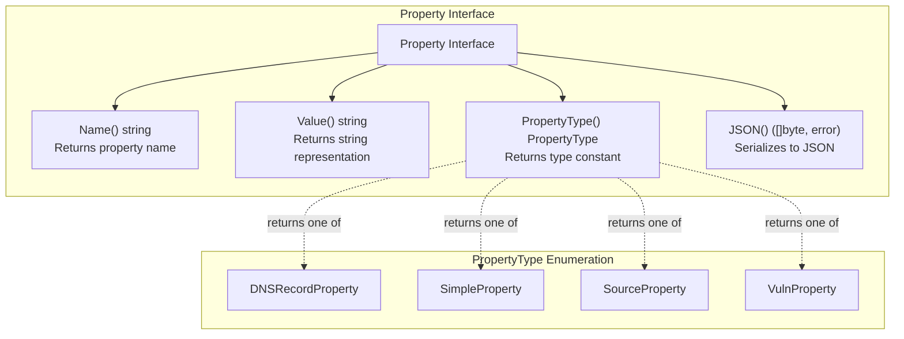
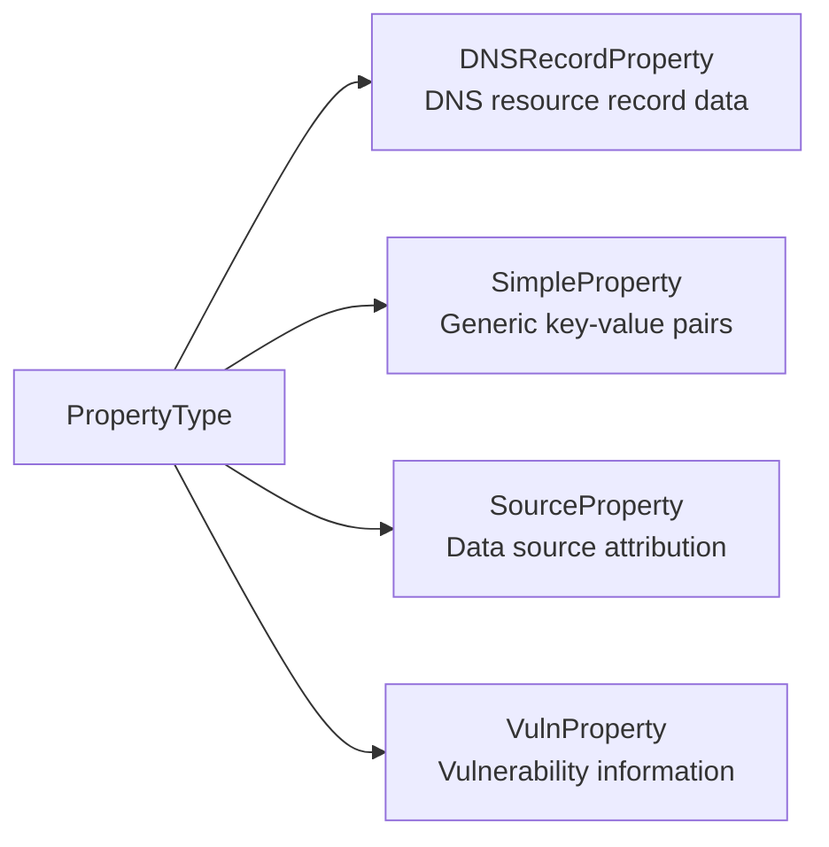
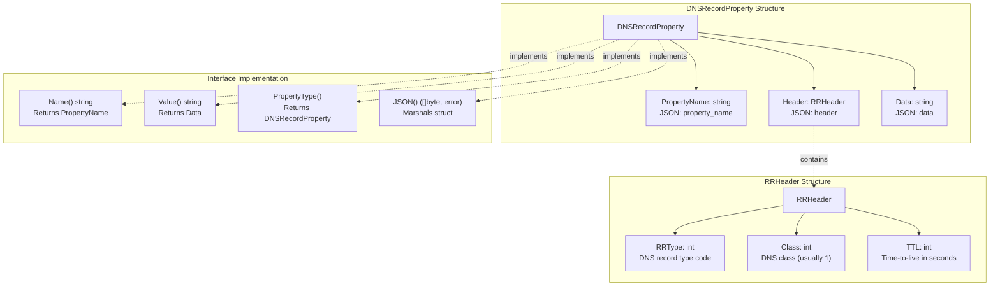
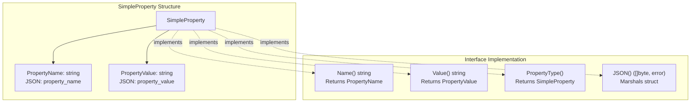
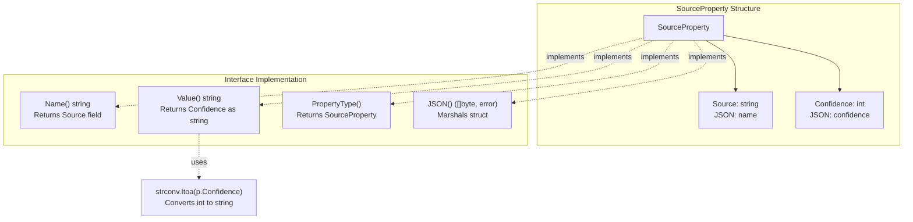
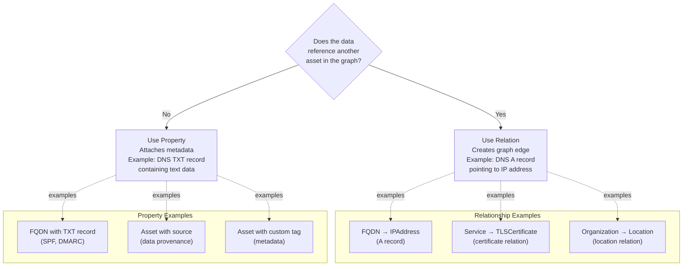

# :simple-owasp: Properties

In the [OWASP](https://owasp.org) [Open Asset Model](https://github.com/owasp-amass/open-asset-model), a **property** is a typed, descriptive annotation attached to an asset or relation. Properties enrich the graph with granular metadata—timestamps, names, identifiers, classifications, fingerprints, and other scalar or structured values—without altering the core topology of the asset graph.

Properties are **first-class elements** of the model. They provide the facts that support inferences, highlight critical traits, and enable high-resolution filtering or grouping of graph data. Each property is tied to the context in which it was discovered, and many include source attribution for traceability.

## :material-database-outline: Why *Properties* Matter

If assets are the **nouns** and relations are the **verbs** of the graph, then **properties are the adjectives**. They give each node and edge its character.

Properties bring three core advantages to the OAM:

1. **Precision** – Properties allow representation of fine-grained detail like last time enumerated and confidence score of evidence.
2. **Traceability** – Many property types (e.g., `SourceProperty`, `DNSRecordProperty`) retain the discovery method and timestamp.
3. **Flexibility** – Because properties are modular and loosely typed, new data can be integrated without schema migrations.

## :material-graph-outline: Property Definition

> **Property**: *A typed key-value annotation attached to an asset or relation, used to describe a specific observable or characteristic.*

Each property answers three questions:

1. **What kind of information is this?**  
   The **type** (e.g., `SimpleProperty`, `DNSRecordProperty`, `VulnProperty`).

2. **What does it say?**  
   A **key-value pair** or structured object expressing some fact about the asset.

3. **Where did it come from?**  
   Optional **source metadata**, such as the tool, timestamp, or confidence level.

## :material-graph-outline: Core Property Types

| Property Type         | Purpose                                      | Example Use Case |
|-----------------------|----------------------------------------------|------------------|
| `SimpleProperty`      | Generic key-value metadata                   | Tag a domain with `last_monitored = 2025-06-20` |
| `SourceProperty`      | Key-value pair with discovery context        | Tag an IP with `whois_country = US` from RDAP |
| `DNSRecordProperty`   | Structured DNS lookup result                 | Record an `A` record resolution for an FQDN |
| `VulnProperty`        | Basic vulnerability data                     | Attach `CVE-2023-1234` to a service asset |

Each property is evaluated in the context of its parent asset or relation and contributes to filtering, scoring, reporting, and pivot logic within the model.

## :material-graph-outline: Property Schema (Conceptually)

Example of a basic `SourceProperty` attached to an `IPAddress`:

```json
{
  "type": "SourceProperty",
  "name": "RDAP",
  "confidence": 75,
}
```

Example of a DNSRecordProperty on an FQDN:

```json
{
  "type": "DNSRecordProperty",
  "property_name": "dns_record",
  "header": {
    "rr_type": 6,
    "class": 1,
    "ttl": 86400,
  },
  "data": "example.com. 86400 IN SOA ns1.example.com. admin.example.com.",
}
```

## :material-graph-outline: Properties in Graph Queries

Properties are not directly navigable edges, but they are critical for filtering and analysis. They can be used in:

assoc queries to filter assets by specific values.

Temporal analysis to find stale, newly discovered, or frequently updated assets.

## :material-graph-outline: Where to Go Next

Explore the types of data used to enrich and explain assets in the graph:

- [Assets](../assets/index.md) – The core entities in the graph.
- [Relations](../relations/index.md) – Overview of Relations in the Open Asset Model.
- [Triples](../../asset_db/triples.md) – Performing graph queries using SPARQL-style syntax.

---

## Technical Reference

### Property Interface Architecture



### PropertyType Constants



| Constant | String Value | Purpose |
|----------|--------------|---------|
| `DNSRecordProperty` | `"DNSRecordProperty"` | DNS records that don't reference other assets (e.g., TXT, SPF) |
| `SimpleProperty` | `"SimpleProperty"` | Generic key-value properties |
| `SourceProperty` | `"SourceProperty"` | Data source metadata with confidence scores |
| `VulnProperty` | `"VulnProperty"` | Vulnerability or security information |

### Concrete Implementations

#### DNSRecordProperty Structure



#### SimpleProperty Structure



#### SourceProperty Structure



### Property vs. Relationship Distinction



| Criterion | Use Relationship | Use Property |
|-----------|------------------|--------------|
| References another asset? | Yes | No |
| Creates graph traversal path? | Yes | No |
| Represents edge data? | Yes | No |
| Represents node metadata? | No | Yes |
| Example: DNS A record | `BasicDNSRelation` | N/A |
| Example: DNS TXT record | N/A | `DNSRecordProperty` |
| Example: Data source info | N/A | `SourceProperty` |

---

© 2025 Jeff Foley — Licensed under Apache 2.0.
