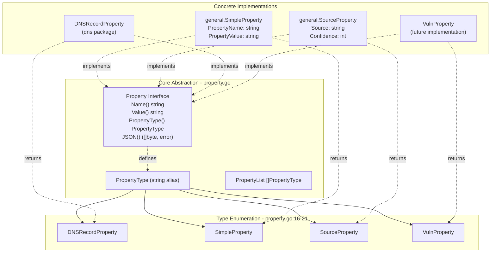
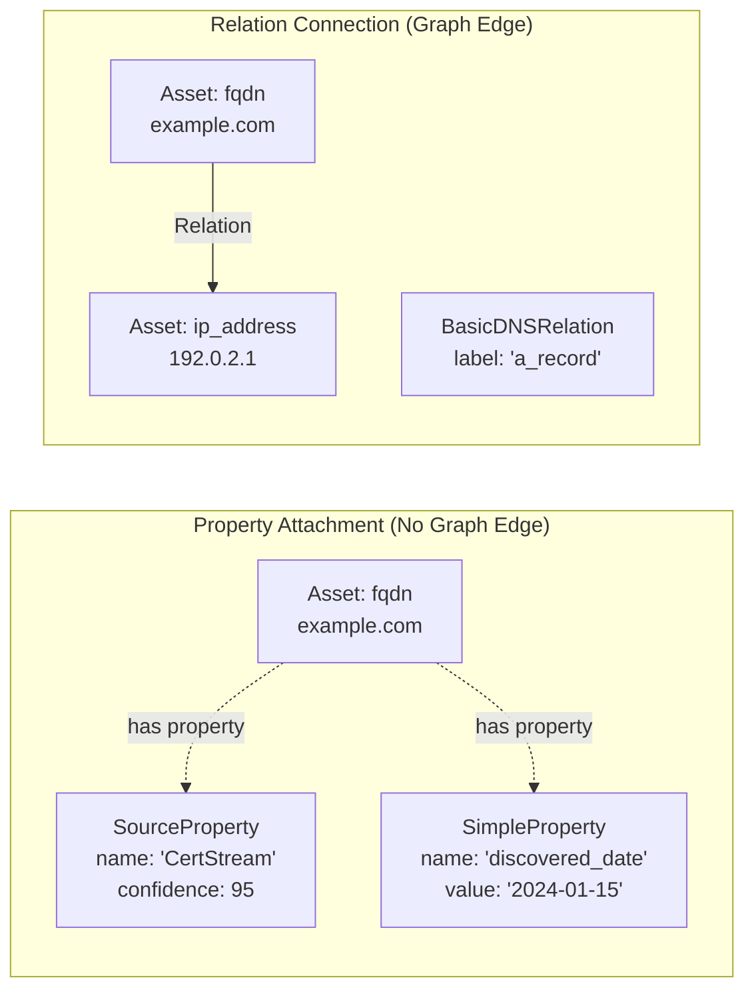
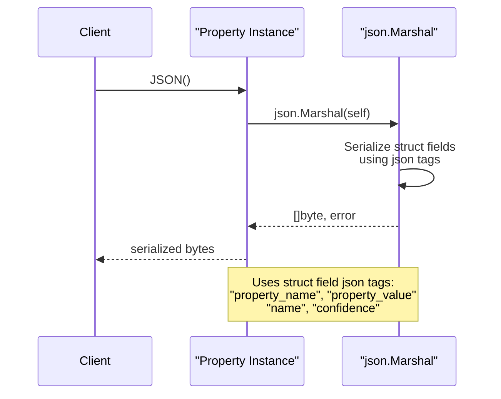
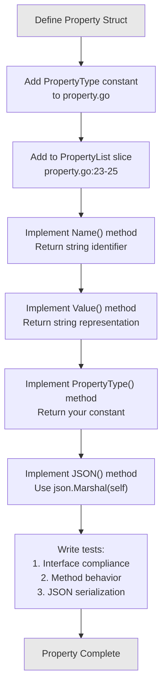
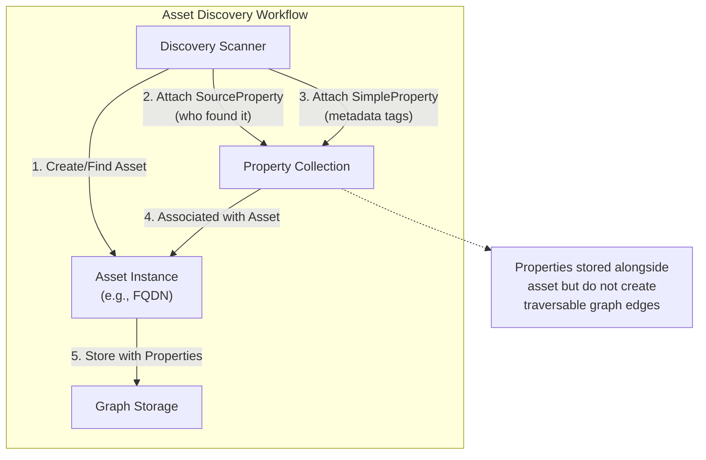

# Property Interface

This document describes the **Property interface**, one of the three core abstractions in the open-asset-model. Properties represent metadata attached to assets that do not establish relationships between assets. For information about connecting assets through relationships, see [Relation Interface](#2.2). For the complete system architecture, see [Core Architecture](#2).

Properties differ from relations in a fundamental way: **properties describe attributes of a single asset**, while relations create connections between two assets. For example, a `SourceProperty` indicates which data source discovered an asset (metadata about the asset itself), whereas a DNS relation connects an FQDN to an IP address (relationship between two distinct assets).

---

## Interface Definition

The Property interface is defined in  and consists of four required methods:

```
Property interface:
  - Name() string
  - Value() string  
  - PropertyType() PropertyType
  - JSON() ([]byte, error)
```

### Method Specifications

| Method | Return Type | Purpose |
|--------|-------------|---------|
| `Name()` | `string` | Returns the property's identifying name or key |
| `Value()` | `string` | Returns the property's value as a string |
| `PropertyType()` | `PropertyType` | Returns the enumerated type constant for this property |
| `JSON()` | `([]byte, error)` | Serializes the property to JSON format for storage/transport |

---

## Property Interface Architecture

The following diagram shows how the Property interface fits into the core abstraction layer and connects to concrete implementations:



---

## PropertyType Enumeration

The `PropertyType` is a string-aliased type defined at  with four constants:

| Constant | Value | Purpose |
|----------|-------|---------|
| `DNSRecordProperty` | `"DNSRecordProperty"` | DNS record metadata (not establishing DNS relations) |
| `SimpleProperty` | `"SimpleProperty"` | Generic key-value property data |
| `SourceProperty` | `"SourceProperty"` | Data source attribution with confidence scores |
| `VulnProperty` | `"VulnProperty"` | Vulnerability information attached to assets |

The `PropertyList` variable at  provides a slice of all defined property types for enumeration and validation purposes.

---

## Properties vs Relations: Key Distinction

The following diagram illustrates the semantic difference between properties and relations in the context of asset modeling:



**Key Differences:**

- **Properties** attach to a single asset and describe its attributes (metadata, sources, tags)
- **Relations** connect two distinct assets and establish graph edges
- **Properties** do not create traversable paths in the asset graph
- **Relations** enable graph queries and topology discovery

---

## Property Implementation: SimpleProperty

The `SimpleProperty` struct () provides a generic key-value property implementation for arbitrary metadata:

### Structure

```
type SimpleProperty struct {
    PropertyName  string `json:"property_name"`
    PropertyValue string `json:"property_value"`
}
```

### Method Implementations

| Method | Implementation | Location |
|--------|---------------|----------|
| `Name()` | Returns `PropertyName` field |  |
| `Value()` | Returns `PropertyValue` field |  |
| `PropertyType()` | Returns `model.SimpleProperty` |  |
| `JSON()` | Marshals struct with `json` tags |  |

### Example JSON Output

```json
{
  "property_name": "discovered_method",
  "property_value": "dns_zone_transfer"
}
```

---

## Property Implementation: SourceProperty

The `SourceProperty` struct () tracks data provenance with confidence scores:

### Structure

```
type SourceProperty struct {
    Source     string `json:"name"`
    Confidence int    `json:"confidence"`
}
```

### Method Implementations

| Method | Implementation | Location |
|--------|---------------|----------|
| `Name()` | Returns `Source` field |  |
| `Value()` | Returns `strconv.Itoa(Confidence)` |  |
| `PropertyType()` | Returns `model.SourceProperty` |  |
| `JSON()` | Marshals struct with `json` tags |  |

### Special Behavior

The `Value()` method converts the integer `Confidence` field to a string representation, ensuring the interface contract returns `string` while preserving type information in JSON serialization.

### Example JSON Output

```json
{
  "name": "OWASP_Amass",
  "confidence": 95
}
```

---

## Property Type Implementation Map

The following table maps each PropertyType constant to its concrete implementation:

| PropertyType Constant | Implementation Package | Struct Name | Status | Primary Use Case |
|-----------------------|------------------------|-------------|--------|------------------|
| `SimpleProperty` | `general` | `SimpleProperty` | ✓ Implemented | Generic key-value metadata |
| `SourceProperty` | `general` | `SourceProperty` | ✓ Implemented | Data source attribution |
| `DNSRecordProperty` | `dns` | `DNSRecordProperty` | ✓ Implemented | DNS record metadata |
| `VulnProperty` | (not yet implemented) | `VulnProperty` | ✗ Reserved | Vulnerability data |

---

## JSON Serialization Pattern

All property implementations must provide JSON serialization via the `JSON()` method. The pattern follows Go's standard `encoding/json` marshaling:



### JSON Tag Requirements

- Field names must use `json` struct tags for consistent serialization
- Use snake_case naming convention (e.g., `property_name`, not `propertyName`)
- Omit empty fields where appropriate using `omitempty` tag

**Example from SimpleProperty:**
```
PropertyName  string `json:"property_name"`
PropertyValue string `json:"property_value"`
```

**Example from SourceProperty:**
```
Source     string `json:"name"`
Confidence int    `json:"confidence"`
```

---

## Implementation Pattern for New Properties

The following diagram shows the standard implementation pattern for creating a new property type:



### Step-by-Step Guide

1. **Define the struct** with appropriate fields and JSON tags
2. **Add constant** to  enumeration
3. **Update PropertyList** at 
4. **Implement Name()** - return the property's identifying name
5. **Implement Value()** - return string representation (convert if needed)
6. **Implement PropertyType()** - return the constant you defined
7. **Implement JSON()** - use `json.Marshal(self)`
8. **Write tests** following patterns in 

---

## Testing Pattern

All property implementations must include comprehensive tests following this pattern:

### Interface Compliance Test

```
var _ model.Property = SimpleProperty{}       // Value receiver
var _ model.Property = (*SimpleProperty)(nil) // Pointer receiver
```

This compile-time check ensures the struct implements the Property interface correctly. See  for the pattern.

### Method Behavior Tests

Test each interface method individually:

| Test Type | Example Location | Validates |
|-----------|------------------|-----------|
| `Name()` correctness |  | Returns expected property name |
| `Value()` correctness |  | Returns expected value string |
| `PropertyType()` correctness |  | Returns correct constant |
| `JSON()` correctness |  | Produces valid JSON output |

### JSON Serialization Test Example

```
t.Run("Test successful JSON serialization of SimpleProperty", func(t *testing.T) {
    sp := SimpleProperty{
        PropertyName:  "anything",
        PropertyValue: "foobar",
    }
    
    jsonData, err := sp.JSON()
    
    require.NoError(t, err)
    require.JSONEq(t, `{"property_name":"anything", "property_value":"foobar"}`, string(jsonData))
})
```

---

## Usage in Asset Graph Operations

Properties are attached to assets during graph construction but do not create edges. The following diagram shows typical usage:



### Common Property Use Cases

1. **Source Attribution**: Track which discovery tools or data sources found an asset
2. **Metadata Tags**: Attach arbitrary key-value data (tags, labels, notes)
3. **Confidence Scores**: Record data quality or verification confidence
4. **Timestamps**: Store discovery/modification times as properties
5. **Vulnerability Data**: Attach CVE information without creating relation edges

---

## Summary

The Property interface provides a lightweight mechanism for attaching metadata to assets without creating graph relationships. The four-method interface (`Name`, `Value`, `PropertyType`, `JSON`) ensures consistent property handling across the system. Implementations must:

- Follow the interface contract exactly
- Use appropriate JSON tags for serialization
- Return the correct PropertyType constant
- Include comprehensive interface compliance and behavior tests

For connecting assets through relationships, see [Relation Interface](#2.2). For implementing custom properties, see [Implementation Patterns](#6).
