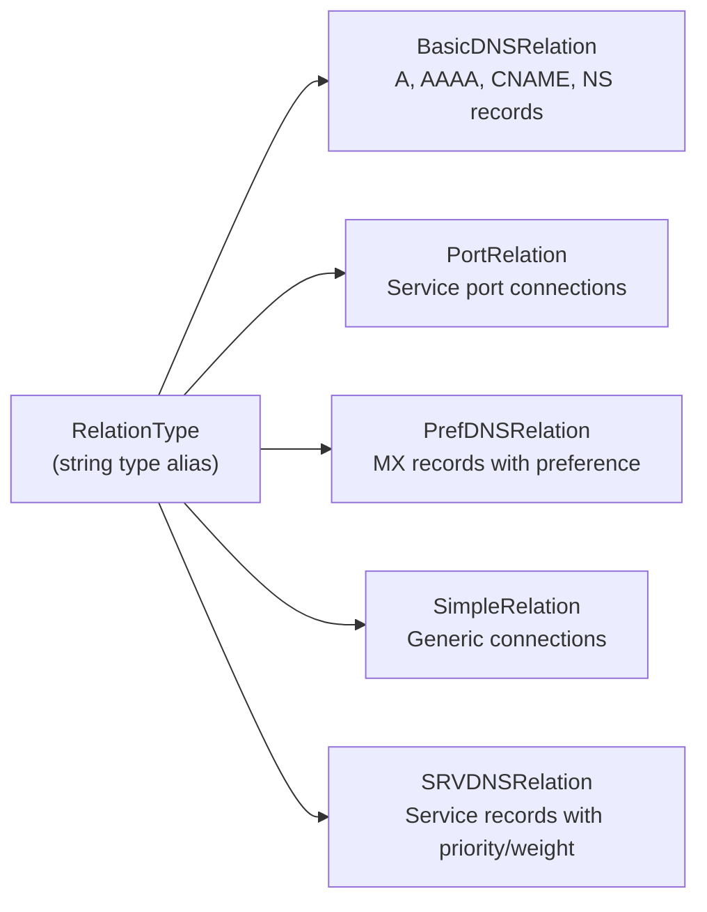
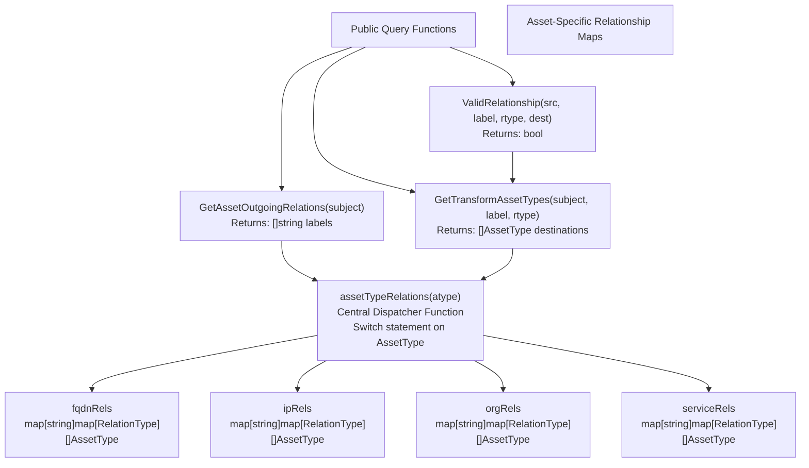
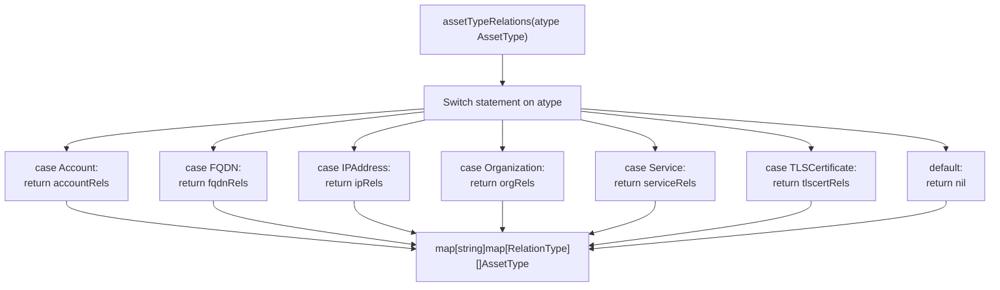
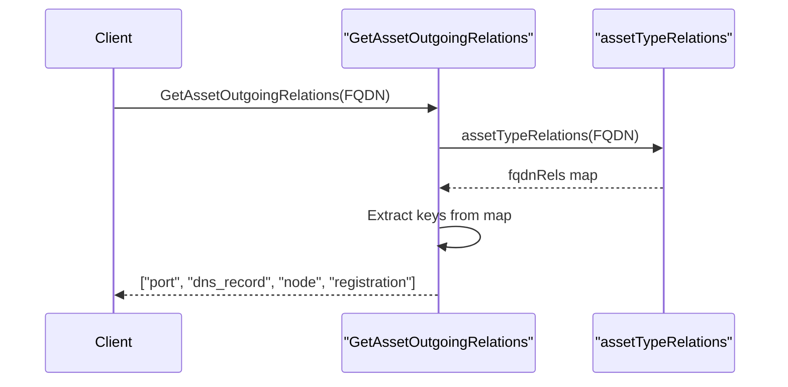
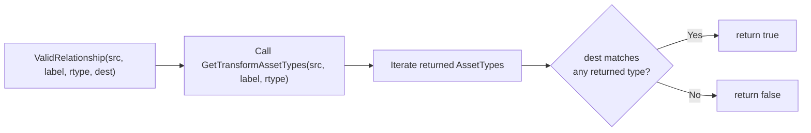

# Relation Interface

This document explains the **Relation interface** and the relationship taxonomy system in the open-asset-model. The Relation interface defines how assets connect to each other through labeled, typed relationships. This page covers:

- The three required methods of the `Relation` interface
- The `RelationType` enumeration (5 distinct types)
- The relationship taxonomy system that defines valid connections between asset types
- Query and validation functions for relationship integrity

For information about the assets being connected, see [Asset Interface](#2.1). For information about non-relational metadata attached to assets, see [Property Interface](#2.3). For detailed documentation on specific relationship implementations, see [DNS Relationship Types](#4.2) and [General Relationship Types](#4.3).

---

## The Relation Interface

The `Relation` interface defines the contract that all relationship implementations must satisfy. It consists of three methods that enable uniform handling of connections between assets.

### Interface Definition

```
Relation interface {
    Label() string
    RelationType() RelationType
    JSON() ([]byte, error)
}
```

### Method Specifications

| Method | Return Type | Purpose |
|--------|-------------|---------|
| `Label()` | `string` | Returns the semantic relationship label (e.g., "dns_record", "port", "parent") |
| `RelationType()` | `RelationType` | Returns the type constant identifying the relationship implementation |
| `JSON()` | `([]byte, error)` | Serializes the relationship data to JSON format for persistence/transport |

The `Label()` method returns a semantic identifier that describes the nature of the connection. Examples include "dns_record" for DNS resolution relationships, "port" for service port connections, or "parent" for organizational hierarchies. These labels are defined in the relationship taxonomy maps and must be lowercase when validated .

The `RelationType()` method returns one of five enumerated constants that classify the relationship's implementation type. This enables type-based dispatching and validation logic.

The `JSON()` method enables serialization of relationship-specific data. For DNS relationships, this includes record-specific fields like preference values for MX records or priority/weight for SRV records.

---

## RelationType Enumeration

The `RelationType` is a string-based enumeration that categorizes relationship implementations. The model defines exactly five relationship types, each serving distinct semantic purposes.

### Defined Relationship Types



| Constant | String Value | Usage |
|----------|--------------|-------|
| `BasicDNSRelation` | "BasicDNSRelation" | Standard DNS record types: A, AAAA, CNAME, NS |
| `PortRelation` | "PortRelation" | Network service port connections from FQDN/IPAddress to Service |
| `PrefDNSRelation` | "PrefDNSRelation" | DNS MX records that include a preference value |
| `SimpleRelation` | "SimpleRelation" | General-purpose connections without specialized semantics |
| `SRVDNSRelation` | "SRVDNSRelation" | DNS SRV records with priority, weight, and port data |

The `RelationList` variable at  provides a slice containing all five types for iteration purposes.

The predominance of DNS-specific relationship types (3 out of 5) reflects the model's origins in network reconnaissance and attack surface discovery. The distinction between `BasicDNSRelation`, `PrefDNSRelation`, and `SRVDNSRelation` allows implementations to properly model the different data structures of DNS record types while maintaining type safety.

---

## Relationship Taxonomy System

The relationship taxonomy defines **which asset types can connect to which other asset types, using specific labels and RelationTypes**. This three-level nested map structure enforces graph integrity at the model level.

### Architecture Overview



### The Three-Level Map Structure

Each asset type's relationships are defined as:
```
map[string]map[RelationType][]AssetType
```

This nesting provides:

1. **Level 1 (Label)**: String key representing the semantic relationship (e.g., "dns_record", "port")
2. **Level 2 (RelationType)**: Which RelationType implementations can use this label
3. **Level 3 (AssetType slice)**: Valid destination asset types for this label+RelationType combination

### Example: FQDN Relationships

The `fqdnRels` map at  demonstrates the taxonomy structure:

```
var fqdnRels = map[string]map[RelationType][]AssetType{
    "port": {PortRelation: {Service}},
    "dns_record": {
        BasicDNSRelation: {FQDN, IPAddress},
        PrefDNSRelation:  {FQDN},
        SRVDNSRelation:   {FQDN},
    },
    "node":         {SimpleRelation: {FQDN}},
    "registration": {SimpleRelation: {DomainRecord}},
}
```

This specification declares:
- An FQDN can have a "port" relationship (via `PortRelation`) to a `Service` asset
- An FQDN can have a "dns_record" relationship to either `FQDN` or `IPAddress` when using `BasicDNSRelation`, but only to `FQDN` when using `PrefDNSRelation` or `SRVDNSRelation`
- An FQDN can have a "node" relationship (subdomain hierarchy) to another `FQDN`
- An FQDN can have a "registration" relationship to a `DomainRecord` (WHOIS data)

### Complete Taxonomy Coverage

The model defines relationship maps for 19 of the 21 asset types. The two asset types without defined outgoing relationships are those that serve as leaf nodes in typical graph structures.

| Asset Type | Variable Name | Line Reference |
|------------|---------------|----------------|
| Account | `accountRels` |  |
| AutnumRecord | `autnumRecordRels` |  |
| AutonomousSystem | `autonomousSystemRels` |  |
| ContactRecord | `contactRecordRels` |  |
| DomainRecord | `domainRecordRels` |  |
| File | `fileRels` |  |
| FQDN | `fqdnRels` |  |
| FundsTransfer | `fundsTransferRels` |  |
| Identifier | `identifierRels` |  |
| IPAddress | `ipRels` |  |
| IPNetRecord | `ipnetRecordRels` |  |
| Location | `locationRels` |  |
| Netblock | `netblockRels` |  |
| Organization | `orgRels` |  |
| Person | `personRels` |  |
| Phone | `phoneRels` |  |
| Product | `productRels` |  |
| ProductRelease | `productReleaseRels` |  |
| Service | `serviceRels` |  |
| TLSCertificate | `tlscertRels` |  |
| URL | `urlRels` |  |

---

## Central Dispatcher: assetTypeRelations Function

The `assetTypeRelations` function serves as the **central dispatcher** that maps an `AssetType` to its relationship taxonomy map. All query and validation functions route through this function.

### Implementation Pattern



The function uses a switch statement at  that exhaustively matches all defined asset types. Asset types without outgoing relationships (those not present in any relationship map) cause the default case to return `nil`.

---

## Validation and Query Functions

The model provides three public API functions for querying and validating relationships. These functions abstract the complexity of the nested map structure.

### Function Signatures and Purposes

| Function | Signature | Purpose |
|----------|-----------|---------|
| `GetAssetOutgoingRelations` | `(subject AssetType) []string` | Returns all relationship labels valid for outgoing connections from the subject asset type |
| `GetTransformAssetTypes` | `(subject AssetType, label string, rtype RelationType) []AssetType` | Returns the asset types that can be destinations for a specific label+RelationType combination |
| `ValidRelationship` | `(src AssetType, label string, rtype RelationType, destination AssetType) bool` | Validates whether a proposed relationship conforms to the taxonomy |

### GetAssetOutgoingRelations

This function returns the set of valid relationship labels for a given asset type. It queries `assetTypeRelations` and extracts the keys from the first-level map.



Implementation at . Returns `nil` if the asset type has no defined relationships.

### GetTransformAssetTypes

This function returns the valid destination asset types for a specific (subject, label, RelationType) tuple. The label is normalized to lowercase at  before lookup.

The function deduplicates results using a map to prevent duplicate entries when the same destination type appears multiple times in the taxonomy .

Example usage:
```
// What asset types can FQDN.dns_record.BasicDNSRelation point to?
destinations := GetTransformAssetTypes(FQDN, "dns_record", BasicDNSRelation)
// Returns: [FQDN, IPAddress]

// What about PrefDNSRelation?
destinations = GetTransformAssetTypes(FQDN, "dns_record", PrefDNSRelation)
// Returns: [FQDN]
```

Implementation at .

### ValidRelationship

This function validates a complete relationship specification: source type, label, relation type, and destination type. It uses `GetTransformAssetTypes` internally and checks whether the destination appears in the allowed types .



This function is critical for **data integrity enforcement**. Discovery tools should call `ValidRelationship` before storing or emitting relationships to ensure graph consistency.

---

## Relationship Label Semantics

While the taxonomy defines the structural validity of relationships, labels carry semantic meaning that guides their usage. Common patterns include:

### Network Infrastructure Labels

| Label | Source Types | Semantics |
|-------|--------------|-----------|
| `"port"` | FQDN, IPAddress, URL | Indicates a network service running on a specific port |
| `"dns_record"` | FQDN | DNS resolution relationships (A, AAAA, CNAME, MX, SRV) |
| `"ptr_record"` | IPAddress | Reverse DNS lookup |
| `"node"` | FQDN | Subdomain hierarchy (e.g., www.example.com → example.com) |

### Registration and Administrative Labels

| Label | Source Types | Semantics |
|-------|--------------|-----------|
| `"registration"` | FQDN, AutonomousSystem, Netblock | Links to WHOIS/RDAP registration records |
| `"whois_server"` | DomainRecord, AutnumRecord, IPNetRecord | WHOIS server used for lookups |
| `"registrar_contact"` | DomainRecord | Contact information for domain registrar |
| `"admin_contact"` | DomainRecord, AutnumRecord, IPNetRecord | Administrative contact |
| `"technical_contact"` | DomainRecord, AutnumRecord, IPNetRecord | Technical contact |

### Organizational Hierarchy Labels

| Label | Source Types | Semantics |
|-------|--------------|-----------|
| `"parent"` | Organization | Parent-subsidiary organizational relationship |
| `"subsidiary"` | Organization | Subsidiary of parent organization |
| `"sister"` | Organization | Sibling organizations under same parent |
| `"location"` | Organization, Person | Physical location of entity |
| `"website"` | Organization, Product, ProductRelease | Official website URL |

### Certificate and Cryptography Labels

| Label | Source Types | Semantics |
|-------|--------------|-----------|
| `"common_name"` | TLSCertificate | Certificate's CN field pointing to FQDN |
| `"san_dns_name"` | TLSCertificate | Subject Alternative Name DNS entries |
| `"issuer_contact"` | TLSCertificate | Certificate issuer contact information |
| `"certificate"` | Service | TLS certificate used by service |

---

## Usage Patterns

### Discovering Valid Outgoing Relationships

Discovery tools can query what relationships are possible from a given asset:

```
// Example: What relationships can an FQDN have?
labels := GetAssetOutgoingRelations(FQDN)
// Returns: ["port", "dns_record", "node", "registration"]

// For each label, discover valid destination types
for _, label := range labels {
    for _, rtype := range RelationList {
        destTypes := GetTransformAssetTypes(FQDN, label, rtype)
        if len(destTypes) > 0 {
            // This label+rtype combination is valid
            // destTypes contains valid destination asset types
        }
    }
}
```

### Validating Before Storage

Data ingestion pipelines should validate relationships before persistence:

```
// Before storing: FQDN --[dns_record/BasicDNSRelation]--> IPAddress
isValid := ValidRelationship(FQDN, "dns_record", BasicDNSRelation, IPAddress)
// Returns: true

// Invalid attempt: FQDN --[dns_record/BasicDNSRelation]--> Service
isValid = ValidRelationship(FQDN, "dns_record", BasicDNSRelation, Service)
// Returns: false
```

### Type-Specific Relationship Discovery

The nested map structure allows precise queries:

```
// What can FQDN's "dns_record" label point to when using BasicDNSRelation?
destinations := GetTransformAssetTypes(FQDN, "dns_record", BasicDNSRelation)
// Returns: [FQDN, IPAddress] - supports A/AAAA records to IPs, CNAME to FQDNs

// What about using PrefDNSRelation (MX records)?
destinations = GetTransformAssetTypes(FQDN, "dns_record", PrefDNSRelation)
// Returns: [FQDN] - MX records only point to mail servers (FQDNs)
```

---

## Design Rationale

### Why Three-Level Nesting?

The `map[string]map[RelationType][]AssetType` structure provides **fine-grained control** over relationship semantics:

1. **Label level**: Groups related concepts (e.g., "dns_record" covers all DNS relationships)
2. **RelationType level**: Distinguishes implementation types with different data structures (BasicDNSRelation vs. PrefDNSRelation have different JSON schemas)
3. **AssetType slice level**: Allows multiple valid destinations (e.g., BasicDNSRelation can point to both FQDN and IPAddress)

Without this nesting, the model would either:
- Lose semantic precision (cannot distinguish A records from MX records)
- Require label proliferation (separate labels for "a_record", "aaaa_record", "cname_record", etc.)

### Why Case-Insensitive Label Matching?

The `strings.ToLower(label)` call at  ensures consistent matching regardless of label capitalization in client code. This reduces validation errors from casing inconsistencies while maintaining lowercase in the taxonomy definitions.

### Why Return nil Instead of Empty Slices?

Functions like `GetAssetOutgoingRelations` and `GetTransformAssetTypes` return `nil` rather than empty slices for invalid inputs , . This **distinguishes between**:
- Asset types with no relationships defined (returns `nil`)
- Asset types with relationships defined but none matching the query (returns empty slice)

Callers can use `if result == nil` to detect taxonomy errors versus legitimate empty result sets.
