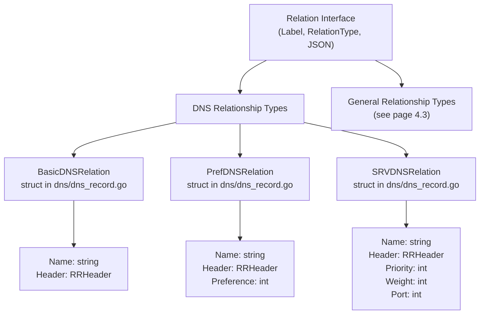
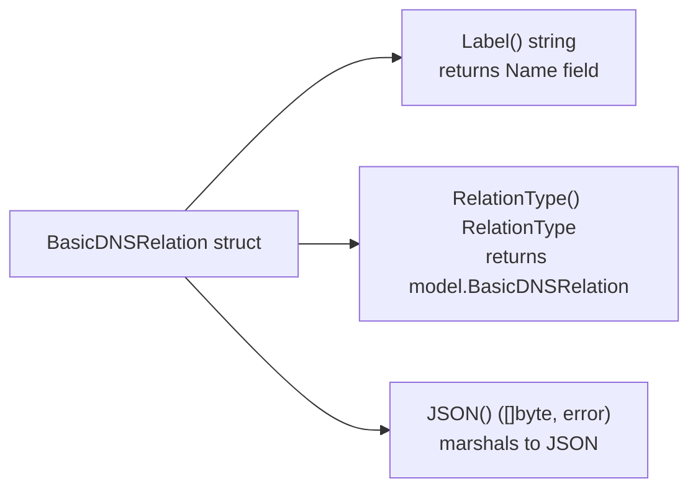
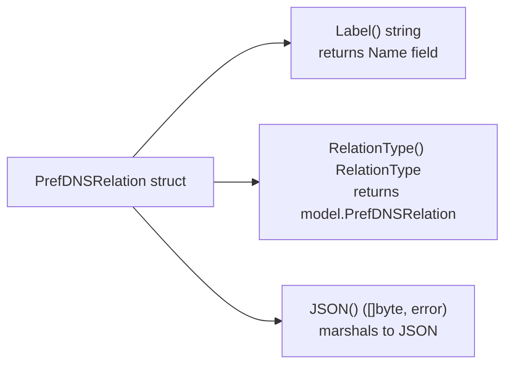
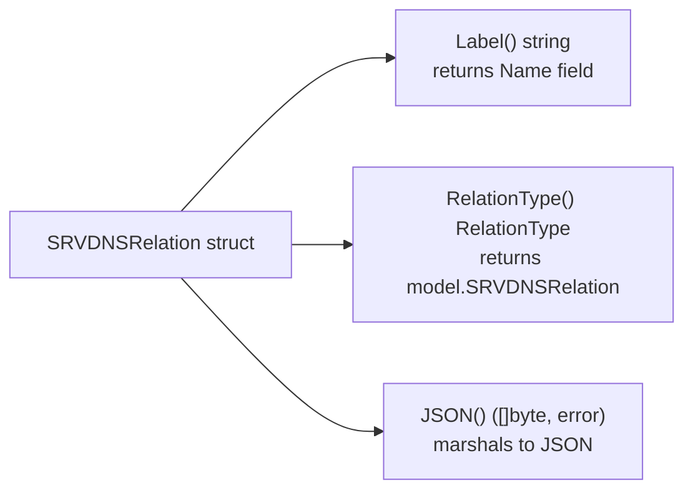
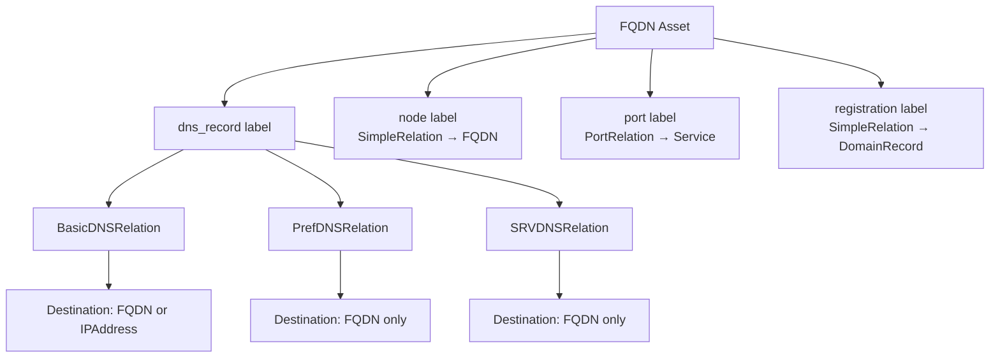
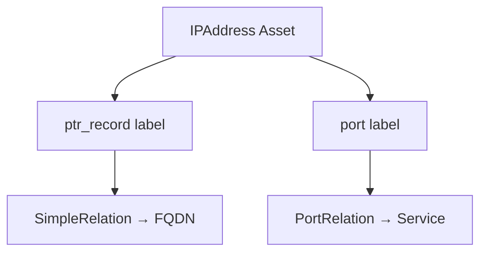

# DNS Relationship Types

This document details the three DNS-specific relationship type implementations in the Open Asset Model: `BasicDNSRelation`, `PrefDNSRelation`, and `SRVDNSRelation`. These specialized relation types model DNS resource records that establish connections between network assets, primarily between FQDN and IPAddress assets. For information about the overall relationship taxonomy and validation system, see [Relationship Taxonomy](#4.1). For non-DNS relationship types, see [General Relationship Types](#4.3).

## Overview

The Open Asset Model defines three distinct `RelationType` constants for DNS relationships, each corresponding to different classes of DNS resource records. These types enable the model to preserve DNS-specific metadata (such as TTL, preference, priority, and weight) when representing relationships between assets.

### DNS RelationType Constants

The following `RelationType` constants are defined for DNS relationships:

| Constant | Purpose | Primary Use Case |
|----------|---------|------------------|
| `BasicDNSRelation` | Standard DNS records without ordering | A, AAAA, CNAME, NS, PTR records |
| `PrefDNSRelation` | DNS records with preference values | MX records |
| `SRVDNSRelation` | Service location records with priority/weight | SRV records |

### Relationship Type Hierarchy



## RRHeader Structure

All three DNS relationship types share a common `RRHeader` structure that captures standard DNS resource record metadata. This structure is embedded in each DNS relation type to maintain consistency with DNS protocol specifications.

### Field Definitions

| Field | Type | JSON Key | Description |
|-------|------|----------|-------------|
| `RRType` | `int` | `rr_type` | DNS record type code (e.g., 1=A, 5=CNAME, 15=MX) |
| `Class` | `int` | `class` | DNS class (typically 1 for IN/Internet) |
| `TTL` | `int` | `ttl` | Time-to-live in seconds |

### Example RRHeader

```go
header := RRHeader{
    RRType: 1,     // A record
    Class:  1,     // IN (Internet)
    TTL:    86400, // 24 hours
}
```

## BasicDNSRelation

`BasicDNSRelation` represents standard DNS resource records that establish direct mappings without ordering or preference semantics. This type is used for A, AAAA, CNAME, NS, and similar record types.

### Structure Definition

The `BasicDNSRelation` struct contains:

- **Name** (`string`): The relationship label, typically `"dns_record"`
- **Header** (`RRHeader`): Standard DNS resource record metadata

### Supported Record Types

`BasicDNSRelation` is used to represent the following DNS record types:

- **A records**: FQDN → IPAddress (IPv4)
- **AAAA records**: FQDN → IPAddress (IPv6)
- **CNAME records**: FQDN → FQDN (canonical name)
- **NS records**: FQDN → FQDN (name server)
- **PTR records**: IPAddress → FQDN (reverse DNS)

### Interface Implementation



### JSON Serialization

When serialized to JSON, `BasicDNSRelation` produces the following structure:

```json
{
  "label": "dns_record",
  "header": {
    "rr_type": 1,
    "class": 1,
    "ttl": 86400
  }
}
```

### Usage in Taxonomy

The relationship taxonomy in  defines that FQDN assets can use `BasicDNSRelation` with the `"dns_record"` label to connect to:
- `FQDN` (for CNAME, NS records)
- `IPAddress` (for A, AAAA records)

Similarly, IPAddress assets can use it with the `"ptr_record"` label to connect to FQDN assets.

## PrefDNSRelation

`PrefDNSRelation` extends `BasicDNSRelation` with a preference field to model DNS records that specify ordering priorities, most notably MX (Mail Exchange) records.

### Structure Definition

The `PrefDNSRelation` struct contains:

- **Name** (`string`): The relationship label, typically `"dns_record"`
- **Header** (`RRHeader`): Standard DNS resource record metadata
- **Preference** (`int`): Priority value (lower values = higher priority)

### MX Record Semantics

The `Preference` field directly corresponds to the preference value in MX records, where:
- Lower values indicate higher priority mail servers
- Multiple MX records for the same domain are sorted by preference
- Mail servers attempt delivery to lower preference values first

### Interface Implementation



### JSON Serialization

When serialized to JSON, `PrefDNSRelation` includes the preference field:

```json
{
  "label": "dns_record",
  "header": {
    "rr_type": 15,
    "class": 1,
    "ttl": 86400
  },
  "preference": 10
}
```

### Usage in Taxonomy

The relationship taxonomy specifies that FQDN assets can use `PrefDNSRelation` with the `"dns_record"` label to connect to other FQDN assets, representing MX records.

## SRVDNSRelation

`SRVDNSRelation` models DNS SRV (Service) records, which provide service location information including priority, weight, and port numbers. This is the most feature-rich DNS relationship type.

### Structure Definition

The `SRVDNSRelation` struct contains:

- **Name** (`string`): The relationship label, typically `"dns_record"`
- **Header** (`RRHeader`): Standard DNS resource record metadata
- **Priority** (`int`): Priority of the target host (lower = higher priority)
- **Weight** (`int`): Relative weight for records with same priority
- **Port** (`int`): TCP/UDP port number for the service

### SRV Record Semantics

The SRV-specific fields encode RFC 2763 semantics:

1. **Priority**: Clients should attempt to contact the target host with the lowest priority value first
2. **Weight**: For targets with equal priority, weight provides a load-balancing mechanism
3. **Port**: The port number on which the service is listening

### Service Discovery Use Cases

SRV records enable service discovery for protocols like:
- LDAP (`_ldap._tcp.example.com`)
- SIP (`_sip._tcp.example.com`)
- XMPP (`_xmpp-client._tcp.example.com`)
- Kerberos (`_kerberos._tcp.example.com`)

### Interface Implementation



### JSON Serialization

When serialized to JSON, `SRVDNSRelation` includes all service location fields:

```json
{
  "label": "dns_record",
  "header": {
    "rr_type": 33,
    "class": 1,
    "ttl": 86400
  },
  "priority": 10,
  "weight": 5,
  "port": 443
}
```

### Usage in Taxonomy

The relationship taxonomy specifies that FQDN assets can use `SRVDNSRelation` with the `"dns_record"` label to connect to other FQDN assets, representing SRV records pointing to target hosts.

## DNS Relationship Taxonomy Integration

The three DNS relationship types integrate with the broader relationship validation system through the `fqdnRels` and `ipRels` maps in the taxonomy.

### FQDN DNS Relationships



### IPAddress DNS Relationships

The IPAddress asset type uses `BasicDNSRelation` implicitly through the `SimpleRelation` wrapper for PTR records:



### Validation Example

The `ValidRelationship` function validates DNS relationships:

```go
// Valid: FQDN with BasicDNSRelation to IPAddress
valid := ValidRelationship(
    FQDN,              // source type
    "dns_record",      // label
    BasicDNSRelation,  // relation type
    IPAddress,         // destination type
)
// Returns: true

// Valid: FQDN with PrefDNSRelation to FQDN (MX record)
valid := ValidRelationship(
    FQDN,             // source type
    "dns_record",     // label
    PrefDNSRelation,  // relation type
    FQDN,             // destination type
)
// Returns: true

// Invalid: PrefDNSRelation cannot point to IPAddress
valid := ValidRelationship(
    FQDN,             // source type
    "dns_record",     // label
    PrefDNSRelation,  // relation type
    IPAddress,        // destination type
)
// Returns: false
```

## DNS Relations vs DNS Properties

It is important to distinguish DNS relationship types from `DNSRecordProperty`. While both model DNS resource records, they serve different purposes:

| Aspect | DNS Relation Types | DNSRecordProperty |
|--------|-------------------|-------------------|
| Purpose | Create connections between assets | Store DNS data that doesn't reference assets |
| Examples | A, AAAA, CNAME, MX, SRV records | TXT records, SOA records |
| Location |  |  |
| Interface | Implements `Relation` | Implements `Property` |
| Page Reference | This page (4.2) | [Property System](#5) |

### When to Use Each

Use DNS Relation Types when:
- The DNS record points to another asset (FQDN, IPAddress)
- You need to represent A, AAAA, CNAME, NS, MX, SRV, or PTR records

Use DNSRecordProperty when:
- The DNS record contains metadata without asset references
- You need to represent TXT, SPF, DKIM, or SOA records

## Usage Patterns

### Creating a BasicDNSRelation for an A Record

```go
relation := dns.BasicDNSRelation{
    Name: "dns_record",
    Header: dns.RRHeader{
        RRType: 1,      // A record
        Class:  1,      // IN
        TTL:    3600,   // 1 hour
    },
}
```

### Creating a PrefDNSRelation for an MX Record

```go
relation := dns.PrefDNSRelation{
    Name: "dns_record",
    Header: dns.RRHeader{
        RRType: 15,     // MX record
        Class:  1,      // IN
        TTL:    86400,  // 24 hours
    },
    Preference: 10,     // Priority
}
```

### Creating an SRVDNSRelation for Service Discovery

```go
relation := dns.SRVDNSRelation{
    Name: "dns_record",
    Header: dns.RRHeader{
        RRType: 33,     // SRV record
        Class:  1,      // IN
        TTL:    3600,   // 1 hour
    },
    Priority: 10,       // Lower = higher priority
    Weight:   5,        // Load balancing weight
    Port:     443,      // HTTPS port
}
```

### Type Assertion Pattern

All DNS relation types properly implement the `Relation` interface, enabling polymorphic usage:

```go
var relation model.Relation

// Can assign any DNS relation type
relation = dns.BasicDNSRelation{Name: "dns_record"}
relation = dns.PrefDNSRelation{Name: "dns_record", Preference: 10}
relation = dns.SRVDNSRelation{Name: "dns_record", Priority: 10}

// Interface methods work uniformly
label := relation.Label()
rtype := relation.RelationType()
jsonData, _ := relation.JSON()
```
