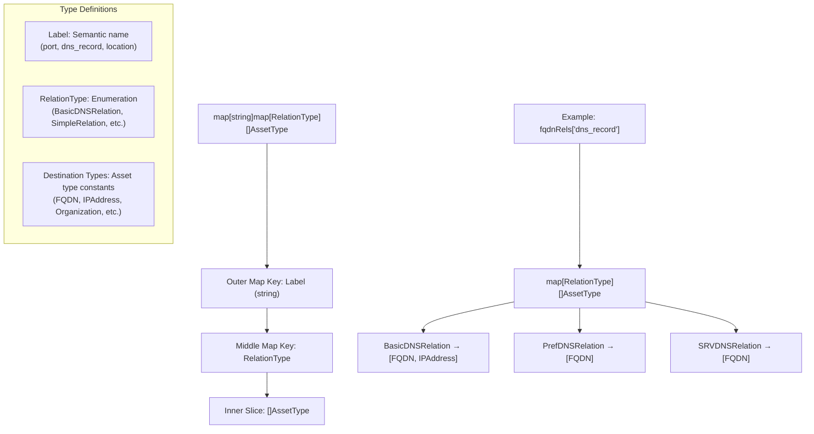
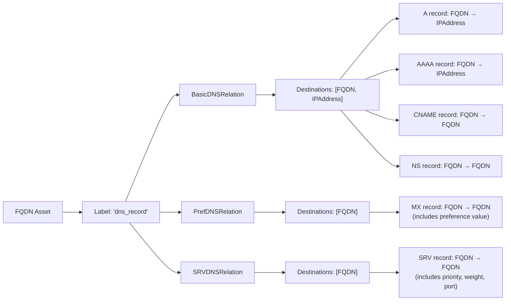
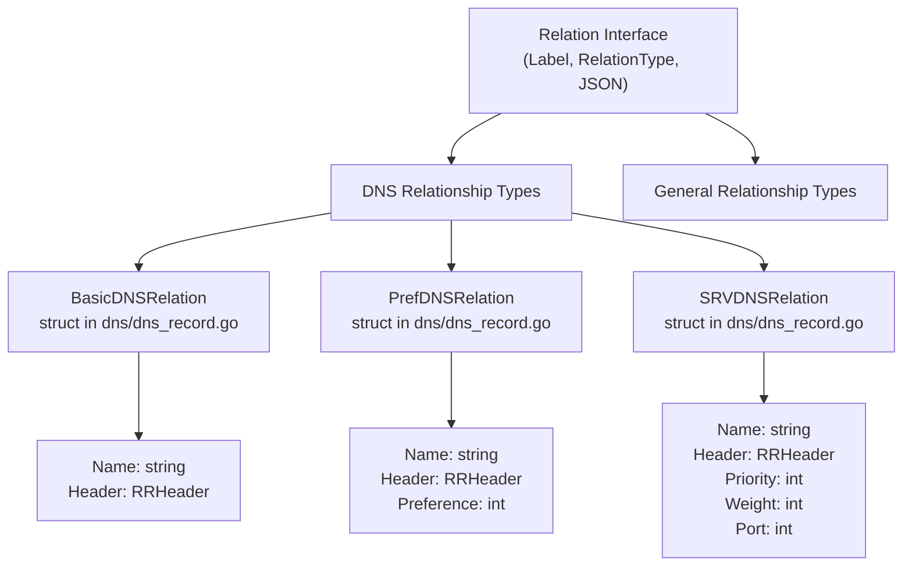
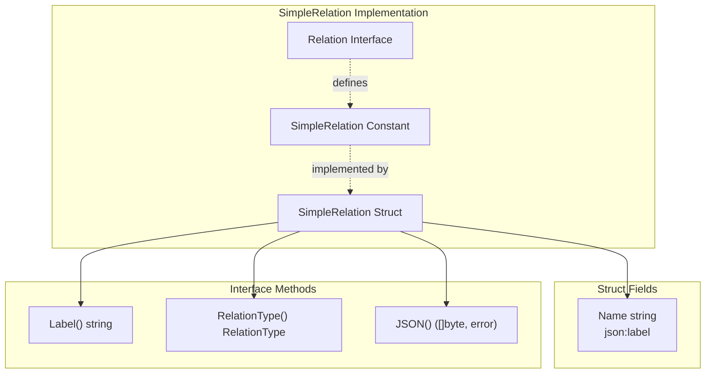

# :simple-owasp: Relations

In the [OWASP](https://owasp.org) [Open Asset Model](https://github.com/owasp-amass/open-asset-model), a **relation** is a typed, directed connection between two assets that expresses how they are linked in the external world. Relations transform isolated observations into an **interconnected graph**, enabling reasoning over ownership, control, communication, service structure, and many other dimensions. Each relation carries contextual metadata such as discovery source, timestamps, and confidence, and is a first-class citizen in the data model—critical for building a coherent picture of an organization's external footprint.

## :material-graph-outline: Why *Relations* Matter

While *assets* are the atomic units of external exposure, **relations** are what make those atoms intelligible as systems. They represent the **structure**, **flow**, and **attribution logic** that connects seemingly disparate observations into a meaningful model.

Relations bring three core advantages to the OAM:

1. **Contextual Linking** – Relations encode meaningful semantics (e.g., *announces*, *contains*, *registration*) between assets.
2. **Graph Navigation** – They enable powerful queries such as tracing supply chain dependencies or resolving domain-to-IP mappings.
3. **Explainability** – Each relation retains source, timestamp, and confidence, making inferences and automated decisions transparent and reproducible.

## :material-graph-outline: Relation Definition

> **Relation**: *A typed, directional edge connecting two assets that captures a discoverable or inferred relationship between them.*

Each relation answers three questions:

1. **What is the connection?**
   The **label** (e.g., *dns_record*, *contains*, *owns*, *announces*).
2. **What assets are involved?**
   A **source asset** and a **target asset**, each uniquely identified.
3. **When was it discovered?**
   A timestamp for when it was first and most recently seen.

## :material-graph-outline: Core Relation Schema (Conceptually)

```json
{
  "label": "contains",
  "source": "Netblock/192.0.2.0-24",
  "target": "IPAddress/192.0.2.4",
  "created_at": "2025-06-20T14:22:00Z",
  "last_seen": "2025-06-20T14:22:00Z",
}
```

See specific relation types for actual JSON field names. Also, see [Triples](../../asset_db/triples.md) for more information regarding how to query the data collected.

## :material-graph-outline: Common Relation Labels (Partial)

| Relation Type        | From (Source Asset) | To (Target Asset)         | Meaning                      |
| -------------------- | ------------------- | ------------------------- | ---------------------------- |
| **dns_record**       | FQDN                | IPAddress                 | DNS resolved A/AAAA record   |
| **contains**         | Netblock            | IPAddress                 | IP belongs to CIDR range     |
| **announces**        | AutonomousSystem    | Netblock                  | AS BGP route announcement    |
| **registration**     | Netblock            | IPNetRecord               | Ownership or allocation data |

*The list is extensible—new relation types are added as threat models and data sources evolve.*

## :material-graph-outline: Directionality and Semantics

Relations are **directed**: a relation from *A → B* is not the same as *B → A*. For instance:

* *FQDN → IPAddress* via `dns_record` indicates resolution;
* *IPAddress → FQDN* is not automatically implied and may require reverse DNS (`ptr_record`).

Understanding directionality is key to constructing valid traversal paths and interpreting graph queries.

## :material-graph-outline: Role in Graph Queries

Relations are the **edges** that enable:

* Ownership traversal: *Domain → Organization → LegalName*
* Infrastructure mapping: *Service → IP → Netblock → AS*
* Contact pivoting: *TLSCertificate → ContactRecord → Organization*

The expressive power of the model arises from chaining these relations through triple-based queries.

Example:

> *“Which TLS certificates are served from IPs owned by ASNs linked to Acme Corp?”*

This query may walk:
`Organization → organization → ContactRecord → registrant → AutnumRecord → registration → AutonomousSystem → announces → Netblock → contains → IPAddress → port → Service → certificate → TLSCertificate`

## :material-graph-outline: Where to Go Next

Learn more about the structure and usage of the model:

- [Assets](../assets/index.md) – The core entities in the graph.
- [Properties](../properties/index.md) – Descriptive metadata that enrich assets.
- [Triples](../../asset_db/triples.md) – Performing graph queries using SPARQL-style syntax.


## Technical Reference

### Relation Interface

The `Relation` interface defines the contract that all relationship types must implement:

```go
type Relation interface {
    Label() string
    RelationType() RelationType
    JSON() ([]byte, error)
}
```

| Method | Return Type | Purpose |
|--------|-------------|---------|
| `Label()` | `string` | Returns the semantic relationship label (e.g., "dns_record", "port", "certificate") |
| `RelationType()` | `RelationType` | Returns the type constant identifying the concrete implementation |
| `JSON()` | `([]byte, error)` | Serializes the relationship data to JSON format for persistence or transmission |

The `Label()` identifies the semantic nature of the relationship (what it represents), while `RelationType()` identifies the structural implementation (how it's represented). This separation allows multiple `RelationType` implementations to share the same label when they have different data structures.

**RelationType constants:**

| RelationType Constant | Value | Use Case |
|----------------------|-------|----------|
| `BasicDNSRelation` | "BasicDNSRelation" | A, AAAA, CNAME, NS DNS records with destination only |
| `PortRelation` | "PortRelation" | Network port and protocol information (port number + TCP/UDP) |
| `PrefDNSRelation` | "PrefDNSRelation" | MX records with preference/priority value |
| `SimpleRelation` | "SimpleRelation" | Generic directed connection with no additional data |
| `SRVDNSRelation` | "SRVDNSRelation" | SRV records with priority, weight, and port information |

### Relationship Taxonomy

The relationship taxonomy uses a three-level nested map structure to define valid relationships:



#### FQDN Relationships

| Label | RelationType | Destination Types | Semantic Meaning |
|-------|-------------|-------------------|------------------|
| `"port"` | `PortRelation` | `[Service]` | Services listening on FQDN |
| `"dns_record"` | `BasicDNSRelation` | `[FQDN, IPAddress]` | A, AAAA, CNAME, NS records |
| `"dns_record"` | `PrefDNSRelation` | `[FQDN]` | MX records with preference |
| `"dns_record"` | `SRVDNSRelation` | `[FQDN]` | SRV records with priority/weight |
| `"node"` | `SimpleRelation` | `[FQDN]` | Subdomain/parent relationships |
| `"registration"` | `SimpleRelation` | `[DomainRecord]` | WHOIS/RDAP registration |

#### IPAddress Relationships

| Label | RelationType | Destination Types | Semantic Meaning |
|-------|-------------|-------------------|------------------|
| `"port"` | `PortRelation` | `[Service]` | Services listening on IP |
| `"ptr_record"` | `SimpleRelation` | `[FQDN]` | Reverse DNS PTR record |

#### Network Infrastructure Relationships

The `"dns_record"` label is the only label in the entire taxonomy that maps to more than one `RelationType`:



#### DNS Relationship Types

The three DNS-specific `RelationType` values each correspond to different DNS record classes:



**DNS RelationType constants:**

| Constant | Purpose | Primary Use Case |
|----------|---------|------------------|
| `BasicDNSRelation` | Standard DNS records without ordering | A, AAAA, CNAME, NS, PTR records |
| `PrefDNSRelation` | DNS records with preference values | MX records |
| `SRVDNSRelation` | Service location records with priority/weight | SRV records |

#### PortRelation and SimpleRelation



`PortRelation` appears in exactly three asset type relationship maps, always with the label `"port"` targeting the `Service` asset type:

| Source Asset Type | Label | RelationType | Destination Asset Type |
|------------------|-------|--------------|------------------------|
| `FQDN` | `port` | `PortRelation` | `Service` |
| `IPAddress` | `port` | `PortRelation` | `Service` |
| `URL` | `port` | `PortRelation` | `Service` |

---

*© 2025 Jeff Foley — Licensed under Apache 2.0.*
