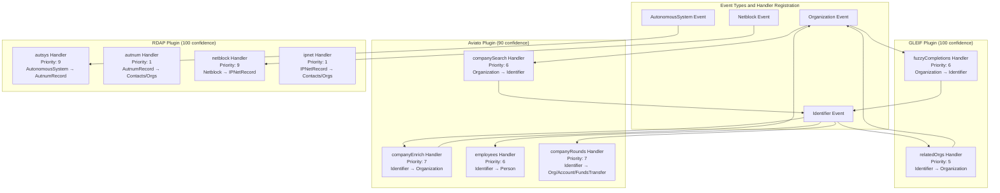
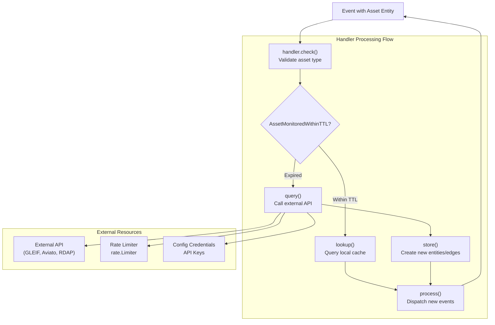
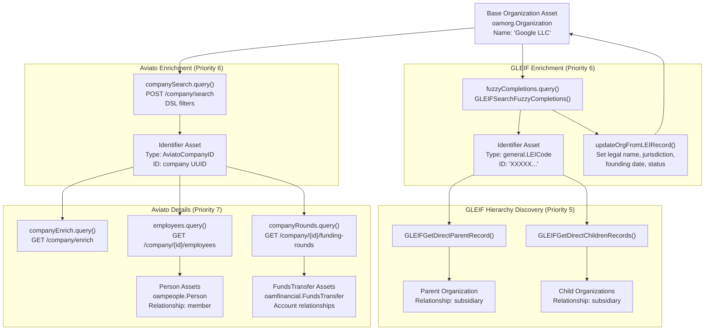
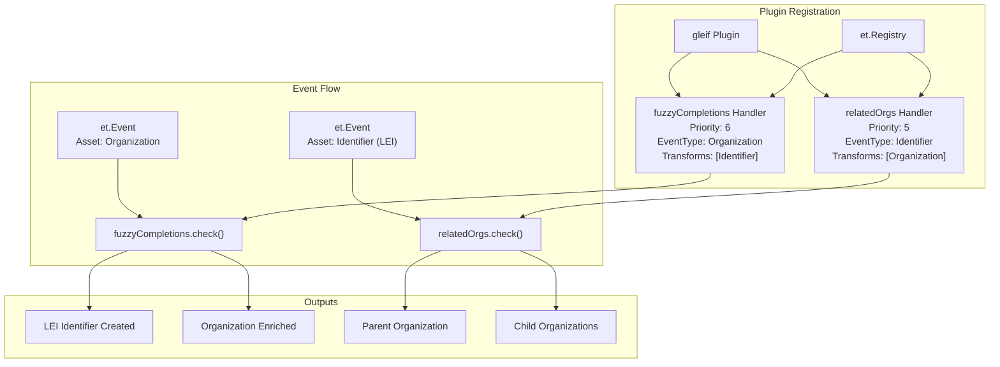
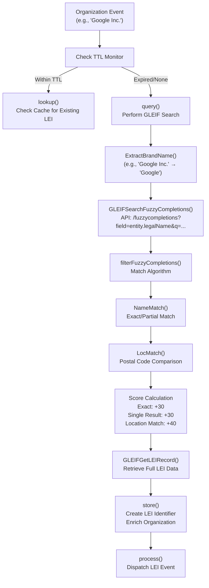
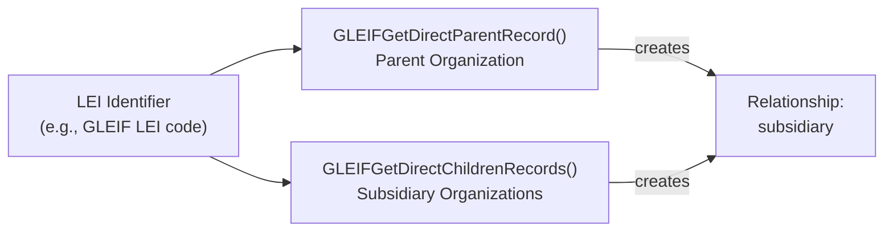
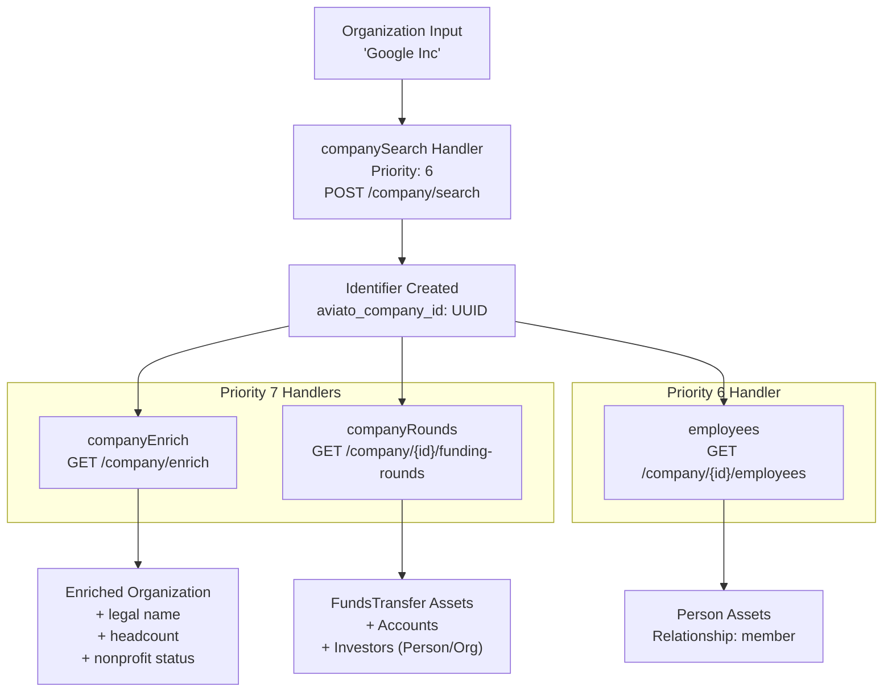

# API Integration Plugins

API integration plugins query external authoritative data sources to enrich discovered assets with additional context such as organization identifiers, employee information, funding data, and registration records. These plugins extend beyond active DNS probing by leveraging third-party APIs to build comprehensive asset profiles.

## Overview

| Plugin | API Source | Primary Asset Types | Transformations | Priority Range |
|--------|------------|---------------------|-----------------|----------------|
| **GLEIF** | GLEIF API (gleif.org) | `Organization` → `Identifier` (LEI) | Organization hierarchies, legal names | 5–6 |
| **Aviato** | Aviato API (aviato.co) | `Organization` → `Person`, `FundsTransfer` | Employees, funding rounds, company data | 6–7 |
| **RDAP** | RDAP servers | `AutonomousSystem`, `Netblock` → `AutnumRecord`, `IPNetRecord` | Contact records, registration data | 1, 9 |
| **WHOIS** | WHOIS servers | `DomainRecord` | Name servers, registrant contacts | Variable |

All API plugins follow common architectural patterns: TTL-based caching to avoid redundant queries, rate limiting to respect API constraints, API key management through the configuration system, and source attribution with confidence scoring.

---

## Handler Registration and Priorities



---

## API Plugin Architecture Patterns



### TTL-Based Monitoring Pattern

All API plugins implement a lookup-before-query pattern to avoid redundant API calls:

1. **TTL Check** — Call `support.TTLStartTime()` to calculate the timestamp before which data is considered stale
2. **Monitored Check** — Call `support.AssetMonitoredWithinTTL()` to check if the asset has been queried recently
3. **Lookup Path** — If within TTL, query the session cache using `OutgoingEdges()` or `IncomingEdges()` with the TTL timestamp
4. **Query Path** — If stale or missing, call the external API, store results, and mark with `support.MarkAssetMonitored()`

```go
since, err := support.TTLStartTime(e.Session.Config(),
    string(oam.Organization), string(oam.Identifier), fc.plugin.name)

var id *dbt.Entity
if support.AssetMonitoredWithinTTL(e.Session, e.Entity, fc.plugin.source, since) {
    id = fc.lookup(e, e.Entity, since)  // Query cache
} else {
    id = fc.query(e, e.Entity)          // Call API
    support.MarkAssetMonitored(e.Session, e.Entity, fc.plugin.source)
}
```

### Rate Limiting Pattern

API plugins use `golang.org/x/time/rate.Limiter` to enforce API rate limits:

```go
// Aviato plugin initialization
limit := rate.Every(2 * time.Second)
return &aviato{
    rlimit: rate.NewLimiter(limit, 1),
}

// In query method
_ = ae.plugin.rlimit.Wait(context.TODO())
resp, err := http.RequestWebPage(ctx, &http.Request{URL: u, Header: headers})
```

---

## Data Enrichment Flow



---

## GLEIF Plugin

The GLEIF plugin integrates with the Global Legal Entity Identifier Foundation (GLEIF) API to discover and enrich organization data with Legal Entity Identifiers (LEI codes) and corporate hierarchy information.

### Handler Structure

| Handler | Priority | Input Asset | Output Assets | Purpose |
|---------|----------|-------------|---------------|---------|
| `fuzzyCompletions` | 6 | `Organization` | `Identifier` (LEI), enriched `Organization` | Search for LEI codes via fuzzy name matching |
| `relatedOrgs` | 5 | `Identifier` (LEI) | `Organization` (parent/children) | Discover corporate hierarchy relationships |



### Fuzzy Completions Handler

The `fuzzyCompletions` handler processes `Organization` events and attempts to find matching LEI codes using GLEIF's fuzzy completion search API.



**Scoring System:**

- Exact match: 30 points
- Single match bonus: +30 points
- Location match: +40 points
- Partial match: Smith-Waterman-Gotoh algorithm (0–30 points)

### Organization Enrichment from LEI Records

The `updateOrgFromLEIRecord()` method enriches organization assets with:

- Legal name and alternate names as identifiers
- Founding date, jurisdiction, registration ID
- Legal address, headquarters address, other addresses as locations
- Additional identifiers: BIC codes, MIC codes, OpenCorp ID, S&P Global ID

### Related Organizations Handler

The `relatedOrgs` handler discovers corporate hierarchy by querying direct parent and child LEI records:



---

## Aviato Plugin

The Aviato plugin provides corporate intelligence through four specialized handlers that discover employees, funding rounds, and detailed company data.

### Custom Identifier Types

```go
const (
    AviatoPersonID  = "aviato_person_id"
    AviatoCompanyID = "aviato_company_id"
)
```

### Handler Pipeline



### Company Search DSL

The company search handler uses a Domain-Specific Language (DSL) for filtering:

```go
filters := []map[string]*dslEvalObj{
    {
        "name": &dslEvalObj{
            Operation: "eq",
            Value:     brand,
        },
    },
}
reqDSL := &dsl{Offset: 0, Limit: 10, Filters: filters}
```

### Funding Rounds Data Model

The `companyRounds` handler creates a financial relationship graph:

1. **Organization Checking Account** — Creates a default checking account for the target organization
2. **Seed Account** — Creates a temporary account representing the funding source
3. **FundsTransfer Asset** — Represents the funding round with amount, currency, and date
4. **Investor Discovery** — Creates `Person` and `Organization` assets for investors, linking them to the seed account

---

## RDAP Plugin

The RDAP plugin queries Registration Data Access Protocol servers for authoritative registration data about IP networks and autonomous systems.

### Four-Handler Architecture

| Handler | Direction | Priority | Purpose |
|---------|-----------|---------|---------|
| `autsys` | `AutonomousSystem` → `AutnumRecord` | 9 | Creates registration records from ASN assets |
| `autnum` | `AutnumRecord` → `FQDN`, `ContactRecord`, `Organization`, etc. | 1 | Expands registration records |
| `netblock` | `Netblock` → `IPNetRecord` | 9 | Creates registration records from netblock assets |
| `ipnet` | `IPNetRecord` → `FQDN`, `ContactRecord`, `Organization`, etc. | 1 | Expands registration records |

### Bootstrap Client Configuration

RDAP uses a bootstrap client with disk caching to discover the correct RDAP server for any given resource:

```go
c := cache.NewDiskCache()
c.Dir = filepath.Join(outdir, ".openrdap")

bs := &bootstrap.Client{Cache: c}
rd.client = &rdap.Client{
    HTTP:      httpClient,
    Bootstrap: bs,
}
```

### VCard Processing

RDAP responses contain VCard contact data, which the plugin parses to create `ContactRecord` assets with related entities:

```go
v := entity.VCard
if adr := v.GetFirst("adr"); adr != nil {
    // Create Location asset from address label
}
if email := strings.ToLower(v.Email()); email != "" {
    // Create Identifier asset with EmailAddress type
}
if phone := support.PhoneToOAMPhone(v.Tel(), "", v.Country()); phone != nil {
    // Create Phone asset
}
```

---

## WHOIS Plugin

The WHOIS plugin handles traditional WHOIS queries for domain registration data.

### Domain Record Transformation

The `domrec` handler processes `DomainRecord` events and creates relationships to discovered assets:

- Name servers as `FQDN` assets
- WHOIS server as `FQDN` asset
- Contact records for registrar, registrant, admin, technical, and billing contacts

### Contact Record Creation

Each contact type creates a `ContactRecord` with relationships to:

| Asset Type | Relationship | Notes |
|------------|-------------|-------|
| `Person` | — | If name parses successfully |
| `Location` | — | From street address parsing |
| `Identifier` | — | Email addresses |
| `Phone` | — | Regular and fax numbers |
| `URL` | — | Referral URLs |
| `Organization` | — | Organization name |

---

## Integration with Support Utilities

API plugins rely heavily on the support package utilities:

| Function | Purpose |
|----------|---------|
| `support.TTLStartTime()` | Calculate TTL timestamp |
| `support.AssetMonitoredWithinTTL()` | Check if asset was recently queried |
| `support.MarkAssetMonitored()` | Mark asset as monitored |
| `support.StreetAddressToLocation()` | Parse addresses into Location assets |
| `support.FullNameToPerson()` | Parse names into Person assets |
| `support.PhoneToOAMPhone()` | Parse phone numbers into Phone assets |
| `support.ProcessAssetsWithSource()` | Create edges with source attribution |
| `org.CreateOrgAsset()` | Create Organization assets with proper relationships |
| `org.ExtractBrandName()` | Extract brand from organization name |
| `org.NameMatch()` | Match organization names |
| `org.LocMatch()` | Match organization locations |

For detailed documentation on these utilities, see [Enrichment Plugins & Support Utilities](enrichment.md).
