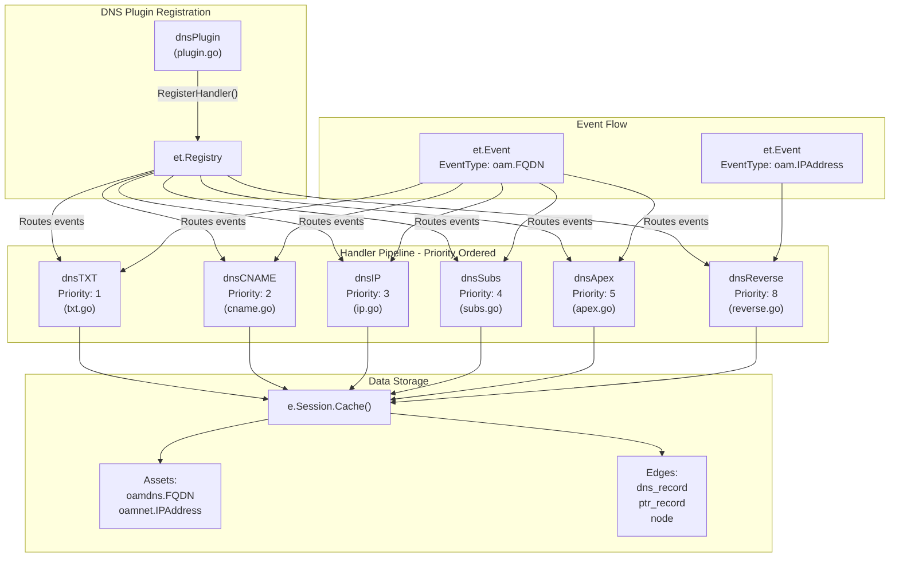
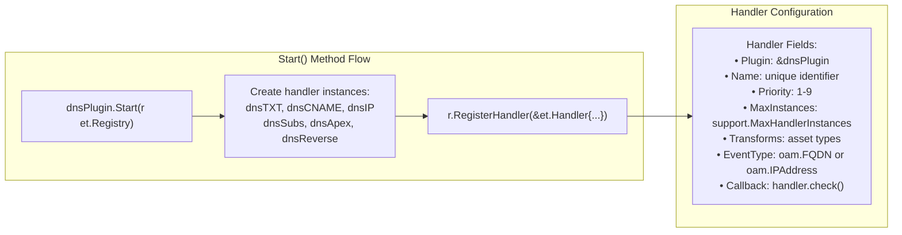
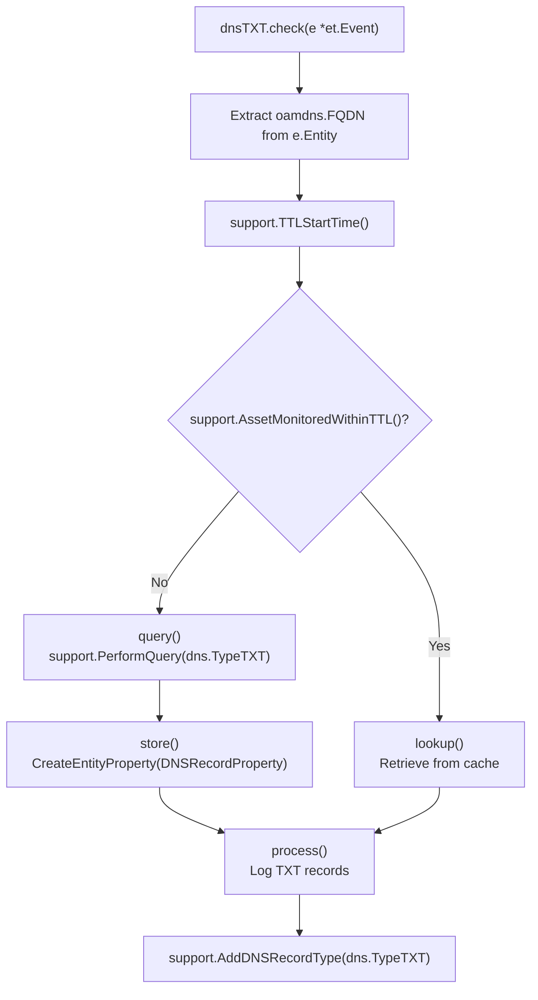
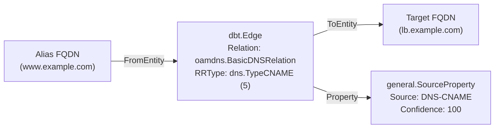
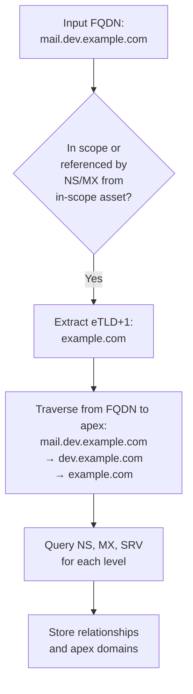
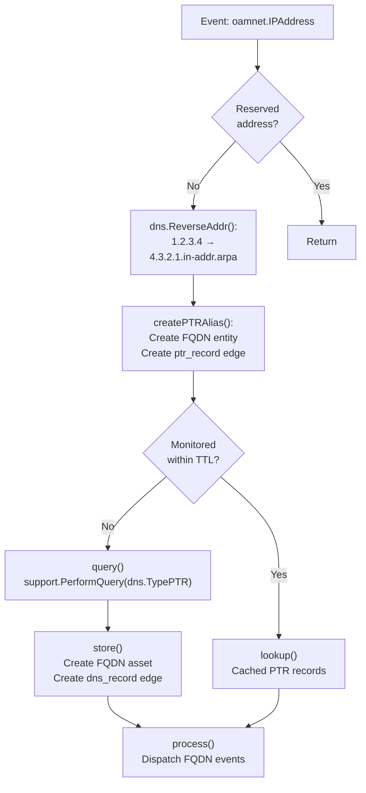
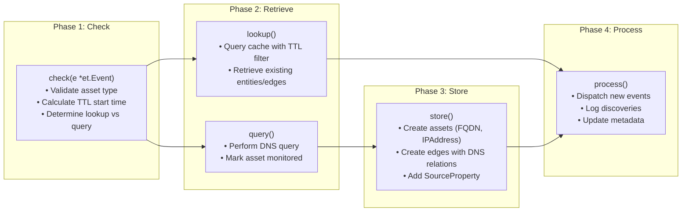
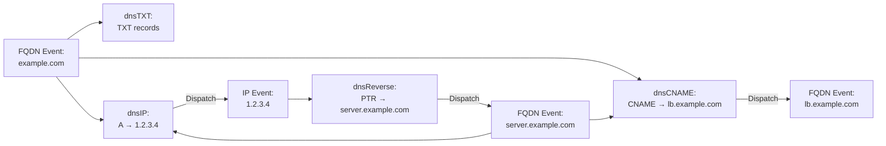

# DNS Discovery Plugins

## Purpose and Scope

The DNS Discovery Plugin suite is responsible for performing comprehensive DNS-based reconnaissance to discover FQDNs, IP addresses, and their relationships. This includes querying various DNS record types (TXT, CNAME, A/AAAA, NS, MX, SRV, PTR), managing the domain hierarchy, and triggering cascading discovery through event dispatch.

## Overview

The DNS plugin consists of six specialized handlers that process different DNS record types in a priority-ordered pipeline. Each handler follows a consistent pattern: check incoming events, query or lookup DNS records, store results in the graph database, and dispatch new events for discovered assets.

## Plugin Architecture

### Main Plugin Structure

The `dnsPlugin` struct serves as the parent plugin that manages all DNS handlers.

| Field | Type | Purpose |
|-------|------|---------|
| `name` | `string` | Plugin name: `"DNS"` |
| `txt`, `cname`, `ip`, `subs`, `apex`, `reverse` | Handler structs | Individual DNS record handlers |
| `firstSweepSize`, `secondSweepSize`, `maxSweepSize` | `int` | IP address sweep sizes (25, 100, 250) |
| `source` | `*et.Source` | Source attribution with 100% confidence |
| `apexLock` | `sync.Mutex` | Protects apex list access |
| `apexList` | `map[string]*dbt.Entity` | Tracks discovered apex domains |

### Handler Registration

During plugin startup, each handler registers with the engine registry specifying its priority, event type, and transforms:

---

## DNS Handlers

### dnsTXT Handler (Priority 1)

The TXT record handler queries DNS TXT records, which may contain organization identifiers, verification records, and other metadata.

**Handler Flow:**

**Key Functions:**

- `check()` — Entry point that validates FQDN and determines lookup vs. query path
- `lookup()` — Retrieves cached TXT records using `GetEntityTags()` with `dns_record` tag
- `query()` — Performs DNS TXT query via `support.PerformQuery()` and marks asset monitored
- `store()` — Creates `DNSRecordProperty` with RRType, Class, TTL, and TXT data
- `process()` — Logs discovered TXT records

---

### dnsCNAME Handler (Priority 2)

The CNAME handler resolves canonical name aliases, creating edges from alias to target FQDNs.

**Data Structure:**

!!! info "Unique Behavior"
    Discovered CNAME targets are dispatched as new events, triggering recursive resolution. CNAME chains are followed until an A/AAAA record is found.

---

### dnsIP Handler (Priority 3)

The IP handler resolves A and AAAA records, creating edges from FQDNs to IP addresses.

- Query types: `dns.TypeA`, `dns.TypeAAAA`
- Skips processing if a CNAME record already exists (`support.HasDNSRecordType(e, int(dns.TypeCNAME))`)
- Triggers IP address sweeps for in-scope assets

**Sweep sizes by condition:**

| Condition | Sweep Size |
|-----------|------------|
| IP in scope (passive) | 100 addresses |
| IP in scope (active) | 250 addresses |
| FQDN in scope, IP not | 25 addresses |

---

### dnsSubs Handler (Priority 4)

The subdomain handler queries NS, MX, and SRV records to discover subdomains and services.

**Record Types:**

| DNS Type | Code | Relation Type | Purpose |
|----------|------|---------------|---------|
| NS | 2 | `oamdns.BasicDNSRelation` | Name server discovery |
| MX | 15 | `oamdns.PrefDNSRelation` | Mail server discovery |
| SRV | 33 | `oamdns.SRVDNSRelation` | Service discovery |

The handler queries 171 predefined SRV record labels concurrently (e.g., `_http._tcp`, `_ldap._tcp`, `_xmpp-server._tcp`).

**Traversal Strategy:**

!!! note "Session Deduplication"
    The handler maintains a per-session string set (`subsSession.strset`) to avoid re-querying the same FQDN within a session. Sessions are released via a background goroutine when `s.session.Done()` returns true.

---

### dnsApex Handler (Priority 5)

The apex handler builds the domain hierarchy by creating `node` relationships from apex domains to their subdomains.

**Processing Logic:**

1. Checks if the FQDN has any DNS record types (via `e.Meta` containing `support.FQDNMeta`)
2. Finds the parent apex domain by searching `apexList` for the longest matching suffix
3. Creates a `general.SimpleRelation` edge with name `"node"` from apex to subdomain

**Apex List Management:**

- `addApex()` — Adds a domain to the apex list (thread-safe)
- `getApex()` — Retrieves an apex entity by name
- `getApexList()` — Returns all apex domain names

---

### dnsReverse Handler (Priority 8)

The reverse DNS handler performs PTR lookups to discover FQDNs associated with IP addresses.

**Processing Flow:**

The handler creates two types of relationships:

1. **ptr_record** — From IP address to reverse DNS FQDN (e.g., `4.3.2.1.in-addr.arpa`)
2. **dns_record** — From reverse DNS FQDN to target FQDN (e.g., `server.example.com`)

---

## Handler Processing Pattern

All DNS handlers follow a consistent four-phase pattern:

---

## Data Storage Patterns

### Edge Types

| Relation Type | Fields | Used By |
|---------------|--------|---------|
| `oamdns.BasicDNSRelation` | `Name`, `Header` (RRType, Class, TTL) | CNAME, A/AAAA, NS, PTR |
| `oamdns.PrefDNSRelation` | `Name`, `Header`, `Preference` | MX |
| `oamdns.SRVDNSRelation` | `Name`, `Header`, `Priority`, `Weight`, `Port` | SRV |
| `general.SimpleRelation` | `Name` | Apex hierarchy, PTR alias |

Every edge receives a `general.SourceProperty` tag for source tracking.

---

## Event Dispatching and Cascading Discovery

DNS handlers dispatch events for newly discovered assets, enabling cascading discovery:

This recursive event model enables comprehensive reconnaissance from a single seed domain.

---

## Integration with Support Package

All DNS handlers rely on the shared support package for common functionality:

| Function | Purpose |
|----------|---------|
| `support.PerformQuery()` | Execute DNS queries with retry logic |
| `support.TTLStartTime()` | Calculate TTL-based cache window |
| `support.AssetMonitoredWithinTTL()` | Check if asset was recently queried |
| `support.MarkAssetMonitored()` | Mark asset as monitored |
| `support.AddDNSRecordType()` | Add DNS record type to event metadata |
| `support.HasDNSRecordType()` | Check if event has specific record type |
| `support.IPAddressSweep()` | Perform IP address range sweep |
| `support.ScrapeSubdomainNames()` | Extract FQDNs from text |

For detailed documentation on these utilities, see [Enrichment Plugins & Support Utilities](enrichment.md).
