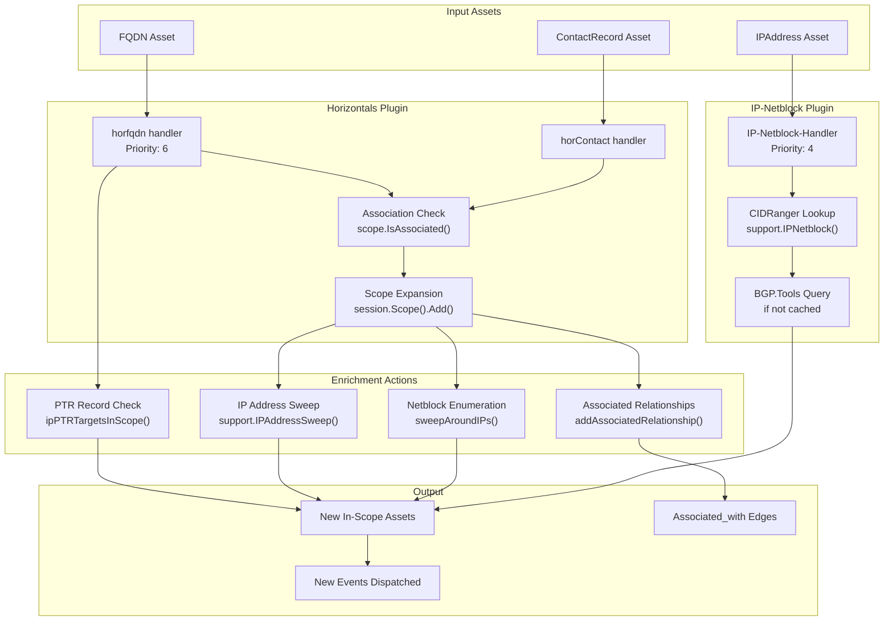
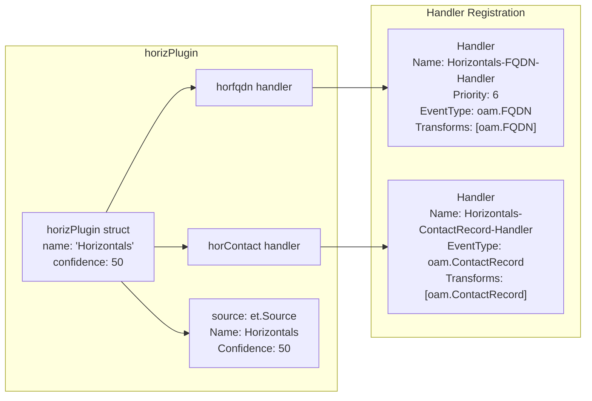
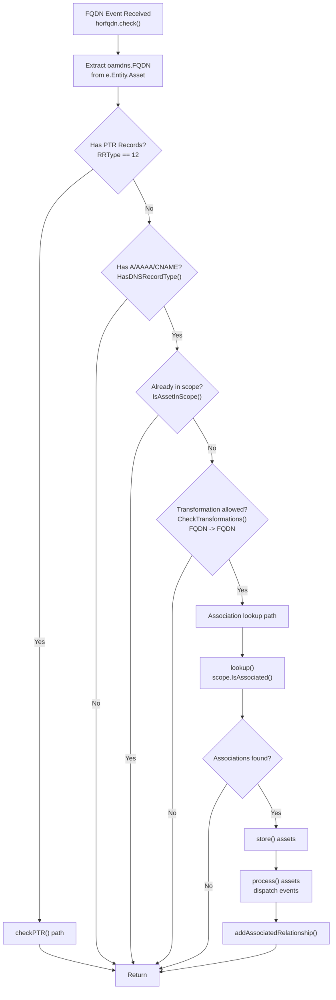
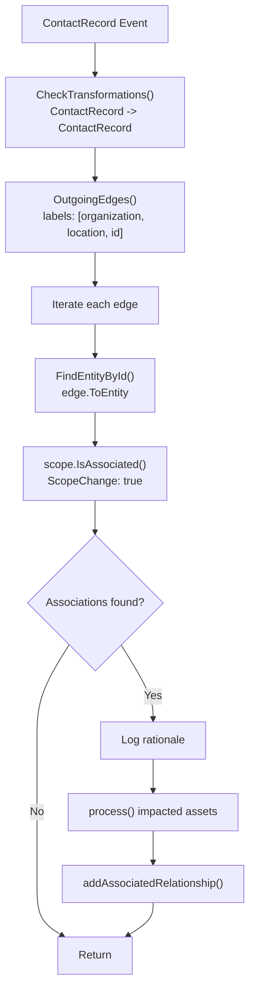
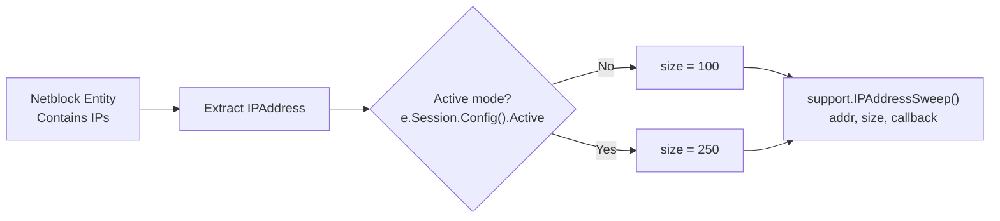
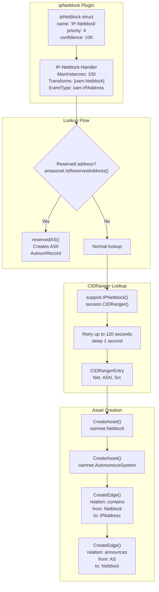
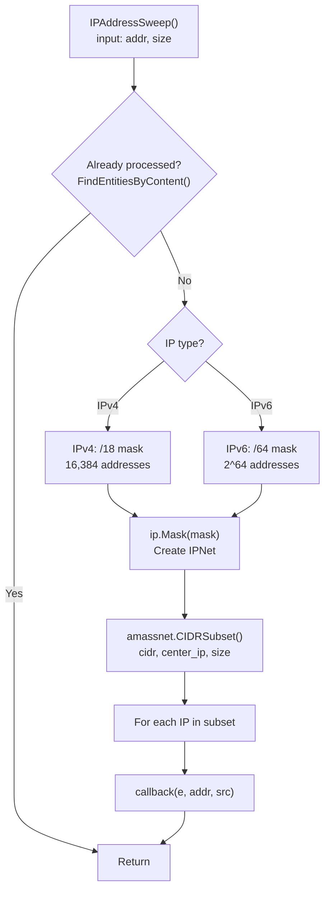
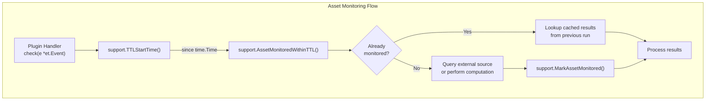
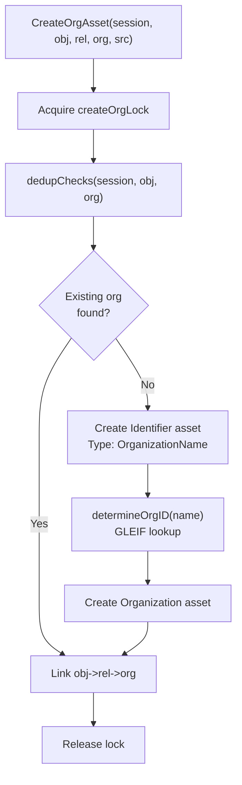
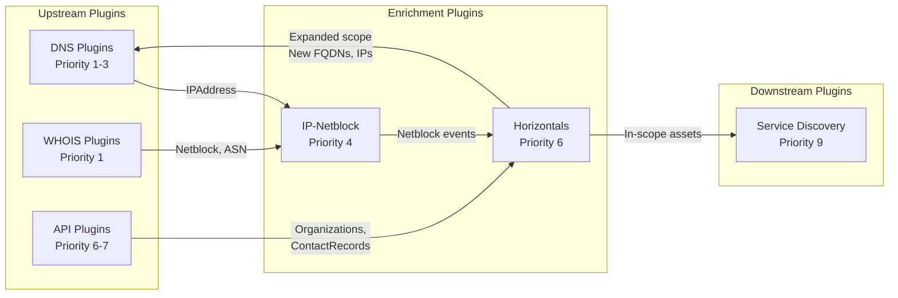

# Enrichment Plugins & Support Utilities

Enrichment plugins expand the reconnaissance scope and add contextual data to discovered assets. They analyze relationships between assets to determine if newly discovered entities should be added to the session scope based on association with in-scope assets.

## Overview: Enrichment Plugin Architecture



---

## Horizontals Plugin

The Horizontals plugin (`NewHorizontals()`) is the primary scope expansion mechanism in Amass. It analyzes asset relationships to determine if out-of-scope discoveries should be brought into scope based on their association with in-scope assets.

### Plugin Structure



### FQDN Handler: Scope Expansion via Associations

The `horfqdn` handler processes FQDN assets to determine if they should be added to scope based on associations with in-scope assets.

**Handler Logic Flow:**



**PTR Record Analysis:**

When a PTR record is found, the handler performs bidirectional scope expansion:

| Scenario | Action |
|----------|--------|
| **PTR source IP is in-scope** | Extract eTLD+1 from PTR target, add domain to scope |
| **PTR target FQDN is in-scope** | Add source IP to scope, perform IP sweep (size 100 or 250 if active) |

### Contact Handler: Organization and Location Expansion

The `horContact` handler processes `ContactRecord` assets to expand scope based on organizational and location relationships. It follows three types of edges from ContactRecords: `organization`, `location`, and `id`.



### Association Logic

Association checking is performed by `scope.IsAssociated()`, which traverses the asset graph to find relationships between submitted assets and in-scope assets.

**Traversal Paths:**

| Asset Type | Outgoing Relations | Incoming Relations | Purpose |
|------------|-------------------|-------------------|---------|
| **DomainRecord** | `registrant_contact` | — | Registration data provides association |
| **IPNetRecord** | `registrant` | `registration` | Network registration |
| **AutnumRecord** | `registrant` | `registration` | AS registration |
| **TLSCertificate** | `subject_contact` | — | Certificate ownership |
| **ContactRecord** | `organization`, `location` | `registrant`, `registrant_contact`, `subject_contact` | Organizational links |
| **FQDN** | `registration` | `node` | Domain ownership |
| **IPAddress** | — | `contains` | Network membership |
| **Netblock** | `registration` | — | Network ownership |
| **Service** | — | `port` | Service attachment |

**Association Confidence Scoring:**

```go
type Association struct {
    Submission     *dbt.Entity    // Asset being checked
    Match          *dbt.Entity    // In-scope asset that matched
    Rationale      string         // Human-readable explanation
    Confidence     int            // 0-100 confidence score
    ScopeChange    bool           // Whether scope was modified
    ImpactedAssets []*dbt.Entity  // Assets added to scope
}
```

When `ScopeChange: true`, all related assets are added to scope and the rationale is extended with the list of impacted assets.

### IP Sweeping

When a new network range is added to scope, the Horizontals plugin performs IP address sweeps:



The sweep size is determined by active mode: 100 IPs in passive mode, 250 IPs in active mode.

---

## IP-Netblock Plugin

The IP-Netblock plugin (`NewIPNetblock()`) maps IP addresses to their containing network blocks and autonomous systems, providing network infrastructure context.

### Plugin Architecture



### CIDRanger Integration

The plugin queries the session's CIDRanger, which is populated by other plugins (primarily BGP.Tools):

```go
for i := 0; i < 120; i++ {
    entry = support.IPNetblock(e.Session, ip.Address.String())
    if entry != nil {
        break
    }
    time.Sleep(time.Second)
}
```

The retry loop gives upstream plugins time to populate CIDRanger data.

### Asset and Relationship Creation

The `store()` method creates the infrastructure graph:

1. **Netblock Asset** — Creates `oamnet.Netblock` with CIDR and type (IPv4/IPv6)
2. **Contains Edge** — Links Netblock → IPAddress with relation `"contains"`
3. **AutonomousSystem Asset** — Creates `oamnet.AutonomousSystem` with ASN
4. **Announces Edge** — Links AutonomousSystem → Netblock with relation `"announces"`

### Reserved Address Handling

For reserved IP addresses (RFC 1918, loopback, etc.), the plugin creates a special AS0 structure:

| Asset Type | Value | Purpose |
|------------|-------|---------|
| **Netblock** | Detected reserved CIDR (e.g., `10.0.0.0/8`) | Represents reserved address space |
| **AutonomousSystem** | Number: 0 | Special AS for reserved addresses |
| **AutnumRecord** | Handle: `"AS0"`, Name: `"Reserved Network Address Blocks"` | Registration record for AS0 |

---

## Support Utilities

The `engine/plugins/support` package provides shared utilities used by all plugins.

### IP Address Sweeping

The `IPAddressSweep()` function performs controlled scanning of IP ranges:



The function creates a large subnet centered on the target IP, then selects a subset of addresses evenly distributed across the range.

### Netblock Lookup

The `IPNetblock()` function queries the session's CIDRanger to find the most specific (longest prefix) netblock containing an IP address:

```go
func IPNetblock(session et.Session, addrstr string) *sessions.CIDRangerEntry
```

Returns the entry with the highest number of mask bits (most specific prefix), e.g., preferring /24 over /16.

### TTL Checking



| Function | Purpose |
|----------|---------|
| `AssetMonitoredWithinTTL(session, entity, source, since)` | Check if asset was monitored by source after `since` |
| `MarkAssetMonitored(session, entity, source)` | Mark asset as monitored by source at current time |
| `SourceToAssetsWithinTTL(session, key, assetType, source, since)` | Find assets created by source after `since` |

### FQDN Resolution Helpers

| Function | Purpose |
|----------|---------|
| `IsCNAME(session, fqdn)` | Returns the CNAME target if the FQDN has a CNAME record |
| `NameIPAddresses(session, fqdn)` | Returns all IP addresses (A/AAAA) associated with an FQDN |
| `NameResolved(session, fqdn)` | Returns true if the FQDN has resolved IP addresses |
| `ScrapeSubdomainNames(s)` | Extracts valid subdomain patterns from arbitrary text |
| `ExtractURLFromString(s)` | Extracts the first URL from a string |

### FQDN Metadata Management

The support package attaches and queries metadata to FQDN events without modifying the underlying asset:

```go
type FQDNMeta struct {
    SLDInScope  bool
    RecordTypes map[int]bool  // DNS RRType -> presence
}
```

| Function | Purpose |
|----------|---------|
| `AddSLDInScope(e)` | Mark that FQDN's SLD is in scope |
| `HasSLDInScope(e)` | Check if FQDN's SLD is in scope |
| `AddDNSRecordType(e, rrtype)` | Record that RRType was queried |
| `HasDNSRecordType(e, rrtype)` | Check if RRType was queried |

Usage example from HTTP-Probes:

```go
if !support.HasDNSRecordType(e, int(dns.TypeA)) &&
    !support.HasDNSRecordType(e, int(dns.TypeAAAA)) &&
    !support.HasDNSRecordType(e, int(dns.TypeCNAME)) {
    return nil
}
```

### Organization Creation and Deduplication

The `org` sub-package provides utilities for creating organization assets with automatic deduplication:



**Deduplication checks (in order):**

1. **Name matching** in existing organization entities
2. **Location sharing** with other contact records or organizations
3. **Shared ancestor** detection in the asset graph
4. **Session membership** — checking if related organizations are in the work queue

**Organization ID Determination:**

When an LEI record is found via GLEIF, the ID format is:
```
{LegalName}:{Jurisdiction}:{RegisteredAs or Other or LEI}
```

Example: `AMAZON.COM, INC.:US-DE:5351052`

When no LEI is found, a UUID is generated as the unique identifier.

### GLEIF API Functions

| Function | Purpose | Rate Limit |
|----------|---------|-----------|
| `GLEIFSearchFuzzyCompletions(name)` | Search for LEI codes by name | 3 sec/req |
| `GLEIFGetLEIRecord(id)` | Get detailed LEI record | 3 sec/req |
| `GLEIFGetDirectParentRecord(id)` | Get parent organization | 3 sec/req |
| `GLEIFGetDirectChildrenRecords(id)` | Get all subsidiaries | 3 sec/req |

### Organization Name Matching

The `NameMatch` function checks if an organization entity corresponds to any of the provided names:

```go
func NameMatch(session et.Session, orgent *dbt.Entity,
    names []string) (exact []string, partial []string, found bool)
```

**Matching Logic:**

1. Extract organization names from `Name` and `LegalName` fields
2. Query for `Identifier` entities linked with `"id"` relation
3. For each name pair: check exact match (case-insensitive); calculate Smith-Waterman-Gotoh similarity; accept if similarity >= 0.85

The `ExtractBrandName` function removes common legal suffixes (Inc, LLC, Ltd, GmbH, etc.) to get the core brand name for better matching.

### Service Discovery Helpers

**`ServiceWithIdentifier`** — Generates unique service identifiers by hashing the session ID concatenated with the target address, ensuring the same endpoint always gets the same service ID.

**`X509ToOAMTLSCertificate`** — Converts Go's `*x509.Certificate` to OAM's `*oamcert.TLSCertificate` format.

**`ProcessAssetsWithSource`** — Takes a slice of `Finding` structs and creates edges, adds `SourceProperty`, dispatches events, and logs relationship discoveries.

```go
type Finding struct {
    From     *dbt.Entity
    FromName string
    To       *dbt.Entity
    ToName   string
    ToMeta   interface{}
    Rel      oam.Relation
}
```

### Global Constants

```go
const MaxHandlerInstances int = 100
```

Default value for handler `MaxInstances` field, limiting concurrent handler executions. Used across all plugin registrations.

---

## Integration with Other Plugins



The IP-Netblock plugin operates at priority 4, between DNS resolution and the Horizontals plugin. This ordering ensures netblock data is available when Horizontals evaluates scope expansion.

---

## Summary

Enrichment plugins expand reconnaissance scope and add infrastructure context through:

1. **Scope Expansion** — The Horizontals plugin analyzes associations between assets to automatically expand the session scope when discovering related entities with sufficient confidence
2. **Infrastructure Mapping** — The IP-Netblock plugin maps IP addresses to their containing network blocks and autonomous systems, providing BGP and network ownership context
3. **Intelligent Sweeping** — IP address sweeps discover nearby hosts within newly added network ranges, with sweep size adjusted based on active/passive mode
4. **Association Traversal** — Graph traversal algorithms follow typed edges (organization, location, registration, certificate) to find relationships between assets
5. **TTL Management** — Plugins respect transformation TTL configurations to avoid redundant processing while ensuring data freshness
