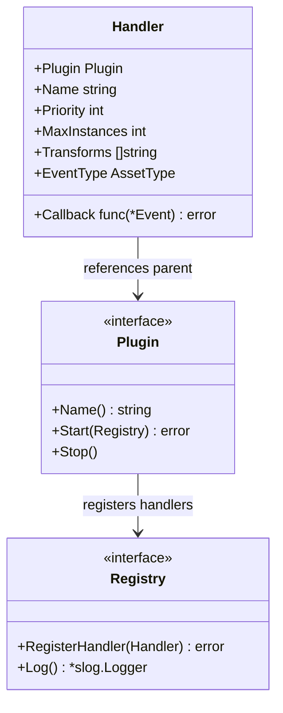
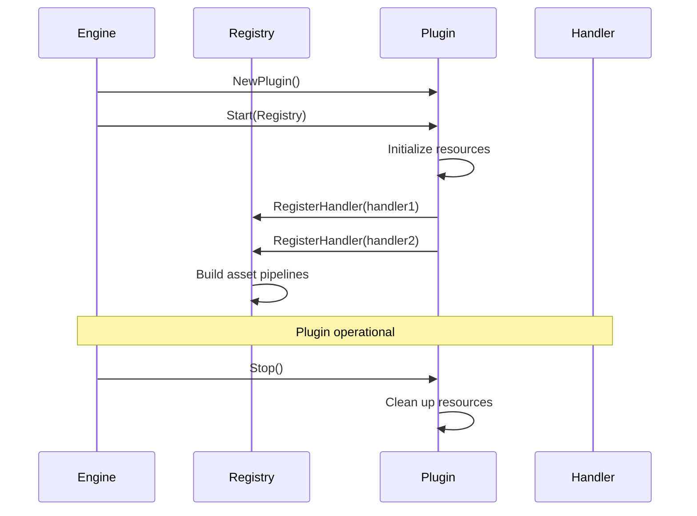
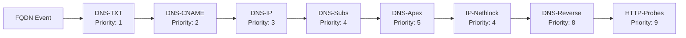
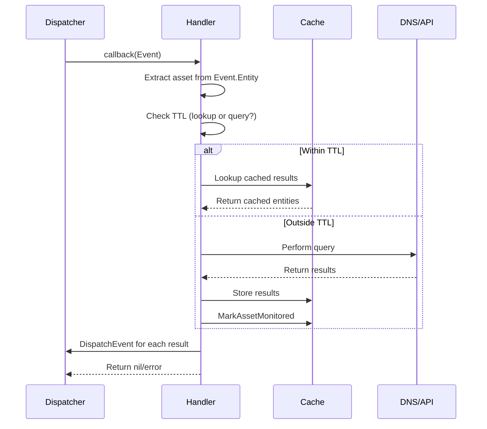
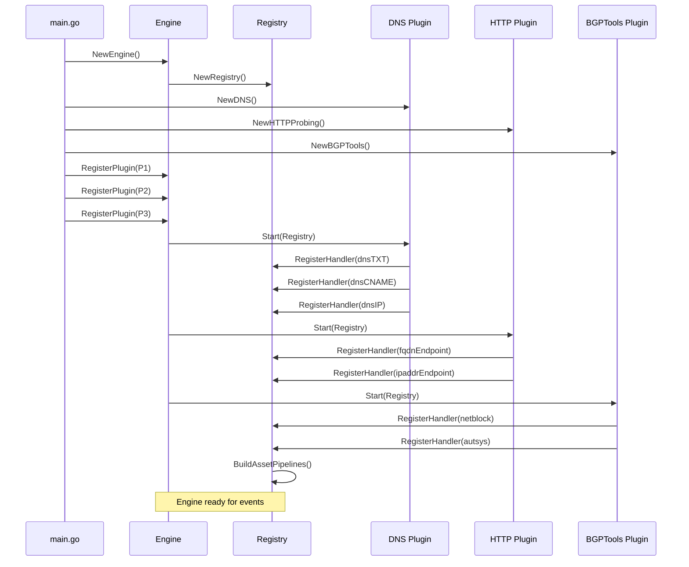

# Plugin System

The plugin system is Amass's primary extensibility mechanism, enabling modular asset discovery and enrichment capabilities. Plugins implement handlers that transform input assets into related output assets through DNS queries, API calls, active probing, or other discovery techniques.

---

## Plugin Architecture

### Core Interface

All plugins implement the `et.Plugin` interface defined in the engine types package:



The `Plugin` interface requires three methods:

- **`Name()`** — Returns the plugin's unique identifier string
- **`Start(Registry)`** — Called during engine initialization to register handlers and set up resources
- **`Stop()`** — Called during engine shutdown to clean up resources

### Plugin Lifecycle



During the `Start()` phase, plugins typically:

1. Initialize logging with `r.Log().WithGroup("plugin").With("name", d.name)`
2. Create handler instances (often as nested structs)
3. Register each handler with the `Registry`
4. Start any background goroutines (e.g., session cleanup)

---

## Handler Registration and Execution

### Handler Structure

Each handler registered by a plugin must provide:

| Field | Type | Description |
|-------|------|-------------|
| `Plugin` | `et.Plugin` | Reference to parent plugin |
| `Name` | `string` | Unique handler identifier |
| `Priority` | `int` | Execution priority (1–9, lower executes first) |
| `MaxInstances` | `int` | Maximum concurrent handler instances (0 = unlimited) |
| `Transforms` | `[]string` | Output asset types this handler produces |
| `EventType` | `oam.AssetType` | Input asset type this handler processes |
| `Callback` | `func(*et.Event) error` | Function invoked when asset matches EventType |

### Priority-Based Execution

The priority system determines handler execution order, creating a processing pipeline:



Priority assignment rationale:

- **Priority 1** — TXT record lookup (discovers organization identifiers)
- **Priority 2** — CNAME resolution (must resolve before IP lookup)
- **Priority 3** — A/AAAA resolution (base IP discovery)
- **Priority 4** — NS/MX/SRV enumeration (subdomain discovery)
- **Priority 5** — Apex domain hierarchy building
- **Priority 8** — PTR reverse DNS lookups
- **Priority 9** — Active HTTP service probing

### Handler Callback Pattern



All handler callbacks follow this pattern:

1. **Asset Extraction** — Extract typed asset from `e.Entity.Asset` (e.g., `*oamdns.FQDN`)
2. **TTL Check** — Determine if asset was recently monitored within TTL window
3. **Lookup/Query Decision** — Use cached results if within TTL, otherwise perform new query
4. **Storage** — Store new results in session cache with source attribution
5. **Event Emission** — Dispatch new events for discovered assets
6. **Error Handling** — Return nil on success or error on failure

---

## Plugin Registration Flow



---

## Creating Custom Plugins

### Step 1: Implement the Plugin Interface

```go
package myplugin

import (
    "log/slog"
    et "github.com/owasp-amass/amass/v5/engine/types"
    oam "github.com/owasp-amass/open-asset-model"
)

type myPlugin struct {
    name   string
    log    *slog.Logger
    source *et.Source
}

func NewMyPlugin() et.Plugin {
    return &myPlugin{
        name: "MyPlugin",
        source: &et.Source{
            Name:       "MyPlugin",
            Confidence: 100,
        },
    }
}

func (p *myPlugin) Name() string { return p.name }

func (p *myPlugin) Start(r et.Registry) error {
    p.log = r.Log().WithGroup("plugin").With("name", p.name)
    return r.RegisterHandler(&et.Handler{
        Plugin:       p,
        Name:         p.name + "-Handler",
        Priority:     5,
        MaxInstances: 10,
        Transforms:   []string{string(oam.IPAddress)},
        EventType:    oam.FQDN,
        Callback:     p.handleFQDN,
    })
}

func (p *myPlugin) Stop() {}
```

### Step 2: Implement Handler Callback

```go
func (p *myPlugin) handleFQDN(e *et.Event) error {
    fqdn, ok := e.Entity.Asset.(*oamdns.FQDN)
    if !ok {
        return errors.New("failed to extract FQDN")
    }

    since, err := support.TTLStartTime(e.Session.Config(),
        string(oam.FQDN), string(oam.IPAddress), p.name)
    if err != nil {
        return err
    }

    var results []*dbt.Entity
    if support.AssetMonitoredWithinTTL(e.Session, e.Entity, p.source, since) {
        results = p.lookup(e, e.Entity, since)
    } else {
        results = p.query(e, fqdn)
        support.MarkAssetMonitored(e.Session, e.Entity, p.source)
    }

    p.process(e, results)
    return nil
}
```

### Key Considerations

!!! tip "Plugin development best practices"
    1. **Source Attribution** — Always attach `SourceProperty` to created entities and edges
    2. **TTL Caching** — Use `AssetMonitoredWithinTTL` to avoid redundant queries
    3. **Error Handling** — Return errors from callbacks to signal failure
    4. **Logging** — Use structured logging with plugin name context
    5. **Concurrency** — Set `MaxInstances` to limit concurrent handler executions
    6. **Priority** — Choose priority based on data dependencies (lower = earlier)

---

## Plugin Categories

<div class="grid cards" markdown>

-   :material-dns:{ .lg .middle } **DNS Discovery Plugins**

    ---

    Six specialized handlers covering TXT, CNAME, A/AAAA, NS/MX/SRV, apex hierarchy, and PTR reverse lookups.

    [:octicons-arrow-right-24: DNS Discovery](dns-discovery.md)

-   :material-api:{ .lg .middle } **API Integration Plugins**

    ---

    GLEIF, Aviato, RDAP, and WHOIS plugins that enrich discovered assets with legal entity, corporate intelligence, and registration data.

    [:octicons-arrow-right-24: API Integrations](api-integrations.md)

-   :material-server-network:{ .lg .middle } **Service Discovery Plugins**

    ---

    DNS-SD, HTTP-Probes, and JARM-Fingerprint plugins that actively probe endpoints to identify running services and TLS certificates.

    [:octicons-arrow-right-24: Service Discovery](service-discovery.md)

-   :material-layers-plus:{ .lg .middle } **Enrichment Plugins & Support Utilities**

    ---

    Horizontals scope expansion, IP-Netblock mapping, and the shared support utilities used by all plugin categories.

    [:octicons-arrow-right-24: Enrichment & Utilities](enrichment.md)

</div>
