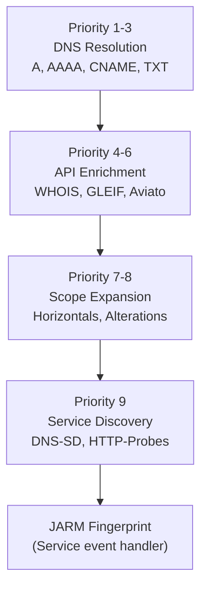
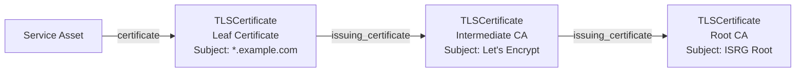

# Service Discovery Integration


## Integration with Event Pipeline

### Priority and Sequencing



This sequencing ensures DNS resolution and scope validation complete before active probing begins.

### Configuration

```yaml
# config.yaml
scope:
  active: true
  ports:
    - 80
    - 443
    - 8080
    - 8443
```

TTL configuration example:

```yaml
transformations:
  - from: "IPAddress"
    to: "Service"
    plugin: "HTTP-Probes-IPAddress-Interrogation"
    ttl: 1440  # 24 hours in minutes
```

### Asynchronous Probing

HTTP probing uses goroutines for non-blocking execution:

```go
if !AssetMonitoredWithinTTL(session, entity, source, since) {
    go func() {
        if findings := query(event, entity); len(findings) > 0 {
            process(event, findings)
        }
    }()
    MarkAssetMonitored(session, entity, source)
}
```

This design prevents blocking the main event processing loop while respecting TTL caching and `MaxInstances` concurrency limits.


## Service Asset Data Model

### Service Entity Structure

The `platform.Service` asset type represents a discovered network service:

```go
type Service struct {
    ID         string            // Unique identifier (hash-based)
    Output     string            // Response body (truncated)
    OutputLen  int               // Full response length
    Attributes map[string]string // HTTP headers
}
```

**Key Attributes:**

| Attribute | Description | Example |
|-----------|-------------|---------|
| `Server` | HTTP Server header | "nginx/1.18.0" |
| `Content-Type` | Response content type | "text/html; charset=utf-8" |
| `X-Powered-By` | Technology identifier | "PHP/7.4.3" |
| `Set-Cookie` | Cookie headers | Session tokens, flags |


### TLS Certificate Chain

TLS certificate chains are represented as linked entities:



**Diagram: TLS Certificate Chain Representation**

The chain extraction occurs during HTTP response processing, iterating through `resp.TLS.PeerCertificates` and creating edges between consecutive certificates.


### Relationship Properties

Service discovery plugins attach detailed properties to edges:

**SourceProperty** (on all edges):
```go
type SourceProperty struct {
    Source     string  // Plugin name: "HTTP-Probes"
    Confidence int     // Confidence: 100
}
```

**PortRelation** (FQDN/IP → Service):
```go
type PortRelation struct {
    Name       string  // "port"
    PortNumber int     // 443
    Protocol   string  // "https"
}
```

**SimpleProperty** (JARM hash on PortRelation):
```go
type SimpleProperty struct {
    PropertyName  string  // "JARM"
    PropertyValue string  // "29d29d00029d29d00041d..."
}
```


---


## Configuration

### Active Scanning Toggle

Service discovery requires explicit enablement via the `Active` configuration flag:

```yaml
# config.yaml
scope:
  active: true
  ports:
    - 80
    - 443
    - 8080
    - 8443
```

When `Config.Active == false`, HTTP-Probes and JARM plugins skip processing entirely.


### Port Configuration

The `Scope.Ports` slice defines which ports to probe:

```go
// Default configuration
Config.Scope.Ports = []int{80, 443, 8080, 8443}

// Custom configuration for extended probing
Config.Scope.Ports = []int{80, 443, 8000, 8080, 8443, 8888}
```

Each configured port is probed for every in-scope FQDN and IP address.


### TTL Configuration

Service discovery respects TTL settings to avoid redundant probes:

```yaml
# config.yaml
transformations:
  - from: "IPAddress"
    to: "Service"
    plugin: "HTTP-Probes-IPAddress-Interrogation"
    ttl: 1440  # 24 hours
```

Assets monitored within the TTL period use cached results instead of re-probing.


---


## Summary

Service discovery plugins transform passive asset discoveries into actionable service intelligence:

1. **DNS-SD** identifies organization affiliations via TXT record verification tokens
2. **HTTP-Probes** actively probes web services, extracting full HTTP responses and TLS certificate chains
3. **JARM-Fingerprint** generates unique TLS fingerprints for service identification

These plugins operate at priority 9, execute asynchronously to avoid blocking, respect TTL caching to minimize network traffic, and create comprehensive Service assets with full relationship graphs including certificates, ports, and fingerprints.
