# Service Discovery Plugins


Service Discovery Plugins actively probe and identify running services on discovered assets. These plugins transform passive asset discoveries (FQDNs and IP addresses) into detailed service information including HTTP endpoints, TLS certificates, and service fingerprints.

!!! info "Active scanning required"
    Service discovery plugins require `Config.Active == true` to operate. HTTP-Probes and JARM plugins skip processing entirely when active scanning is disabled.

## Overview

Service discovery plugins operate at **priority 9** in the event processing pipeline, running after DNS resolution and API enrichment have identified basic assets. These plugins:

1. **Actively probe** HTTP/HTTPS endpoints on configured ports
2. **Extract TLS certificates** from HTTPS connections
3. **Fingerprint services** using JARM TLS fingerprinting
4. **Discover organization affiliations** via DNS TXT records containing site verification tokens
5. **Create Service assets** with detailed metadata (headers, response bodies, certificates)

| Plugin Name | Handler Priority | Event Types | Purpose |
|-------------|-----------------|-------------|---------|
| DNS-SD | 9 | FQDN | Extracts organization identifiers from TXT records |
| HTTP-Probes | 9 | FQDN, IPAddress | Probes HTTP/HTTPS services, extracts TLS certificates |
| JARM-Fingerprint | N/A | Service | Generates JARM fingerprints for TLS services |

---

## System Architecture

### Service Discovery Flow

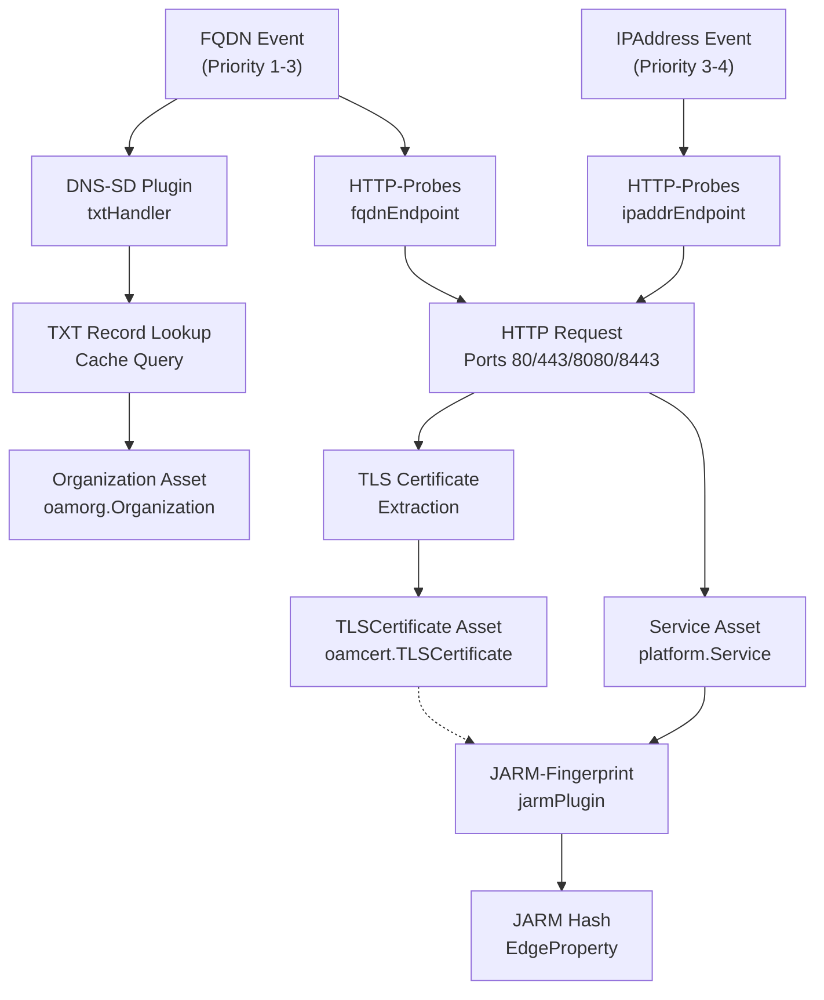

---

## DNS-SD Plugin

The **DNS-SD** (DNS Service Discovery) plugin analyzes DNS TXT records to discover organization affiliations through site verification tokens. When services like Google, Microsoft, or Adobe verify domain ownership, they require placing specific TXT records that contain company identifiers.

### Plugin Registration

The DNS-SD plugin registers a single handler:

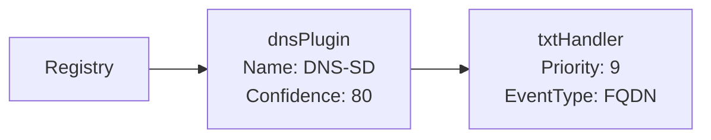

### TXT Record Processing

The `txtHandler` processes FQDN events by:

1. **Querying the cache** for existing TXT records using `GetEntityTags` with relationship type `"dns_record"`
2. **Filtering for TXT records** by checking `prop.Header.RRType == dns.TypeTXT`
3. **Matching verification prefixes** against a database of 100+ known service verification patterns
4. **Creating Organization assets** when matches are found

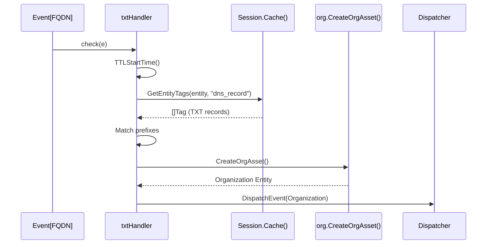

### Site Verification Database

The plugin maintains a comprehensive database of verification record prefixes mapped to organization names:

| Verification Prefix | Organization |
|---------------------|--------------|
| `google-site-verification=` | Google LLC |
| `MS=` | Microsoft Corporation |
| `apple-domain-verification=` | Apple Inc. |
| `facebook-domain-verification=` | Meta Platforms, Inc. |
| `amazonses=` / `amazonses:` | Amazon Web Services, Inc. |

The complete database includes **100+ verification patterns** for services including Zoom, Slack, Adobe, Shopify, Stripe, Twilio, and many others. When a match is found, a `"verified_for"` relationship edge is created between the FQDN and the Organization asset.

---

## HTTP-Probes Plugin

The **HTTP-Probes** plugin is the core service discovery mechanism, actively probing HTTP and HTTPS endpoints to discover running web services, extract TLS certificates, and collect service metadata.

### Plugin Architecture

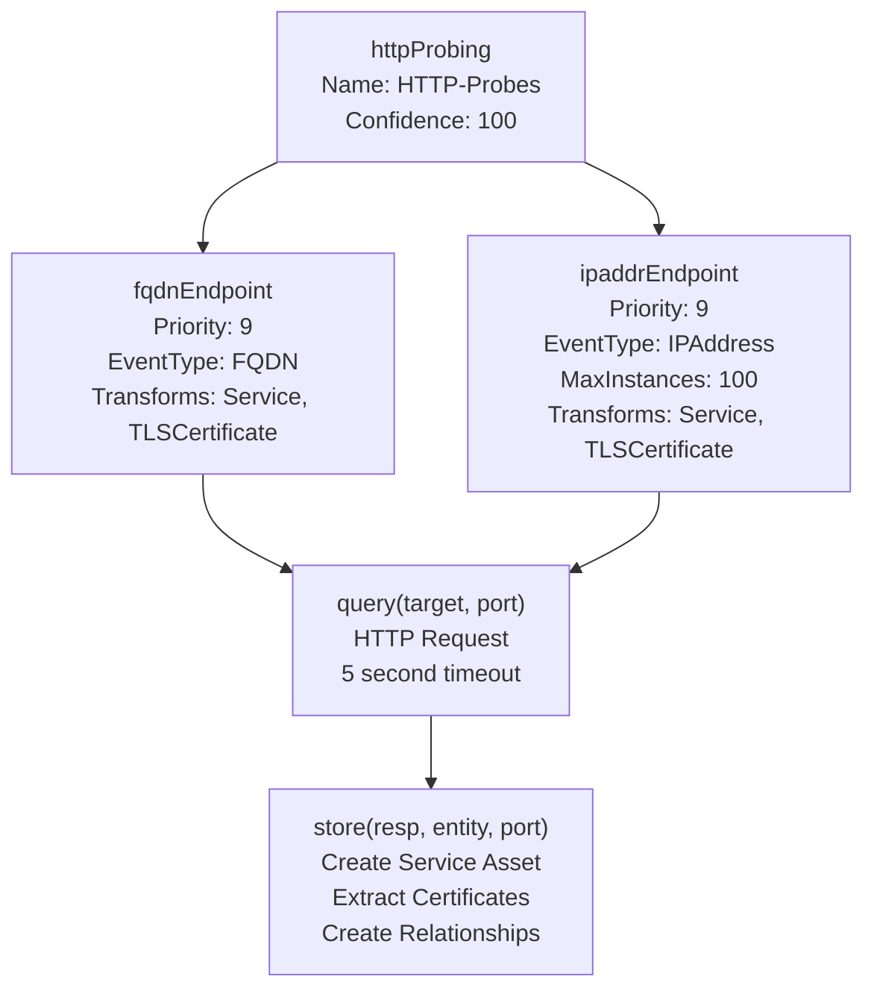

### Port Configuration

The plugin probes ports specified in `Config.Scope.Ports`. Default ports:

| Port | Protocol |
|------|----------|
| 80 | HTTP |
| 443 | HTTPS |
| 8080 | HTTP (alternate) |
| 8443 | HTTPS (alternate) |

Protocol selection: ports 80 and 8080 use `http`; all others default to `https`.

### FQDN Endpoint Handler

The `fqdnEndpoint` handler processes FQDN events with these filtering criteria:

1. **Active scanning enabled** — `Config.Active == true`
2. **DNS resolution exists** — Asset has A, AAAA, or CNAME records
3. **In scope** — FQDN passes scope validation

TTL-based caching avoids redundant probes:

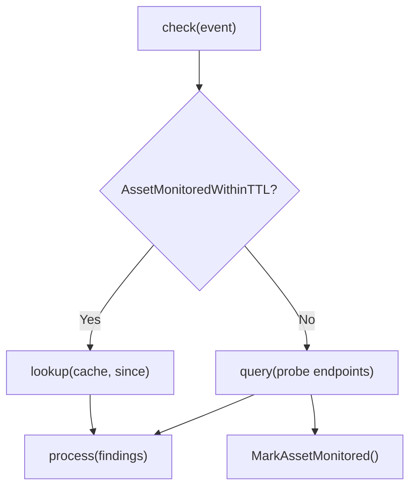

### IPAddress Endpoint Handler

The `ipaddrEndpoint` handler includes additional filtering:

1. **Reserved address check** — Skips RFC 1918 private addresses
2. **Scope validation** — IP must be in configured CIDR ranges

When an IP address is probed, the handler also initiates a **sweep** of nearby addresses:

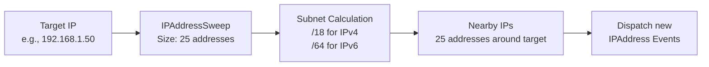

### Service Asset Creation

The `store` function creates comprehensive Service assets from HTTP responses:

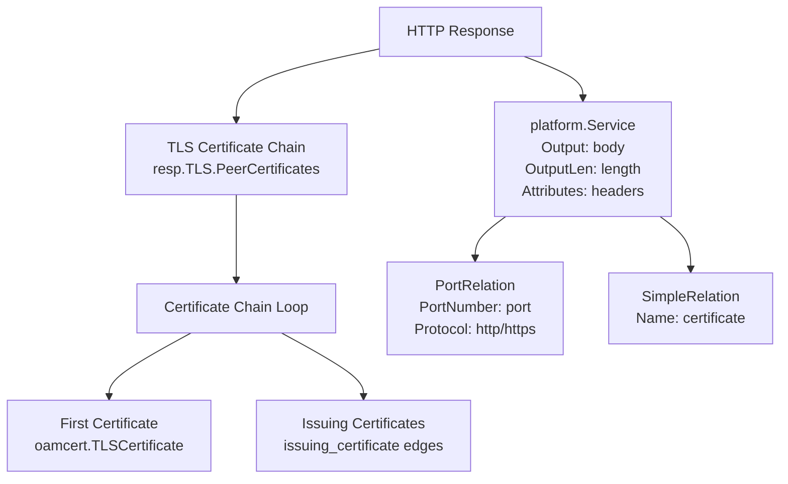

**Service Asset (`platform.Service`):**

| Field | Description |
|-------|-------------|
| `ID` | Unique hash-based identifier |
| `Output` | HTTP response body (truncated) |
| `OutputLen` | Response length in bytes |
| `Attributes` | HTTP headers as map |

**TLS Certificate Asset (`oamcert.TLSCertificate`):**

| Field | Description |
|-------|-------------|
| `SerialNumber` | X.509 serial number |
| `Subject` | Certificate subject DN |
| `Issuer` | Certificate issuer DN |
| `NotBefore` / `NotAfter` | Validity period |

**Relationship Types:**

| From Asset | Relation | To Asset | Purpose |
|------------|----------|----------|---------|
| FQDN/IPAddress | `port` (PortRelation) | Service | Associates service with endpoint and port |
| Service | `certificate` | TLSCertificate | Links service to its TLS certificate |
| TLSCertificate | `issuing_certificate` | TLSCertificate | Certificate chain hierarchy |

### TLS Certificate Chain

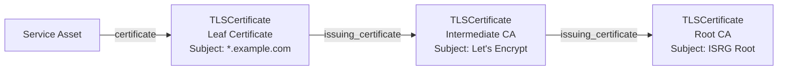

### Service Identifier Generation

Service assets use a deterministic identifier generated by hashing the session ID and target address:

```go
hash := maphash.Hash
hash.SetSeed(MakeSeed())
serv := ServiceWithIdentifier(&hash, session.ID(), addr)
```

This ensures uniqueness within a session, deterministic regeneration, and collision resistance across different targets.

---

## JARM Fingerprint Plugin

The **JARM-Fingerprint** plugin generates TLS fingerprints for HTTPS services using the JARM fingerprinting technique, which analyzes server TLS handshake responses to create unique service signatures.

### Plugin Behavior

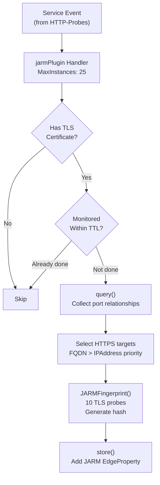

### JARM Fingerprinting Process

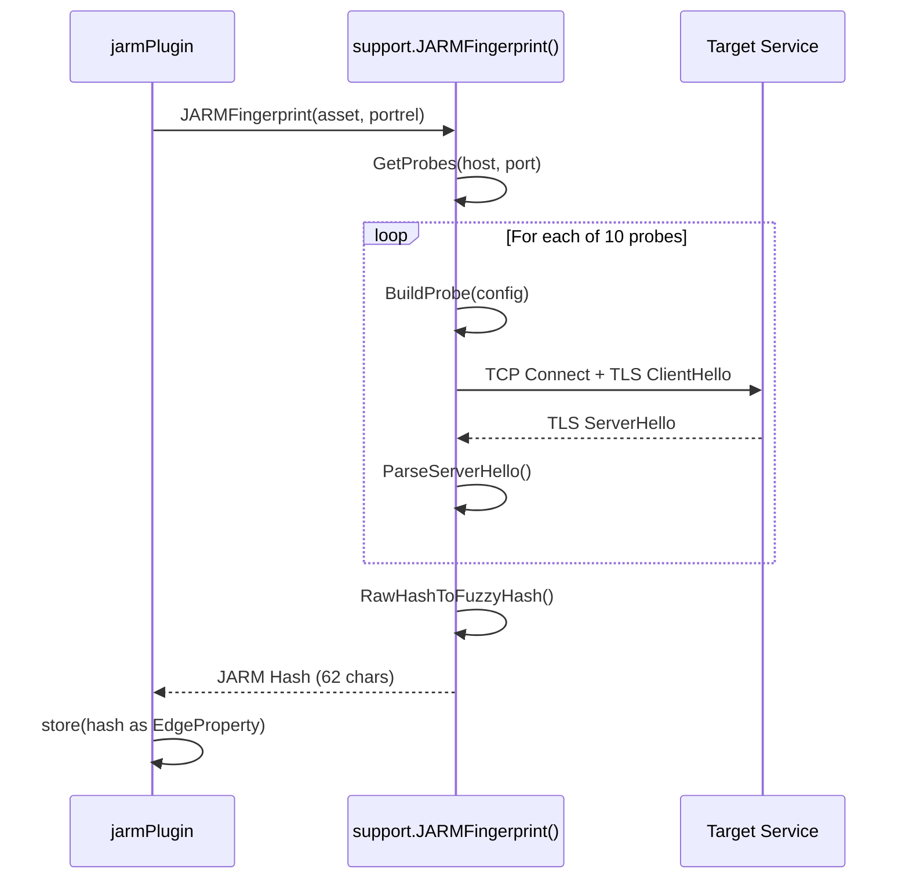

### JARM Probe Configuration

| Probe # | TLS Version | Cipher Suite Order | Extensions | ALPN |
|---------|-------------|-------------------|------------|------|
| 1 | TLS 1.2 | Forward | Standard | HTTP/1.1 |
| 2 | TLS 1.2 | Reverse | Standard | HTTP/1.1 |
| 3 | TLS 1.2 | Forward | Rare | HTTP/1.1 |
| 4 | TLS 1.2 | Forward | Standard | None |
| 5 | TLS 1.1 | Forward | Standard | None |
| 6 | TLS 1.2 | Forward | Standard | None |
| 7 | TLS 1.3 | Forward | Standard | HTTP/1.1 |
| 8 | TLS 1.3 | Reverse | Standard | HTTP/1.1 |
| 9 | TLS 1.3 | Forward | Invalid | HTTP/1.1 |
| 10 | TLS 1.2 | Forward | Standard | HTTP/1.1 |

### JARM Hash Storage

The JARM hash is stored as an **EdgeProperty** on the `port` relationship edge:

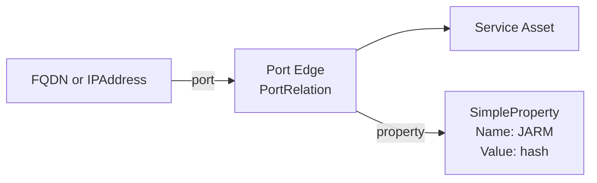

This approach associates the fingerprint with the specific port/protocol combination, allowing different fingerprints for different ports on the same host.

---
